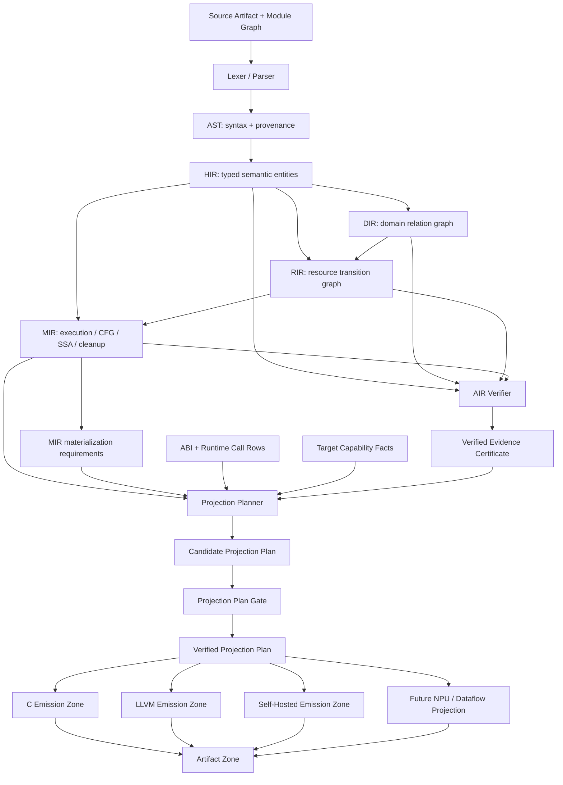

# 180. Compiler Logical Spine, Handles, And Gates

Status: `architecture-frame` (2026-07-10)

This document fixes the logical frame used to grow the compiler. It is not a
claim that every layer already satisfies the target. Current gaps are marked
`PARTIAL` or `ABSENT`.

The central rule is:

> **Stable handles, movable boundaries, gated migrations.**

Compiler ownership boundaries are not permanent folder borders. They move as a
fact gains more consumers, requires broader context, becomes cacheable, or must
survive serialization. Identity must remain stable while the owner moves, and a
gate must prevent the old owner from remaining as a second truth.

Related contracts:

- `docs/125_source_of_truth_spine.md`
- `docs/131_ai_coding_atomic_units.md`
- `docs/169_agent_boundary_sentinel_library.md`
- `docs/semantics/09_abstraction_loss_contracts.md`
- `docs/semantics/pass_contract_manifest.md`
- `docs/self_hosted/14_target_compiler_world.md`

## 0. Anchored boundary deltas (2026-07-17)

The current hardening pass makes the input-side identities explicit at their
first real consumers:

- `PgyTokenStreamHandle` fingerprints one lexer input and stamps every token
  with a monotonic ordinal. The parser rejects a token whose stream anchor
  changes, while token printing remains byte-compatible and does not expose
  the internal handle.
- `PgySourceModuleGraph` is built from the import-resolved AST's canonical
  origin paths and syntax IDs. The native driver validates the graph before
  lowering and destroys it at the pipeline boundary; it cannot silently fall
  back to a path-only module identity.
- DIR carries both `source_program_syntax_id` and `domain_graph_id`, and DIR
  validation fails closed when either anchor is absent. The graph anchor is a
  bridge until typed domain payload/entity rows move off the AST carrier.
- Semantic for-loop header facts now survive into native MIR JSON and the
  self-host MIR JSON producer. C/LLVM source-local capture and the self-host
  rung-2 producer consume the same `(function_syntax_id,
  iteration_syntax_id)` rows; no backend source-type guess is used.
- The self-host compatibility-evolution manifest is validated by the native
  diagnostic driver on the normal compile path. This validates the manifest
  shape and coverage without turning the driver into a second compatibility
  owner; diagnostic ABI trace and package-gate consumers remain a documented
  bridge.

The permanent gates for this slice are
`lexer-token-stream-anchor-test-smoke`, `source-module-graph-test-smoke`,
`iteration-type-fact-test-smoke`, `compatibility-evolution-native-test-smoke`,
and `dir-domain-identity-test-smoke`. The C/LLVM producer-first rung-2 gate
also exercises the for-range and identifier-foreach rows.

## 0.1 Typed array-mutation receiver boundary (2026-08-13)

The direct-MIR scalar GraphPlan now treats a collection mutation receiver as a
carried identity, not as a use-name or a parameter-shape guess.

- Objective: route `ArrayPush`, `ArraySet`, and `ArrayPop` through one typed
  operation owner with an exact local or value-result formal receiver.
- Priority: routine identity, LocalRef identity and parameter ordinal, ordered
  index/value expressions, operation identity, then C/LLVM copy-in/out parity.
- Fact owners: the source-to-MIR primary LocalRef attachment, routine
  signature/ABI facts, and the existing ArrayInt/ArrayString carrier facts.
- Last legitimate consumers: program operation storage/readiness and the C/LLVM
  collection-operation emitters.
- Forbidden fallbacks: instruction-use receiver selection, unique-parameter or
  first-parameter inference, backend MIR rereads, source spelling branches, and
  a second collection plan.

The producer now emits `parameter:<routine-source-syntax-id>:<ordinal>` for a
value-result receiver. Local and formal receivers join their exact existing
facts; operation 37 owns ArrayInt value-result set with its index/value graph
rows. The focused gate mutates only the second of two same-typed
`Array<Int>` value-result formals and proves C/LLVM copyout identity. Missing,
wrong-owner, wrong-type, broken-graph, duplicate-use, missing-ABI, and
out-of-range-ordinal variants fail closed. Retired local-only mutation paths are
absence-gated.

`DirectMirScalarCfgControlTransferFromOwners` now gives the single-routine and
program GraphPlan consumers one exact break/continue decision. The focused
two-routine C/LLVM gate rejects swapped targets, and the existing loop snapshot
and break-exit gates remain green. This widens the already `CLOSED` GraphPlan
substitution and does not create or promote a top-level SoT family.

The next two expression seams are also owner-derived. `StringJoin`/`Join`
consume the existing semantic signature and `("string", "join")` runtime ABI
row; C uses the canonical runtime body and LLVM implements that exact ABI.
`ToString(String)` is the semantic registry's identity specialization, while
`ToString(Int)` retains the formatting ABI. Routine-name branches, compile-time
join, raw backend symbols, and a second ArrayString ABI remain forbidden. The
two stable expression identities, 69 and 70, advance the wire schema from
`graph-plan.v44` to `graph-plan.v46`. Historical `GraphPlan vN` headings
below are migration-rung labels rather than wire-schema suffixes; they do not
reserve or redefine that suffix sequence.

Stable operation 38 closes that reached `Option<Int>` try-let. Its admission
strips only the persisted unary try root, normalizes the operand through the
shared expression owner, requires the existing OptionInt ABI and enclosing
OptionInt callable identity, and rejects value-result copyout in this first
rung. C and LLVM both return the admitted None value on absence and unwrap Some
into the declared Int local. Wrong payload, enclosing return, operand edge,
Option ABI, and carriage mutations fail closed. Operation 38 advances the wire
schema to `graph-plan.v47`; it adds no top-level authority row.

The fixed canary now reaches a Bool `logical_and` whose right subtree is the
five-argument `SubEqualsWithLen` builtin call. The next seam must preserve that
persisted conditional topology and consume the existing builtin facts. A
routine/name branch, eager right-call evaluation, raw JSON reread, or a second
builtin registry is forbidden.

## 1. Current Logical Topology

The native compiler currently behaves approximately as this graph:

```text
source bytes
  -> lexer -> tokens
  -> parser -> AST
  -> semantic annotations on the AST
       |-> HIR indexed view + CFG
       |-> DIR domain relation graph
       |-> RIR resource/state graph
       `-> DAG type-resolution metadata
  -> HIR + RIR -> MIR CFG/SSA/cleanup/ABI facts
  -> HIR/DIR/RIR/DAG/runtime-policy facts -> AIR verification graph
  -> MIR facts augment the same AIR verification graph
  -> CompilerIRBundle(HIR, DIR, RIR, MIR)
  -> C or LLVM backend + runtime
  -> artifacts
```

This fan-out is current reality: DIR and initial RIR lowering still collect
their domain/state shape from the annotated AST, but the semantic
`ResourceFlowUniverse` has one native adapter consumer. HIR receives the
`SemanticResult` rows once and validates routine source identity plus
routine-local stable indexes. DIR does not consume this fact family and no
longer flattens, deep-copies, or revalidates it. RIR joins source-backed
routines by HIR source identity and consumes HIR-owned stable rows during flow
enrichment; MIR receives the same routine-local projection. The qualified DIR
slot nodes carry declaration and owner
`SyntaxNodeId` values. RIR validation joins exact owner IDs and fails closed
when they are absent. The demanded function-parameter flow summary is likewise
snapshotted by semantic analysis and attached to HIR routines by stable
`SyntaxNodeId`; unknown routine or duplicate parameter rows fail closed. HIR is
not yet the sole semantic input for all DIR/RIR domain/state shape, so the
target diagram below is still a migration, not a description of an already
linear HIR -> DIR -> RIR pipeline.

Two decisions are already correct:

1. `CompilerIRBundle` excludes AIR. AIR is a verifier/evidence side graph, not
   a backend input.
2. Both native backends receive MIR and are progressively losing permission to
   reconstruct semantic facts from AST/source.

The main current structural debt is that the graph still uses three identity
systems at once:

- raw `ASTNode *` provenance that is sometimes still read semantically;
- names such as `slot_anchor`, owner name, or type spelling used as identity;
- owner-local `size_t` indexes with no compilation-revision or cross-layer
  handle contract.

Measured examples make this concrete:

- HIR callgraph now joins semantic declaration targets to `RoutineId`; MIR
  hosted-method/routine joins still use `(owner_name, method_name)` lookup;
- C/LLVM intent inventory permits prefix-shaped compatibility matching;
- AIR/RIR boundary evidence joins by names plus AST pointer/subtree matching;
- semantic type metadata is keyed by `ASTNode * -> Type *`, then later MIR
  stages recapture type spellings from AST;
- native lexical bindings and most SSA values are still collapsed into name and
  `name.version` strings. The installed self-host scalar-CFG range slice is a
  bounded exception: producer-carried `LocalRef` identity now distinguishes
  declaration and nested iteration binders, but general lexical identity is
  still open;
- dynamic ABI rows can be returned from temporary ring storage and therefore
  cannot serve as durable layout/runtime-call identity.
- `ResourceFlowUniverse` snapshots function-local stable rows into
`SemanticResult`; HIR is the single native adapter consumer and carries those
  rows on the matching `RoutineId`. DIR receives only a copied HIR-derived
  snapshot through its enriched lowering entry point. Its top-level node and
  edge iteration also consumes the HIR declaration inventory; only the
  declaration payload details remain AST-backed. RIR verifies HIR's
  declaration/parameter identity before it enriches flow.
- `FunctionParamFlowSummary` snapshots demanded interprocedural rows into
  `SemanticResult`; HIR carries `(SyntaxNodeId, parameter_index, mask)` rows
  with duplicate and unknown-routine rejection. RIR now copies and validates
  those rows during HIR enrichment, and MIR materializes the same rows on each
  routine with source syntax identity, duplicate/index checks, and a
  program-level presence flag. AIR projects the MIR rows with the same stable
  identity and fail-closed presence/index checks. The self-hosted MIR JSON
  routine owner now consumes those rows and rejects malformed identity/count
  facts; full self-hosted summary parity remains the final open seam.
  The eventual HIR entity carrier for DIR's domain collection is still open.
- RIR captures each resource fact's source `SyntaxNodeId` at its initial fact
  collection boundary. HIR-to-RIR flow enrichment joins that typed ID and no
  longer derives identity from `fact->ast`; the remaining AST ownership is the
  initial RIR shape/resource collection itself, not a second identity source.

## 2. Target Logical Topology

The target is a graph of owned facts, not a linear stack of copied trees:



The `Verified Projection Plan` is the physical nerve bundle from the compiler
world into codegen. It is not a new semantic IR. It contains only target-facing
rows already justified by owner facts:

- target profile and accepted capability rows;
- ABI layout handles;
- runtime-call ABI handles;
- materialize / summarize / erase / reject decisions;
- required cleanup, panic, ownership, and source-map rows;
- the verification certificate/digest that approved the plan.

AIR validates evidence/disposition and emits a compact certificate. The
Projection Planner cites that certificate, and the Projection Plan Gate checks
the candidate plan. C, LLVM, SelfHosted, and future targets do not read AIR,
AST, or source to rebuild it.

## 2.1 Self-Hosted Program Graph Unification Contract

Status: `PARTIAL`; semantic topology repointed. This is a hard-substitution
condition, not an independent graph-cleanup project.

Objective card:

- Objective: carry one immutable expression topology from HIR through semantic
  analysis and MIR consumption instead of copying node kind, text, and child
  arrays into each stage.
- Priority: stable identity and byte-equal behavior, owner-directed facts,
  bounded lifetime and memory, old-store deletion, then physical file layout.
- Fact owner: the HIR program-graph structural owner issues expression identity;
  semantic, MIR, AIR, and backend paths consume typed overlays or projections.
- Last legitimate consumers: semantic expression verdict owners, MIR
  instruction-root projection, AIR evidence publication, and the verified
  C/LLVM/self-hosted projection lanes.
- Forbidden fallback: dual structural reads, `new ? old`, reparsing expression
  text, copying a whole-program graph per routine or instruction, aliasing
  distinct semantic identities to one integer, or raising the build-memory cap.
- Verification: the structural-owner ratchet below, bounded MIR/C byte parity,
  missing/foreign-handle rejection, and a complete full-driver MIR artifact
  under the existing 3 GiB process-tree private-memory boundary.

Target structural owner: `src/self_hosted/hir/program_graph_owner.pgy`.
The existing `AstExpressionArena` type identity moved intact to that owner, so
parser/HIR and semantic consumers share the same node ordinals. A future
`CompilationRevisionId` must scope this topology when the source/module owner
lands; this migration must not invent a substitute revision identity.
Normalized expression nodes that are not one-to-one with syntax nodes will
receive an owner-issued `ExpressionNodeId`. `SyntaxNodeId`, `EntityId`,
`TypeId`, `SymbolId`, `InstructionId`, and `ValueId` remain distinct because
their equality and lifetime contracts differ.

The target is one immutable expression topology with typed overlays, not one
flat mutable mega-graph:

| Projection | Owns | Must not own |
|---|---|---|
| HIR program graph | expression node kind, interned atom/text handle, ordered child handles, syntax provenance | type verdicts, SSA values, backend layout |
| Semantic overlay | normalized spelling plus `ExpressionNodeId -> TypeId/SymbolId/place/call/verdict` facts | copied node kind or child arrays; normalized spelling remains an explicit open overlay until text handles land |
| MIR view | instruction/root/origin handles plus MIR-only CFG/SSA nodes | a second copy of source expression topology |
| Type DAG / DIR / RIR | their typed relations keyed by stable handles | syntax-tree storage or backend recovery policy |
| AIR | evidence provider/subject/disposition references | semantic rediscovery or backend materialization decisions |
| Projection plan | verified target-facing MIR/ABI/runtime rows | AST, expression text, or AIR graph traversal |

AIR remains a verifier. CFG, the type DAG, DIR, RIR, and AIR keep their own
typed edge sets and lifetimes; "one graph" means one revision and structural
identity spine, not one node-kind enum or one always-live allocation. Routine
scratch and temporary analysis regions must still be released at their last
consumer so graph unification does not turn into whole-program retention.

Current structural storage:

| State | Owner | Current duplicate payload |
|---|---|---|
| `LANDED` | `src/self_hosted/hir/program_graph_owner.pgy` | stable `AstExpressionArena` kind/text/children topology shared by parser/HIR and semantic |
| `RETIRED` | `src/self_hosted/hir/ast_expression_graph_owner.pgy` | no structural fields; validates graph rows and node invariants over the target topology |
| `REPOINTED` | `src/self_hosted/semantic/ast_expression_graph_fact_owner.pgy` | borrows target topology; owns normalized text, call-target, and place overlays only |
| `HANDLE` | `src/self_hosted/mir/expression_graph_fact_owner.pgy` | instruction-local root and bounded-range handles over the program-owned semantic graph; no copied topology |

This is a storage-and-identity migration under the existing
`selfhost.expression_graph` semantic authority, not a second top-level fact
family. The owner move is recorded in
`docs/semantics/boundary_migration_manifest.md`, while the existing registry
authority remains `selfhost.expression_graph`; the target is classified as its
structural carrier rather than a competing semantic authority.

Migration order:

1. **Done:** lock the three legacy stores as the starting baseline.
2. **Done:** move the stable `AstExpressionArena` declaration to the target
   owner without renumbering handles.
3. **Partial:** semantic now consumes that topology and its duplicate kind/child
   arrays are deleted. Normalize text and call/place facts remain overlays;
   missing rows fail closed, and revision-scoped `ExpressionNodeId` is open.
4. **LANDED:** MIR carries only instruction/root/origin handles over the
   program-owned semantic graph in SelfMirProgramFacts. JSON, validation, and
   assignment checks use typed semantic accessors. Missing and out-of-range
   handles fail closed; revision-scoped foreign-handle identity remains open, and copied graph rows are deleted.
5. Repoint AIR and emission consumers to typed handles/projections, then retire
   the HIR compatibility owner if no legitimate consumer remains.
6. Run the pressure-owned full-driver fixed point and the unfiltered 280-row
   C/LLVM/self-hosted matrix. The first artifact/parity failure selects the next
   owner seam.

`tests/self_host_program_graph_unification_smoke.sh` is the negative ratchet.
Before the target exists it recognizes exactly the three historical stores.
With the target present it requires exactly one structural store: the program
topology. A returned HIR/semantic/MIR topology copy, any unregistered store,
or a second owner fails the gate.
`tests/self_hosted/parity/mir_expression_graph_projection_owner_smoke.sh` is
part of the same Make/dashboard target. It rejects raw topology reads, missing
typed semantic handle reads, copied MIR topology, and expression-text
recovery.

The 2026-07-31 fixed-input release observation closes the storage/publication
falsifier for this rung. A pre-stream artifact run completed all MIR facts and
JSON construction but crossed the unchanged 3 GiB stop at 3.098 GiB private
while committing an approximately 86 MB materialized payload. After program
graph ownership and artifact streaming, the same source-to-MIR target exited 0
in 83.364 seconds at 1.525 GiB peak private and 1.404 GiB working set.
This proves the native-built release execution boundary only. The next
falsifier is a driver rebuilt through the Pergyra parser/codegen seed, with
byte parity against the native-built oracle before gen2/gen3 continuation.

## 3. Layer Contract

| Layer | Owns | Stable output | Last legitimate consumer | Current |
|---|---|---|---|---|
| Source Artifact | canonical module identity, bytes, content digest, import relation, source spans | `CompilationRevisionId`, `SourceUnitId`, `SourceSpan` | diagnostics, compatibility, source maps | `PARTIAL`: import expansion remains driver-owned and source identity is not one stable cross-stage handle |
| Lexer/Tokens | token kind, token value, source position, lexical diagnostics | token stream scoped to `SourceUnitId` | parser and explicit token dump | `PASS` for the current lexical owner |
| AST | syntax category, concrete provenance, recovery artifact | `SyntaxNodeId` scoped to a source unit | target: HIR lowering plus diagnostics/source maps | `PARTIAL`: parser-to-AST loss is documentation-only; per-module stable IDs are assigned before import merge; AST payloads currently survive into MIR/backend debt |
| Semantic/Type DAG | binding, resolved type, generic/default/ability metadata | `EntityId`, `SymbolId`, `TypeId` mappings | HIR/DIR/RIR lowering and AIR evidence | `PARTIAL`: metadata is AST-pointer keyed and much of the semantic context is destroyed before later IR consumers, which then recapture type spellings |
| HIR | typed normalized entities, declarations, routines, scopes, body facts | `EntityId`, `TypeId`, `ScopeId` | DIR/RIR/MIR and semantic tooling | `PARTIAL`: declaration/routine IDs and CFG exist, but HIR still borrows `ASTNode *` and is not a total owning semantic IR |
| DIR | intent/domain declarations and typed relations | references to `EntityId`, domain-edge IDs, source/owner `SyntaxNodeId` | RIR and AIR verifier | `PARTIAL`: HIR owns top-level declaration inventory and DIR uses it for node/edge iteration; qualified payload slots and remaining entity/type joins are still AST/name based |
| RIR | resources, slot ownership, transfer, authority, state transitions | `ResourceId`, `BoundaryId` | MIR and AIR verifier | `PARTIAL`: HIR source identity, parameter-count facts, and stable resource rows are verified during enrichment; summary validation no longer rereads AST parameter bounds, while initial shape and `slot_anchor` joins remain |
| MIR | routines, blocks, instructions, SSA values, cleanup, cancellation, abstract materialization requirements | routine-scoped block/value/instruction handles plus ABI references | Projection Planner, AIR verifier, diagnostics | `PARTIAL`: strong CFG/dataflow facts exist; statement inventories, expressions, match payloads, and some type recovery still carry AST |
| AIR | evidence completeness, abstraction drift, compression disposition/explanation, diagnostics | `EvidenceId`, verified evidence certificate | current: driver/LSP/CI/compatibility; target: Projection Planner, Artifact Zone, verifier paths | `PASS` for backend isolation; `PARTIAL` for hosted-method boundary producer coverage and complete evidence lifetime/certificate projection |
| ABI/Target Facts | type layout, call shape, target capability, ownership/materialization policy | `LayoutId`, `RuntimeCallAbiId`, `TargetProfileId` | compiler-owned Projection Planner (single native SoT consumer) | `PARTIAL`: the planner alone reads/validates the target-capability adapter and binds its fingerprint; C/LLVM receive only the derived plan row; artifact digest and complete target-profile binding remain open |
| Verified Projection Plan | target-specific projection of already-owned facts | `ProjectionPlanId` and typed plan rows | backend emitters and Artifact Zone | `PARTIAL`: native plan row 1 maps MIR intent-observability usage to C/LLVM `OBS0/ERASE` or `OBS1/MATERIALIZE`, cites the AIR evidence certificate fingerprint, carries target-envelope plus abstract and physical machine-declaration fingerprints, and is the only row C/LLVM inspect; C/LLVM `CompilerResult` now carries the anchored plan revision/digest; persisted content digest and remaining axes are open |
| Backend | mechanical emission only | object/text/debug artifacts | linker and Artifact Zone | `PARTIAL`: AIR is excluded, but native AST/type reconstruction and backend-local compatibility paths remain |
| Runtime | only explicitly materialized state, guards, capabilities, quotas, and observability | runtime handles tied to plan rows | execution and runtime trace | `PARTIAL`: retained facilities exist; attribution and sandbox coverage are not total |
| Artifact/Compatibility | schema-versioned outputs, hashes, parity, migration policy | `ArtifactId` | cache, CI, release, migration tooling | `PARTIAL`: many schemas and a seed corpus exist; historical compatibility corpus is incomplete |
| Self-Hosted Compiler | a replacement implementation over the same handles and artifacts | the same MIR/AIR/ABI/diagnostic artifacts | bootstrap and Artifact Zone | `PARTIAL`: bounded fixed points exist; whole semantic/MIR/native-driver replacement does not |

The target-capability owner is self-hosted, but it is not self-host-only. The
compiler-owned projection planner is the single native consumer of the
immutable adapter rows in `src/compiler/target_capability_contract.c` and the
abstract machine manifest and its checked host-sim physical declaration in
`src/compiler/machine_layer_manifest.c`; it
validates both selected projections and forwards one fingerprinted plan row.
C and LLVM consume that derived row only, so their physical representations
remain backend-specific without duplicating target-envelope or machine-manifest
reads. In particular, LLVM's `DeviceSlot<T>` projection retains a distinct
named `%PgyDeviceSlot_<T>` IR aggregate instead of silently reusing the
ordinary `%PgySlot_<T>` type. Self-hosted parity is an additional owner/proof
path; it does not make
C or LLVM reinterpret the machine layer or infer a target from command-line
defaults. The current physical declaration is an explicit host-sim target
record; it is not a claim that a board/MMIO/linker source has been imported.
The self-host MIR reader validates explicit `machine_contact_kind` plus its
`machine_layer` row, and the self-host AIR validator validates
`machine_layer_sites`; both consume the native `pgy.machine-layer.declaration.v1`
artifact through `machine_layer_declaration_consumer.pgy`, including the
physical grant `base`, `size`, and access `mode`, and fail closed
on a missing or mutated row. The self-host MIR producer now carries the same
row from the semantic expression-graph call-target fact into its JSON output;
`tests/self_hosted/mir_machine_layer_smoke.sh` exercises that producer-to-reader
path for all five contacts.
The native RIR owner also exposes the same contact rows through
`--rir-json`/`rir_dump_json` as a clean `pgy.rir.v1` artifact. This is an
inspection and handoff boundary, not a second machine contract: the RIR owner
still owns classification, while later consumers validate the typed rows they
receive.

## 4. When A Handle Is Required

Do not create a handle for every struct or helper. A handle is required when at
least one of these is true:

1. identity crosses an owner or IR boundary;
2. another graph stores a reference to the fact;
3. the fact survives serialization, caching, or incremental invalidation;
4. equality changes semantic behavior;
5. the fact outlives the arena or storage that produced it;
6. a runtime artifact must point back to a compile-time reason.

Owner-local pointers and indexes remain valid implementation details when they
never escape the owner, never become serialized identity, and are invalidated
before storage mutation or destruction.

Spelling is not identity. After HIR normalization, a name string may be used for
diagnostics, mangling input, or provenance, but not as the only join key between
DIR, RIR, MIR, AIR, ABI, and runtime facts.

## 5. Minimal Handle Spine

The goal is a small set of real identities, not a collection of aliases over
`size_t`.

| Handle | Issuing owner | Meaning | Required validation |
|---|---|---|---|
| `CompilationRevisionId` | Source/Module owner | one immutable source/module graph revision | content/module digest matches every serialized child handle |
| `SourceUnitId` | Source owner | canonical module/source identity | canonical path/module row and content digest are present |
| `SyntaxNodeId` | AST owner | provenance-only syntax node within `SourceUnitId` | node exists, span belongs to source unit, parent/child graph is valid |
| `EntityId` | HIR semantic owner | declaration or domain entity identity | kind is explicit; no name-only lookup after binding; every downstream reference resolves |
| `RoutineId` | HIR routine owner | executable body identity, including specialization origin/substitution | no first-match name or prefix lookup; every call edge resolves exactly one routine |
| `SymbolId` | semantic binding owner | parameter/local/member binding identity | shadowed declarations receive different IDs; name is dump/provenance only |
| `TypeId` | Type DAG owner | canonical resolved type including generic actuals/defaults | resolver row exists; no backend string reconstruction |
| `ScopeId` | HIR owner | lexical/semantic scope | parent scope is valid and every local belongs to one scope |
| `ResourceId` | RIR owner | resource/slot/view ownership identity | state machine and owning entity exist |
| `RirOpId` | RIR owner | one resource transition operation | operation belongs to one resource/scope and remains addressable after storage growth |
| `BoundaryId` | RIR boundary owner | authority/concurrency/transfer/IO boundary | producer site, capture facts, and required evidence are total |
| `BlockId` / `InstructionId` | MIR owner | routine-scoped CFG/instruction identity | ID belongs to one `RoutineId`; DCE and rewrites reject dangling references |
| `ValueId` | MIR owner | one SSA definition/result identity | every use and phi input resolves one dominating value; spelling is dump-only |
| `LayoutId` | ABI owner | target-specific type representation row | target, size, align, fields, ownership, tag/niche policy are complete |
| `RuntimeCallAbiId` | ABI owner | logical operation to calling convention/symbol row | argument/return layout handles and target availability exist |
| `TargetProfileId` | Target capability owner | one target capability and ABI policy set | target facts and fallback/reject reasons are complete |
| `ProjectionPlanId` | Projection Planner | immutable target plan over MIR/ABI/target facts | AIR evidence certificate matches; Projection Plan Gate proves every row cites owner handles |
| `EvidenceId` | AIR owner | evidence node with typed provider and subject references | producer, subject, last consumer, and disposition are known |
| `ArtifactId` | Artifact Zone | schema + producer + target + content digest identity | content hash and producing plan/revision are recorded |

Do not create aliases that merely rename the same index. Create a separate
identity only when lifetime or equality is genuinely different. In the current
compiler, `RoutineId`, `SymbolId`, and `ValueId` meet that test: generic routine
specialization, lexical shadowing, and SSA definitions are not the same entity
relation as a source declaration.

## 6. Boundaries Must Be Allowed To Move

A growing compiler will discover that an earlier boundary was too narrow. This
is expected. The architecture fails only when both boundaries remain valid
sources of truth.

Typical migration signals:

- two or more consumers repeat the same derivation;
- a consumer lacks context and rescans source/AST/program roots;
- a fact must survive longer than its owner's arena;
- a codegen helper starts resolving declarations or generic defaults;
- a backend needs a semantic fact that MIR does not carry;
- incremental invalidation needs stable identity across files or passes;
- an owner grows unrelated mutable resources or exceeds the responsibility cap;
- a runtime check exists because no compile-time owner exposes the decision.

The recent local-binding migration is the canonical example:

```text
old: codegen-local Let name/type/initializer owner
signal: semantic and multiple codegen consumers require the same binding fact
new: artifact-bound semantic local-binding owner
bridge: explicitly named initializer-provenance view only
retired: old codegen owner and name/type fallback
```

### Boundary Migration Protocol

Every ownership move follows this order:

1. **Declare** the fact set, old owner, new owner, stable handle, and last
   consumer.
2. **Produce** the new owner facts without changing consumers.
3. **Compare** old/new facts on positive, negative, nested, generic, and stale
   artifact fixtures.
4. **Repoint** consumers one at a time to the new owner.
5. **Fail closed** when the new fact is missing; never use `new ? old`.
6. **Delete** the old producer/accessor rather than leaving an alias.
7. **Ratcheting gate** rejects the old symbol, source rescan, and fallback.
8. **Update** owner, loss, lifetime, compatibility, and self-host manifests.

An allowed migration bridge is one-way and typed. It may expose provenance or a
fact not yet promoted, but it cannot decide the migrated fact and cannot fall
back to the old owner.

Observation does not create a second bridge owner. A debug or pressure CLI may
select an observed adapter and emit owner-boundary receipts, but it must call
the same artifact/fact owner as the normal path. It may not invoke a parser,
artifact constructor, semantic analyzer, or backend bridge directly merely to
place markers around it. The negative gate must reject that direct call in the
orchestration file and require the observed adapter in the established owner.

A gate receipt is part of the evidence contract, not decorative output. Its
stable text must name the material positive and negative facts that the gate
actually ran. When a registry cites that receipt, weakening or shortening the
message without changing the registry is a failing evidence drift; expanding
the message without executable checks is equally invalid. New `*_fact_owner`
files must also be classified immediately as an authority or as a named
`projection`, `bridge`, `cache`, or `local_view` of an existing authority.

Function-scoped structural checks must own an exact function body. A shared
extractor starts only when the signature begins at column zero and stops at the
outer column-zero closing brace; it must not assume that the next declaration
starts with Pergyra `func`, because the same inventory also checks C functions.
Otherwise a forbidden spelling in the next C function can falsely condemn the
target, or a required spelling anywhere later in the file can falsely satisfy
it. A single-term check accepts exactly one term. Multiple required or rejected
terms use an explicit variadic wrapper so shell surplus arguments cannot be
silently ignored. The permanent regression shape keeps a retired spelling in
the function immediately following the target: the target check must pass, and
moving that spelling into the target must fail. These remain structural source
claims; executable parity continues to own behavior.

### Boundary Migration Gate

The repository has one manifest-backed gate with these fields:

```text
migration_id
fact_kind
stable_handle
old_owner
new_owner
allowed_bridge
forbidden_old_reads
consumer_inventory
parity_fixture
negative_fixture
retirement_gate
status: shadow | repointing | mandatory | retired
```

`retired` is valid only when the old producer is absent and the negative gate
proves it cannot return.

The live ledger is
[`semantics/boundary_migration_manifest.md`](semantics/boundary_migration_manifest.md),
and `make boundary-migration-test-smoke` is blocking on Linux, macOS, and
Windows CI. The first retired row records the self-hosted local-binding owner
migration; later rows must reuse this contract instead of inventing a second
migration vocabulary.

## 7. Gate Map

| Gate | Protected boundary | Current | Missing closure |
|---|---|---|---|
| Source/Parser Artifact Gate | bytes/tokens -> AST | `ABSENT` dedicated enforcement | stable source/syntax handles, recovery artifact totality, raw-source reread rejection |
| Boundary Migration Gate | compiler owner movement | `LANDED`; manifest-backed and blocking CI | add each live owner move before shadow facts are consumed; keep all retired paths absent |
| Stable Identity Gate | AST/HIR/DIR/RIR/MIR/AIR joins | `PARTIAL`; merged-program `SyntaxNodeId`, semantic declaration placeholders, and HIR `RoutineId` call edges are blocking CI | add revision/source-unit identities; exact method/boundary/type/binding/value joins; stale/foreign ID rejection; remaining name/prefix/AST join prohibition |
| HIR Totality Gate | AST -> typed semantic entities | `PARTIAL` | every stable declaration/local/body/type fact owned without semantic AST fallback |
| DIR Referential Gate | HIR entity -> domain graph | `PARTIAL`; source/owner `SyntaxNodeId` is carried and the RIR join is exact, but collection is still AST-owned | make HIR/entity facts the input; typed references replace name/AST joins; edge totality corpus |
| RIR Transition Gate | HIR/DIR resource facts -> state graph | `PARTIAL`; current initial lowering is AST-owned | remove AST-call recovery in validation; stable resource/boundary handles across join/loop/transfer/authority cases |
| MIR Verifier Gate | HIR/RIR -> executable graph | `PARTIAL`, comparatively strong | eliminate residual AST statement/expression/type recovery; complete cleanup/cancellation/body facts |
| AIR Evidence Lifetime Gate | owner facts -> proof/disposition | `PARTIAL`; enum/manifest gate is not blocking CI | hosted-method/expression boundary producer totality; all evidence kinds prove producer, last consumer, erase/summarize/retain/reject behavior and the gate is CI-required |
| Projection Plan Gate | certified evidence + MIR/ABI/target facts -> target plan | `PARTIAL`; `make verified-projection-plan-test-smoke` blocks the first native intent-observability row | bind AIR certificate/digest, layout/cleanup/capability rows, Artifact Zone identity, and self-hosted consumption |
| ABI/Runtime Call Gate | type/op -> target ABI | `PARTIAL` | every aggregate/generic/runtime callsite consumes `LayoutId`/`RuntimeCallAbiId`; active LLVM Slot/resource consumers now validate concrete MIR rows and call shapes through one owner; constructed nominal materialization remains an explicit compatibility edge, never an implicit symbol fallback |
| Backend Dumb-Emitter Gate | MIR/plan -> C/LLVM | `PARTIAL` | forbid all AST/HIR/AIR semantic recovery and backend-local layout/materialization decisions |
| Materialization Residue Gate | plan -> runtime symbols/state | `PARTIAL` | every retained symbol cites a plan row; erase fixtures contain zero forbidden residue |
| C/LLVM/SelfHosted Parity Gate | peer projections -> artifacts | `PARTIAL`, broad bounded coverage | same plan, ABI, diagnostics, trace, and behavior for whole stable corpus |
| Determinism/Incremental Gate | revision/handles -> cache | `PARTIAL`; collection determinism is CI-backed but double-emit codegen determinism is not | import-graph fingerprints, stable handle ordering, precise invalidation, bounded cache ownership |
| Sandbox Gate | untrusted plan -> runtime | `PARTIAL` | default deny, signed/content loader, file/network chokepoints, full frame/host-call quotas |
| Compatibility Gate | old artifact -> new compiler/runtime | `PARTIAL` seed corpus | real historical source/MIR/AIR/ABI/diagnostic/trace/capability artifacts and migration targets |
| Bootstrap Gate | compiler source -> self compiler | `PARTIAL` | whole semantic/MIR/driver replacement plus gen1/gen2/gen3 artifact equality |
| Build Resource Budget Gate | compiler/test graph -> host resources | `PARTIAL` | per-stage RSS/disk/process caps, isolated impact plan, bounded parallelism, leak-vs-work amplification diagnostics |
| Program Graph Unification Gate | HIR expression identity -> semantic/MIR typed views | `PARTIAL`; one structural store and handle-only MIR carriage are blocking, but revision identity and the full-driver memory bound remain open | bind the owner to revision-scoped identities, reject stale/foreign handles without repeated whole-graph comparison, and complete the full driver below 3 GiB |

## 8. Highest-Value Missing Choke Points

### P0-A. Stable Cross-Layer Identity

Introduce `CompilationRevisionId`, `SourceUnitId`, `SyntaxNodeId`, `EntityId`,
`RoutineId`, `SymbolId`, `TypeId`, `ResourceId`, `RirOpId`, `BoundaryId`, and
MIR `ValueId` as owner-issued records. Start by carrying them beside current
pointers/strings, then retire semantic pointer/string joins one owner at a time
through the migration protocol.

The negative corpus now covers same-name hosted and top-level routines for HIR
callgraph linkage. It must expand to receiver/method joins, `Foo` versus
`Foo_T` prefix collision, nested shadowing with different
types, multiple boundaries on one source line, stale/foreign IDs, parser ID
overflow, and ABI call-shape mismatch.

The first parser migration must assign program-wide IDs after import merge or
use `(SourceUnitId, local_node_id)` identity. Per-module counters restarted at
one cannot be used as merged-program identity or backend symbol entropy.

### P0-B. HIR Semantic Totality

HIR must stop being only an indexed borrowed AST view. Function signatures,
local declarations, and the first ResourceFlowUniverse stable-symbol carrier
have begun the move. Assignment/use/expression/body facts, scope/type
references, declaration identity, and a Semantic/Type DAG lifetime that
survives lowering are the next required owners.

### P0-C. DIR/RIR Input Ownership

Rebase DIR and RIR construction on HIR/entity facts instead of independent AST
rescans. The first identity seams are now landed: DIR consumes the semantic
HIR owns the `ResourceFlowUniverse` snapshot and its qualified slots carry
source/owner `SyntaxNodeId`; DIR receives only the HIR-derived carrier, while
RIR validation rejects missing owner identity instead of joining by owner name.
RIR captures its initial resource-fact IDs once and HIR-owned `parameter_count`
bounds RIR function-flow summaries without an AST reread. For the machine
boundary specifically, MIR now carries a typed `machine_layer_fact_required`
bit from the RIR contact owner; once RIR declares a contact, MIR validation
does not recover contact identity by scanning AST/source call names.
Remove the remaining AST domain collection, initial resource shape collection,
and AST-call recovery paths and extend the missing-fact corpus. Until that
closes, the target HIR -> DIR -> RIR spine is a design contract rather than the
native data path.

### P0-D. Verified Projection Plan

Extend the native plan owner beyond its first gate-backed intent-observability
row. That row turns the canonical MIR inventory fact plus the shared
runtime-call ABI rows into C/LLVM `OBS0/ERASE` or `OBS1/MATERIALIZE`, and now
requires an AIR evidence certificate whose fingerprint still matches the AIR
owner facts. It also binds the abstract machine-layer manifest and checked
physical host-sim declaration fingerprints, so machine contact projection
cannot be silently changed behind the plan. Missing or mutated facts fail
closed. The single native planner consumer reads the target-capability envelope
and both machine declaration rows, so target defaults and command guessing are
not an allowed native fallback. C and LLVM receive only the verified plan row.
The remaining work is a persisted
cryptographic/artifact identity plus ABI layout, cleanup, target capability,
Artifact Zone, and self-hosted rows in one immutable plan. Backends receive the
verified plan, not AIR.

This closes the current wording tension between "AIR is verification-only" and
"a backend needs a proof-gated compression/materialization decision."

### P0-E. Backend Recovery Elimination

Remove the C MIR resource-hook AST type reconstruction and complete the native
consumer inventory. A missing plan/layout/type row must be a structured backend
error, never an AST rescan or default C type.

### P0-F. Boundary Migration Gate

Make ownership movement first-class so compiler growth does not leave aliases,
dual reads, or compatibility fallbacks behind. Use the local-binding migration
as the first committed manifest row.

### P1. Parser, Artifacts, Compatibility, And Resource Budgets

Close parser-to-AST loss, stable module/source identity, historical
compatibility artifacts, incremental fingerprints, and build RSS/disk/process
budgets after the identity and projection spines exist.

## 9. Required Contract Template

Every new layer, fact owner, or boundary migration must fill this frame:

```text
Owner:
Input artifacts:
Owned facts:
Issued handles:
Preserved facts:
Allowed loss:
Last legitimate consumers:
Allowed bridge:
Forbidden recovery:
Verifier:
Positive fixture:
Negative fixture:
Migration trigger:
Retirement gate:
Serialization/version policy:
```

If the owner, handle, last consumer, and negative gate cannot be named, the
boundary is not ready to become architecture.

The accepted whole-spine instances of this template are registered in
`docs/semantics/sot_owner_spine_registry.md`. New top-level fact families must
extend that registry and `SoTAuthority.v` in the same change. Moving an existing
owner uses `boundary_migration_manifest.md`; it must not create a second owner
row or a second handwritten self-host registry.

## 10. Execution Order

Do not implement all handles at once.

1. **LANDED:** boundary-migration manifest/gate and the completed local-binding
   move are blocking CI.
2. **PARTIAL:** merged-program `SyntaxNodeId` is unique and fail-closed; add
   semantic declaration placeholders now match by that ID rather than source
   coordinates; add source/revision/entity handles in shadow mode with parity
   checks.
3. Move HIR declaration/local/body/type facts behind those handles.
4. Carry resource/boundary handles through DIR -> RIR -> MIR -> AIR.
5. Add the Verified Projection Plan over existing ABI/runtime-call/target rows.
6. Repoint C, LLVM, and self-host emitters to the same plan.
7. Delete AST/string recovery paths and lower ratchets to zero.
8. Expand compatibility, incremental, materialization, sandbox, and build-budget
   gates over the stable handle spine.

This order lets boundaries evolve without freezing today's physical folder
shape as tomorrow's semantics.

## 11. 2026-07-30 Architecture Review Execution Decision

The external review observed `5fd9fc3a` and correctly promoted the exact
5,106,665-byte bootstrap AST from a memory investigation to the active CPU
falsifier. Its general query-engine, opaque artifact, binary transport, and
installed-driver proposals are directions, not evidence that all four should
be introduced in one migration.

The active objective card is:

```text
objective: finish exact 5,106,665-byte C emission within 3,072 MiB and 2,400 s
priority: first measured superlinear owner -> old-read ratchet -> exact parity
fact owner: SemanticAstArtifactAnalysis plus AstBodyAnalysisAdmission receipt
last consumer: SemanticAstBodyTypeBundleFromAdmittedAnalysisObserved
forbidden fallback: an admitted body consumer revalidates constructor rows or
                    reconstructs an already-carried whole-program fact family
gate: exact fixture pressure run plus normalized emitted-C parity
falsifier: same fixture/hash, same memory cap, same timeout
```

The first dynamic samples did not enter emission. Both stayed in
`SemanticAstNominalConstructorRowsReady`, reached from an admitted body
call-target environment. The fixed fixture has 311 nominal declarations and
2,280 field rows. One readiness call performs 2,598,060 field-identity
comparisons before the owner-field projection; repeating it per expression is
therefore a concrete superlinear consumer, not a hypothetical cache candidate.

Removing only the call-target leak advanced the next sample to the expression-
place stage, where the same checked seeder reopened the same proof. The correct
closure is to let every body production core that already holds the admission
receipt call the admitted constructor seeder, while public/arbitrary-pair and
standalone contracts retain the checked entry. A negative gate fixes the
transitive checked-seeder count of the admitted body family at zero. This is a
validate-once repair behind the existing owner; it does not introduce a cache,
second constructor authority, or caller-selectable fast path.

The separate emission audit found four owner-local node-ID indexes still using
linear search. Their producers already preserve ascending `SyntaxNodeId`, so
lower-bound lookup is the smallest valid downstream correction. It keeps the
same owner, schema, signatures, and first-row behavior for destructuring
duplicates. Boundary fixtures cover first, middle, last, missing, out-of-range,
and duplicate-first cases. This work must not be reported as the first observed
bottleneck: the dynamic trace placed repeated constructor proof before it.

A general incremental query engine remains deferred until a measured consumer
needs cross-revision reuse and the repository has a stable revision/key owner.
Introducing owner IDs, cache hit/miss policy, dependency edges, and invalidation
before that proof would create a second authority beside the current fact
owners. When the trigger exists, it must use the owner/handle/migration template
in this document and retain a from-scratch differential oracle.

Installed-driver promotion, opaque admitted capability packaging, and binary
transport remain ordered after the current exact emission falsifier. JSON stays
the parity and mutation oracle. No timeout or memory ceiling is raised to claim
progress.

### Same-epoch codegen type-row lookup rung

The next repeated exact-run samples reached `RewriteSemanticDirectCall` and
`RewriteSemanticLeaf` through `LookupKindTypeRows`.  The global environment was
immutable by then, but every query recomputed its multi-megabyte length and
rescanned the flat serialization.

```text
objective: remove whole-global-row work from each Ready emission lookup
priority: same-epoch identity -> first-row behavior -> local-row behavior -> cost
fact owner: CodegenTypeEnv.global_rows
derived owner: CodegenTypeGlobalIndex (offsets plus sealed rows_length)
last consumer: LookupKindType during Ready C emission
forbidden fallback: LookupKindTypeRows(env.global_rows, ...)
gate: index contract + raw-constructor allowlist + exact fixture rerun
falsifier: Lookup/Contains calls StringLength(rows), scans global_rows, or a
           declaration field/parameter loop rebuilds a pre-seal index
```

The index is not a cross-revision query engine. It is an immutable projection
of one `global_rows` value and carries only boolean/integer arrays. Values stay
owned by the row serialization and are sliced only for the lookup result, so a
pre-seal snapshot does not retain copied placeholder/value strings. Dynamic
local rows keep the existing prepended first-row rule. Declaration scheduling
may seal one explicitly named dependency snapshot per selected batch; field and
parameter loops may not rebuild it. The final Ready `base_env` seals the final
row epoch once, and statement-local state views must retain that index. Those
views take the sealed global rows from `base_env`; they must not compare the
multi-megabyte state copy to `base_env.global_rows` on every statement.

### Exact bootstrap emission result and next executable rung

The fixed old artifact remains available as
`.tmp/self_hosted/compiler/bootstrap/driver.ast.txt`: 5,106,665 bytes, SHA-256
`97EEFA34159BE8AFEA8D15F44BF5F74FB57D5DD1D8C03ABF565AF4A14B8D5190`.
After admitted constructor proof reuse, binary node-ID lookup, carried call
return/place facts and the same-epoch type-row index, the complete codegen run
finished under the unchanged 3,072 MiB / 2,400-second pressure policy:

| Run | Input/result | Elapsed | Peak private | Outcome |
|---|---|---:|---:|---|
| r3 | old 5.1 MB AST | stopped after sampling | 1,282 MB | repeated global type lookup observed |
| r5 | old 5.1 MB AST | 301.2 s | 1,687.4 MB | fail-closed intent step-shape diagnostic |
| r8 | old 5.1 MB AST | 158.0 s | 1,659.1 MB | complete C emission, exit 0 |
| r9 | fresh 5,326,689-byte AST | 164.3 s | 1,742.1 MB | complete C emission, exit 0 |
| r10d | r9 AST + exact zone authority facts | 145.7 s | 1,759.6 MB | complete byte-identical C emission, exit 0 |
| r11 | current 5,324,488-byte AST + sealed source scans | 164.1 s | 1,726.6 MB | complete C emission, exit 0 |

The fresh r9 AST has SHA-256
`49BFB21900867135FBAF6F51F23364BB108B88A65C62328541D6089DBD64844B`.
Its parser preserves one source-ordered parameter stream instead of appending
all `involves` rows before all value rows. The interleaved
zone/value/subject/value fixture rejects reintroduction of the split arrays.

The intent codegen correction follows the language owners rather than C-shaped
argument heuristics: an omitted `who` is derived by the semantic actor owner;
`who` records actor/provenance and is not required to equal `authority`; an
explicit authority must resolve to a subject slot declared as authority by the
exact `zone`; and `using` accepts both by-value intent values and `inout`
participant zones. An explicit `where` must equal the `using` zone; an omitted
`where` derives that exact boundary from `using`, matching native semantics.
Exact zone-slot binding prefers the source alias and otherwise requires one
unique participant-type match. The executable binding contract covers distinct
actor/authority success plus mismatched where, undeclared authority, ambiguous
slot, missing slot, and both zone address modes.

This is `REACHABLE`, not `SUBSTITUTING`. The r10d self-host C is byte-identical
to r9 at 5,365,353 bytes (5,270,018 bytes after CR removal). A newly parsed and
newly built r11 run closes the stale-artifact ambiguity: its current AST is
5,324,488 bytes and its emitted C is 5,351,899 bytes (5,256,386 bytes after CR
removal). It finishes under the same limit at 1,726.6 MB peak private and
1,635.7 MB working set,
while the current native reference C is 17,251,635 bytes; normalized byte parity
is false. Compiling the fresh r11 self-host C removes the earlier intent
signature and argument-order errors but reports exactly 15 missing
`*Zone_sync` declarations/bodies. A fresh isolated installed-driver build reaches the same host-compile
failure, while the existing installed `bin/pgy-self-driver.exe` is stale and
fails earlier admission/typed-intent gates.

The next objective card is therefore:

```text
objective: make fresh self-host C carry and emit the native zone-sync semantics
priority: runtime meaning -> one owner plan -> host compile -> installed driver
fact owner: DIR/MIR domain topology and semantic.domain_runtime_assignment
last consumer: self-host C zone declaration/runtime emitter
forbidden fallback: empty Zone_sync body, name-only reconstruction, native C
                    body copy detached from the admitted domain facts
gate: compile r11 emitted C, then fresh installed-driver build and live typed intent
falsifier: any missing sync symbol, missing lock/generation/dirty/frontier field,
           unbounded projection loop, or output/runtime divergence
```

The native bodies currently combine write locking, generation/dirty state and a
bounded projection frontier. Those are semantic obligations, not linker stubs.
The next slice must project them from the existing domain owners and fail closed
when required facts are absent. A generic incremental query engine stays
deferred: the measured same-epoch lookup defect is closed without creating a
cross-revision cache authority.

The pre-existing CI selfcheck timeout was also closed without raising its
60-second owner budget. `compiler_world_direct_mir_owner.pgy` expands to a
760,066-byte signature bundle. Sealed-length source scans plus one-pass bundle
assembly reduce the focused Windows run from more than 86 seconds without a
verdict to 2.681 seconds with `Status: ok`. The faster path exposed and closed a
real checker gap: `zone` and `world` constructors now derive their exact
zone/subject/object/tobject slot types and skip nested callable bodies.

### Installed immutable companion rule

When a public self-host request consumes an artifact whose semantic producer
must remain native, installation may carry one immutable companion instead of
creating a second serializer. The producer emits it once, the build receipt
hashes it with the installed binary, and the launcher resolves it relative to
that selected binary. The self-host request must parse and validate the
companion through the existing consumer before replaying its original payload.
Missing or invalid companions fail at that boundary; they do not retry native
semantics and they do not reconstruct the artifact from duplicated constants.

This rule applies only when the payload is invariant for the installed binary.
It cannot be used for a source-specific semantic result. In particular,
`--capability-manifest` is derived from the current program's inferred
capability facts; packaging one fixed companion would replace semantic analysis
with stale installation data. The installed path therefore derives callable
declared, direct-used, transitive-used, and exported masks from admitted call
identities, then renders only the resulting program mask. Declared `with caps`
text is a constraint, not evidence of use. The renderer cannot rescan builtin
names, infer `FileOpen` mode, or repeat the interprocedural fixed point.

Builtin capability assignment and file-mode refinement are separate canonical
registries. Native type checking and the generated self-host projection consume
those rows and fail admission if their registries are incomplete. A new ambient
builtin must first enter the builtin signature inventory and the capability
registry; adding it to only one side is a deterministic failure. The `Now`
builtin exposed this exact omission during the first installed run.

Call identity and call-argument topology are also distinct facts. A `Call` node
owns the resolved callee identity, while its argument list begins at the
matching `CallArgument` spine. Passing the `Call` node to a generic spine view
can silently produce an empty argument list and misclassify literal
`FileOpen("w")` as a dynamic mode. The call-view owner must join the exact call
node to its argument spine once; capability policy consumes that view and does
not search the graph again.

The public spelling is not an independent oracle after delegation. Exact byte
parity uses `--native-pipeline --capability-manifest`; missing installed
siblings, arity drift, and unsupported option combinations fail without a
native retry. The permanent falsifier includes clean, declared-but-unused,
interprocedural under-declaration, literal read/write/read-write modes, dynamic
mode, and missing-driver cases. A fixed companion, declared-as-used shortcut,
renderer name scan, or public-vs-public comparison is a forbidden recurrence.

Text framing belongs to the final sink, not the semantic artifact. In
particular, a CRLF companion passed unchanged to a Windows text-mode stream
becomes CRCRLF because the stream translates the LF again. A verified replay
may remove the already-owned CR immediately before that sink so the platform
emits exactly one CRLF. The gate must compare raw oracle bytes and include
changed-working-directory, missing-companion, and invalid-companion cases;
broad trimming or JSON normalization is not evidence of parity.

### DIR inventory is not a census

The self-host DIR debug path distinguishes the program inventory from the
MIR-facing domain census. `SelfDirDomainGraphFacts` may own a graph anchor and
aggregate counts for the executable domain subset, but those numbers do not
prove which nodes and edges were admitted. The debug renderer therefore calls
`SelfDirGraphInventoryFactsFromAdmittedFacts` exactly once and renders those
rows. When the independent domain census is present, its counts must equal the
inventory lengths; the renderer never creates rows from the count or anchor.

```text
objective: replace count-only DIR confidence with exact admitted node/edge rows
priority: internal references -> source order -> independent census seal -> text
fact owner: admitted declaration, role, authority, zone-state, topology,
            and intent rows
derived owner: SelfDirGraphInventoryFactsFromAdmittedFacts and typed intent
               step provenance rows
last consumer: CompilerDirTextArtifactFromProjection and
               CompilerDirIntentTextFromFacts
forbidden fallback: count-to-row reconstruction, native-oracle graft,
                    provenance-text rescan, renderer default re-inference,
                    native numeric source-ID equality
gate: tests/self_hosted/parity/dir_graph_inventory_owner.sh
falsifier: a count-preserving edge or intent-provenance mutation compares equal
```

Source syntax IDs belong to one parser artifact epoch. Native and self-host
parsers may assign different numeric values while preserving the same program
identity and internal joins. Differential DIR evidence may normalize only the
`source` and `owner_source` fields (plus the topology directive source field).
It must not normalize DIR node indexes, edge `from`, `resolved`, row order,
kind, name, label, target, or topology owner. Treating all numbers as cosmetic
would hide a broken internal reference; demanding native source-ID equality
would create a false cross-producer ABI.

`SelfDirZoneStateRows` now carries the exact state name, effect/relation layer
slot, and participant-slot identities from the DIR fact boundary. The state is
not also treated as a runtime-topology directive, and the inventory emits one
`zone-state` edge whose resolved node is the owning zone. The focused oracle
includes a source whose state row has no semicolon because the native grammar
admits both spellings. Requiring `;` only in the self parser was a compatibility
bug, not a stricter ownership rule; future syntax gates must execute both
spellings instead of pinning one parser branch as evidence.

Intent detail now has an exact admitted subset. `SelfDirIntentFacts` owns
participant/value ranges and ordered steps, while
`SelfDirIntentStepProvenanceFacts` records whether action- or transfer-derived
`who`, `where`, `using`, `requires`, `causes`, and `authorized_by` values came
from a default rather than an explicit clause. The renderer consumes those booleans;
it may not compare final spellings with an action contract and guess the
provenance after the fact. The focused oracle executes a zero-step participant
intent, a fully explicit step, an action-default step, and both derived and
explicit transfer steps. Changing only `who-derived=on-receiver` or reversing
only the transfer endpoints while preserving every count must fail comparison.

That gate also exposed a separate same-mistake bug: an intent participant with
zone type carried the right declaration index but the inventory resolved it as
kind `type`. A declaration identity is not a type-only hint. Resolution now
uses the declaration owner's exact DIR kind, so subject/type, zone, and other
nominal participant rows join the node inventory consistently.

Intent-level `who` and `where` defaults now enter through the parser-owned
`ParserIntentStepDefaultsResolve` boundary. The compact AST appends kind 88 for
the exact native `ContractProvenance` row; the DIR clause census consumes that
typed row and never infers intent defaults from the resolved values. The
focused gate byte-compares the default-bearing compact AST as well as its final
DIR output, and a default-to-derived provenance mutation must fail.

Inline sub-intent targets now append compact-AST kind 89 and keep their exact
expression node in `target_expression_node_ids`. Action targets require an
`On` row. Intent targets admit the exact carried syntax row: appended `Intent`
for inline syntax or `On` for the established `on: NestedIntent(...)` spelling.
The semantic target kind must not be used to invent one syntax tag. The old
action-only `on_node_ids` carrier is forbidden. Step header parsing remains
owned once by `SemanticAstIntentStepHeaderFromText`; DIR consumes that semantic
row instead of adding a second header parser. The focused oracle executes both
spellings and requires byte-equal native DIR rows, including the native
`where=- resolved=- using=-` spelling and single-participant provenance.

Public `pgy --dir` now delegates to the installed Pergyra driver through
`--emit-dir-verified`. The public bytes equal the direct installed-driver bytes;
the independent oracle is explicitly `--native-pipeline --dir`, never public
`--dir` again. The replacement gate covers authority rows, intent defaults,
transfer shorthand, inline `intent:` targets, and nested `on:` intent targets.
Missing installed drivers and unsupported option combinations fail closed
without native retry. A header with correct counts, omitted detail, or renderer-
inferred provenance is never a partial success.

Same-mistake rule: before adding a syntax-row parser to a later IR owner, search
the semantic row owners and migrate every consumer to one canonical parser.
Parser/default and semantic row owners are not automatically derived-fact
registry rows; only repository-classified `*_fact_owner.pgy` carriers belong in
that inventory. A target expression node must be named for both admitted target
kinds instead of preserving an action-only field and treating an inline intent
as a special missing value. Do not equate a semantic target kind with one source
syntax tag: the same intent identity can arrive through `on:` or `intent:` and
the carried AST node decides which tag is valid. Once a public mode delegates,
every differential gate that claims a native oracle must spell
`--native-pipeline`; otherwise public-versus-public is a self-comparison.

The same closure rule applies at the native link boundary. The declaration-
header layout guard is produced with the MIR storage owner and consumed before
nominal ABI capture or destruction dereferences rows. `pgy-lsp` previously
linked the nominal consumer through a selective AIR list but omitted that
producer symbol. Its target now consumes the canonical `MIR_CORE_OBJECTS`
closure. Do not duplicate a hand-picked ABI link inventory: after a header
layout change it can either fail to link or, worse, omit the fail-closed receipt
that prevents a mixed-object heap dereference.

## Arbitrary scalar multi-routine legalization

A declaration-free scalar program is classified by its admitted routine
inventory and typed direct-call edges, not by the number of routines it happens
to contain. `DirectMirScalarProgramRouteFact` carries the exact routine rows in
canonical Main-first order. One `DirectMirScalarCfgProgramCallableInventory`
then joins every non-Main routine's persisted source syntax ID to its ordered
parameter types, return type, and signature digest. Expression admission and
the final routine partition consume that catalog; neither scans display names
nor creates one optional callable receipt per instruction.

```text
objective: legalize declaration-free scalar programs with any admitted routine count
priority: callable identity -> typed edges -> all-routine partition -> C/LLVM parity
fact owner: MirProgramRoutineIndex plus carried expression call-target syntax IDs
derived owner: DirectMirScalarCfgProgramCallableInventory
last consumer: DirectMirScalarCfgGraphPlan C and LLVM program emitters
forbidden fallback: routine_count == N dispatch, name lookup, AST/source rescan,
                    fabricated local/value rows, native retry
gate: tests/self_hosted/parity/direct_mir_scalar_multi_routine_owner.sh
falsifier: four-routine call chain, missing call target, duplicate routine identity
```

Same-mistake rule: a routine count is cardinality evidence, never a semantic
program shape. When one admitted inventory already owns routine identity and
one expression graph already owns direct-call target IDs, route and legalize by
those facts. Do not add another `count == 3`, `count == 4`, or fixture-name
branch, and do not manufacture dummy CFG locals or SSA values to satisfy a
minimum-shape check. A zero-local, zero-definition expression-only program is
valid when its typed graph, routine partition, and operation inventory are
otherwise ready.

## Option<Int> value representation in the shared GraphPlan

`Option<Int>` is the first non-scalar return family admitted by the arbitrary
routine inventory. Surface spelling is not a representation fact. The program
path captures one required MIR ABI row into
`DirectMirOptionMatchAbiFact`, verifies every reached instruction agrees with
that layout identity, and carries the receipt inside the existing GraphPlan
extension. The C and LLVM emitters consume target projections of the same tag,
value, print-type, field-index, and discriminant facts.

```text
objective: carry Option<Int> returns and nested calls through any admitted routine inventory
priority: persisted ABI identity -> typed expression/call readiness -> C/LLVM parity
fact owner: required MIR ABI row projected as DirectMirOptionMatchAbiFact
last consumer: GraphPlan C/LLVM signatures, expression writers, and program preambles
forbidden fallback: type-name-only {tag,value} invention, copied offsets/tags,
                    routine-count route, source rescan, native backend retry
gate: tests/self_hosted/parity/direct_mir_scalar_option_int_owner.sh
falsifier: Main -> Extract -> Relay -> Wrap, exact 11, value offset 4 -> 0 mutation
```

Same-mistake rule: generic syntax answers which value family is requested; it
does not answer its physical layout. Never legalize a new `Option<T>` merely by
adding a backend struct spelling or an LLVM aggregate literal. First capture a
required ABI row, seal one target-neutral receipt, make missing or disagreeing
receipts fail closed, and then project both backends from that receipt. Direct
call readiness must consume the callable return-type policy; a second
“scalar-only” check after callable admission silently recreates the old type
classifier and rejects the very representation the inventory admitted.

## Two-Int nominal representation in the shared GraphPlan

A nominal spelling is not a physical representation, and the existence of one
supported declaration does not legalize every declaration in the program. The
bounded first nominal rung scans the admitted declaration table once and
selects exactly zero or one struct whose declaration-owned field identities and
required MIR ABI row prove two ordered `Int` fields. Unsupported unrelated
declarations do not become representation facts; a second eligible candidate
is ambiguous and fails closed. One
`DirectMirScalarProgramTwoIntNominalAbiFact` is carried through route,
callable, extension, and target projection owners. Every matching formal
parameter and instruction ABI receipt must equal that declaration row.

```text
objective: carry one admitted two-Int nominal value through the arbitrary routine inventory
priority: declaration identity -> exact ABI row -> all-routine signatures -> C/LLVM parity
fact owner: DirectMirScalarProgramTwoIntNominalAbiFact derived from abi.layout_rows
last consumer: GraphPlan C/LLVM nominal preamble, signature, and return emission
forbidden fallback: type-spelling layout inference, copied field offsets,
                    routine-count routing, unused-routine deletion, native retry
gate: tests/self_hosted/parity/direct_mir_scalar_two_int_nominal_owner.sh
falsifier: unused Keep(Pair)->Pair plus scalar Main chain; offset 4 -> 0 mutation
```

The target-neutral projection carries the selected target capability
fingerprint. C emits size, alignment, and field-offset assertions from the
admitted row; LLVM emits its aggregate spelling only after the same physical
shape proof. The fixture deliberately leaves `Keep(Pair) -> Pair` unreachable
from `Main` and also declares an unused, unsupported `Metadata` struct. Both
backends must still compile `Keep` while omitting the unrelated declaration,
which prevents dead-routine elimination from masquerading as representation
support. A second fixture adds `KeepMetadata(Metadata) -> Metadata`; both
backends must reject it without publishing an artifact.

Same-mistake rule: do not turn one selected declaration into
`declaration_count > 0` acceptance, and do not flatten the whole declaration
table into each routine. The next generalization must derive one program-wide
representation inventory from the admitted declaration index and the complete
routine signature/instruction ABI references, then fail at the first referenced
unsupported row. Unreferenced declarations are not permission to guess a
layout; referenced declarations are not permission to drop the routine.

## Logical-record identity and readonly parameter carriage

A logical record without a persisted physical ABI is still a declaration-owned
identity. Its ordered fields can authorize a bounded target-local value carrier,
but equal field types do not make two declarations interchangeable. The program
projection therefore owns one inventory keyed by declaration row and name; a
consumer joins the left value's declaration to that inventory before resolving
the field ordinal. Expression binding-kind vocabulary is not a replacement for
that join.

```text
objective: carry distinct logical-record identities and readonly parameters through GraphPlan
priority: declaration identity -> signature carriage -> addressability -> C/LLVM parity
fact owner: DirectMirScalarProgramLogicalRecordFact plus DirectMirRoutineSignatureFact
last consumer: C/LLVM signature, expression, local, and direct-call projection
forbidden fallback: shape selection, first-match selection, copied offsets,
                    readonly-to-value coercion, temporary-by-address, backend MIR reopen
gate: tests/self_hosted/parity/direct_mir_scalar_logical_record_owner.sh
falsifier: same-shape ObjectTableFact/ArrayObjectTableFact plus readonly-ref carriage mutation
```

Same-mistake rule: a special signature branch must consume the same admitted
type inventory as the general branch. The first zero-parameter implementation
checked only scalar returns and therefore rejected a logical-record constructor
that the program inventory already admitted. Likewise, source `ref` is not a
backend hint: in persisted MIR for this rung it is the exact tuple
`readonly-ref`, `resource=none`, `pass=indirect`, and ABI absent. Preserve that
tuple through the routine partition and require an addressable caller value.
Never derive `pass=direct` merely because the referenced local itself has
ordinary direct storage.

## Recursive logical-record dependencies and target-neutral value phi

GraphPlan v34 extends the same declaration-keyed logical-record inventory to
variable field counts and nested logical-record fields. The inventory starts
from every callable return and parameter type, selects only candidates whose
scalar or previously admitted record dependencies are complete, and appends
them in dependency-first order. An unsupported declaration family is not a
reason to invalidate an otherwise complete optional projection; a referenced
unsupported type still fails closed later at the callable route envelope.

```text
objective: close ABI-absent nested logical records and Bool/record value joins
priority: declaration identity -> dependency closure -> ABI absence -> value phi -> C/LLVM parity
fact owner: DirectMirScalarProgramLogicalRecordFact plus DirectMirScalarCfgPhiOperationKind
last consumer: C/LLVM record preamble, signature, expression, local, and memory-local phi projection
forbidden fallback: fixed field count, shape/first-match identity, unsupported-candidate global poison,
                    record-to-Int/String phi relabeling, backend layout inference, backend MIR reopen
gate: tests/self_hosted/parity/direct_mir_scalar_recursive_logical_record_phi_owner.sh
falsifier: same-shape nested leaves, five-field outer record, dependency cycle,
           cross-identity nested field, and value-phi identity mutation
```

Same-mistake rule: an optional program fact selects only the fully closed
subset that it owns. Do not turn an incomplete candidate from another type
family into global invalidity. After fact-bearing admission, every later
readiness check must consume that same fact; calling the fact-free convenience
wrapper at the last consumer silently discards the admitted inventory. Bool and
logical-record joins use the target-neutral `PhiValue` operation and remain
memory-local in both backends; they must never be disguised as integer or
String phi rows merely to reuse target code.

When a canary reaches a composite signature, close the whole last-consumer
lifecycle rather than only the first diagnostic predicate. GraphPlan v32 does
this for exactly one `Void` routine shape with one `Array<String>` value-result
parameter. The captured Array storage layout and persisted
`value-result + resource=none + pass=direct` tuple feed the signature, an
addressable caller argument, callee copy-in, mutation, and copy-out on every
Void return edge. The focused C/LLVM fixture observes the mutated carrier after
early and fallthrough returns; route-envelope admission alone is not accepted
as representation or ownership evidence.

```text
objective: close exact Void + Array<String> value-result copy lifecycle
priority: persisted carriage -> ABI identity -> addressability -> every exit -> execution
fact owner: DirectMirScalarProgramArrayStringAbiFact plus DirectMirRoutineSignatureFact
last consumer: C/LLVM signature, call argument, copy-in, push, return-edge copy-out
forbidden fallback: Void-by-name, Array<Int> type substitution, by-value caller,
                    backend MIR reopen, early-return copy-out omission
gate: tests/self_hosted/parity/direct_mir_scalar_array_string_value_result_void_owner.sh
falsifier: recursive owned pushes with pre/post-mutation early returns plus ABI/carriage mutations
```

Same-mistake rule: read a fact only from the carrier that owns it. Local-ref
plans own local identity, not local types; the latter come from
`DirectMirScalarCfgValueTypePlan`. A runtime-call ABI row spells validity as
`ok`, not as a guessed generic `valid`. Carriage must be checked before sending
a value-result parameter expression through the readonly-record adapter.
Generated call framing owns one closing delimiter, not one in both the value
renderer and the caller. LLVM copy-out loads also need identity per
`(parameter, exit block)` because local SSA names are function-wide even when
the instructions sit in distinct return blocks. These rules are structural
ratchets around the executable requirement, not substitutes for it.

## Owned Array return transfer and schema-constructor ratchets

An owned aggregate return is neither a borrowed-static view nor an `inout`
copy-out. The callee transfers its carrier by value, the caller stores that
carrier in its own local, and cleanup belongs to the caller's final lifetime
boundary. Reusing either earlier Array contract would make the element/storage
lifetime ambiguous.

```text
objective: close the exact owned Array<String> return transfer
priority: signature identity -> persisted return ABI -> transfer -> caller cleanup -> parity
fact owner: DirectMirRoutineSignatureFact plus DirectMirScalarProgramArrayStringAbiFact
last consumer: C/LLVM return, direct-call result, caller local, entrypoint cleanup
forbidden fallback: borrowed-static/value-result substitution, spelling-only return,
                    copied offsets, callee cleanup, backend MIR reopen
gate: tests/self_hosted/parity/direct_mir_scalar_owned_array_string_return_owner.sh
falsifier: empty and populated returns plus return-layout and return-kind mutations
```

GraphPlan v35 keeps that return ownership intact while removing the exact
two-String parameter fallback. The callable may have any nonempty number of
direct value-carried scalar parameters (`Bool`, `Int`, or `String`), each with
no resource or ABI row. The focused fixture executes both the original
two-String call and a four-argument `(String, Int, Int, String)` call in C and
LLVM, then observes caller cleanup for every returned carrier. Collection and
nominal parameters remain outside this contract.

GraphPlan v36 extends declaration-owned logical records with terminal
`Array<String>` and `Array<Int>` fields without making the record owner a
physical-layout authority. `DirectMirScalarProgramLogicalRecordCollectionAbiReady`
joins the record field inventory to the existing ArrayString and ArrayInt ABI
facts. C and LLVM consume those facts for their own target-local field types;
neither copies field offsets into the logical-record fact. The first ArrayInt
expression rung is an exact empty literal only, and final typed readiness
requires the program ArrayInt fact to be both present and ready.

```text
objective: carry one collection-bearing logical record through GraphPlan
priority: declaration identity -> collection ABI join -> typed locals -> C/LLVM parity
fact owner: DirectMirScalarProgramLogicalRecordFact plus existing Array ABI facts
last consumer: C/LLVM record preamble, constructor, member, local, and return projection
forbidden fallback: shape-first identity, copied collection offsets, populated ArrayInt widening,
                    type-only local readiness, backend MIR reopen
gate: tests/self_hosted/parity/direct_mir_scalar_logical_record_collection_fields_owner.sh
falsifier: exact nine-field record plus cross-identity and ArrayInt/ArrayString layout mutations
```

GraphPlan v37 and v38 admit direct value-carried ArrayInt and ArrayString
parameters without reclassifying them as value-result. Each collection keeps
one program-wide physical layout fact. The parameter signature owns carriage;
only value-result rows enter the copy-in/copy-out identity arrays. C and LLVM
therefore receive a value carrier for `value` and a mutref only for the exact
value-result identity.

The ArrayString extension previously treated every callable whose first
parameter was ArrayString as the old caller-frame index/lifetime proof. That
proof actually belongs only to the one-parameter
`Array<String> value -> String` signature. One
`DirectMirScalarProgramArrayStringBoundarySignatureReady` predicate now owns
that decision, and both ABI seal and extension readiness consume it.

```text
objective: carry exact by-value ArrayInt and ArrayString parameters through GraphPlan
priority: signature carriage -> existing ABI fact -> call/callee value flow -> negative ratchet
fact owner: DirectMirRoutineSignatureFact plus the existing ArrayInt/ArrayString ABI facts
last consumer: route, C/LLVM signature, call argument, callee local, and value-result copy owner
forbidden fallback: value-result substitution, copied offsets, type-family lifetime widening,
                    backend MIR reopen, deep-free of borrowed collection elements
gates: tests/self_hosted/parity/direct_mir_scalar_array_int_value_parameter_owner.sh
       tests/self_hosted/parity/direct_mir_scalar_array_string_value_parameter_owner.sh
falsifier: C/LLVM execution plus offset, carriage, and pass-shape mutations
```

Same-mistake rule: a broad type-family condition cannot authorize a narrower
lifetime proof. Put the exact signature condition behind one named owner and
make seal and readiness consume it; duplicated local conditions are dual
authority. Likewise, program-wide local ordinals are inventory facts, not
fixture-local numbering assumptions.

CI has the same ownership issue at the build boundary. `self-host-compiler` is
phony, so separate make invocations rebuild it. The Linux self-host parity job
keeps driver construction first in one serial make invocation, and the CI
profile rejects a second invocation while pinning the nineteen-gate GraphPlan
aggregate.

Same-mistake rule: a digest-valid canonical-empty ABI fact is not evidence that
the program carries that collection. Any local or field requiring an ArrayInt
layout must additionally require `present`. Zero-parameter callable emission is
also distinct from zero-argument call-expression admission; a focused fixture
must not silently broaden the latter to exercise the former.

Same-mistake rule: arity is not callable identity. Derive each parameter from
the complete signature fact and keep return ownership tied to the persisted
ArrayString ABI rows. Expanding the signature does not authorize direct mutation
of an owned local array; that operation needs its own last-consumer and element
ownership proof. Route-only canary progress also does not prove a routine body
was lowered when a later program-wide callable envelope still fails first.

Same-mistake rule: a positional fact-schema edit is incomplete until every
constructor has migrated, including constructors used only by mutation and
negative gates. GraphPlan v33's first canonical build failed because the
extension ABI mutation owner still used the v32 positional field count; the
generated C then shifted an `Array<Int>` into `allocator_offset`. Keep an exact
constructor ratchet for such mutation rows, and run the generated C compile
before claiming the schema is closed.

A schema revision also has gate consumers. Search the complete focused-gate
inventory for the previous schema literal and migrate all matches with the sole
owner declaration. The logical-record gate's stale v32 literal caused a false
regression after production had correctly moved to v33. A green component
inventory plus executable focused gates is required; neither alone proves that
the schema and its ratchets agree.

## Nested logical records, normalized constructor storage, and ArrayInt return

GraphPlan v39 keeps nested record identity with the declaration inventory while
joining an `Array<Bool>` terminal field to the exact persisted ArrayBool ABI.
The record fact does not copy collection offsets. C and LLVM project the same
declaration-keyed field order and the same target-neutral ArrayBool receipt.

Normalized call storage is arity-dependent: one- and two-argument calls use the
topology `left/right` lanes, while larger calls use the nary operand rows. Every
constructor consumer must call one argument-row owner, and a node containing
both encodings is invalid. Reading only the nary rows silently turns valid small
constructors into empty calls.

```text
objective: carry nested declaration identity plus the exact ArrayBool ABI
priority: declaration identity -> dependency closure -> collection ABI -> one argument view -> parity
fact owner: DirectMirScalarProgramLogicalRecordFact plus DirectMirScalarProgramArrayBoolAbiFact
last consumer: logical-record readiness and C/LLVM constructor/member/return projection
forbidden fallback: same-shape selection, copied offsets, per-consumer arity decoding,
                    mixed left-right/nary storage, backend MIR reopen
gate: tests/self_hosted/parity/direct_mir_scalar_nested_logical_record_array_bool_return_owner.sh
falsifier: same-shape distractor plus field-order, identity, ArrayBool-layout, and pass-shape mutations
```

GraphPlan v40 reuses the existing program-wide ArrayInt physical receipt for a
direct return. The callable signature owns that it is a return, and the ABI fact
accepts matching definition, parameter, and return rows. Only an exact
`value-result` formal enters copy-in/copy-out identity arrays; an ordinary return
is a value transfer and must never acquire a mutref.

```text
objective: close direct ArrayInt return/value flow without a second ABI owner
priority: persisted storage ABI -> return signature -> caller local -> by-value consumer -> negatives
fact owner: DirectMirRoutineSignatureFact plus DirectMirScalarProgramArrayIntValueResultFact
last consumer: C/LLVM signature, return expression, direct-call result, caller local, value argument
forbidden fallback: value-result relabeling, copied offsets, legacy two-routine route,
                    nested-call broadening, backend MIR reopen
gate: tests/self_hosted/parity/direct_mir_scalar_array_int_return_owner.sh
falsifier: exact C/LLVM output plus return-layout, return-kind, and parameter-layout mutations
```

Same-mistake rule: a focused fixture must isolate the owner under test. The first
v40 fixture used a nested direct call and hit an unrelated expression boundary;
the second had exactly two routines and was claimed by the older specialized
Array-return route. The final three-routine fixture uses a named caller local and
an already admitted by-value consumer, proving the scalar GraphPlan return seam
without widening either unrelated path.

## Long literal identity and target width

GraphPlan v41 adds canonical Long only for the reached zero-parameter literal
return. The ABI registry already owns the representation equivalence: C uses
`long long` and LLVM uses `i64`. Long remains a distinct semantic expression
identity, and this rung does not admit arithmetic, casts, or zero-argument calls.

```text
objective: project one canonical Long literal return without Int coercion
priority: stable kind identity -> canonical payload -> target type -> generated compile -> negatives
fact owner: CompilerAbiLayoutLongTypeName plus DirectMirScalarProgramExprLongLiteral
last consumer: callable return policy, expression readiness, C/LLVM signature and return emission
forbidden fallback: Int semantic kind, host long width, suffix passthrough, Long arithmetic/call widening
gate: tests/self_hosted/parity/direct_mir_scalar_long_literal_return_owner.sh
falsifier: C long-long/LLVM i64 projection plus return-type and literal-kind mutations
```

Same-mistake rule: stable IDs owned in sibling files still share one global
namespace. The first Long patch selected 51, which already belonged to the
ArrayInt empty literal; source compilation alone did not expose the collision.
Pin 51=ArrayInt, 52=ArrayBool, and 53=Long together. Also consume utility APIs by
their exact signature: `SubstringWithLen` requires the known source length,
start, and length. The generated DRV-2 C compile, not a string inventory gate,
is what falsifies that call contract.

## Bool return with four ArrayString value-result formals

GraphPlan v42 keeps schema v37 and reuses the existing ArrayString ABI receipt.
The callable parameter owner admits only the prior Void/one-copyout shape and
the reached Bool/seven-parameter shape with four trailing copyouts. C and LLVM
already enumerate every carried copyout row; the new gate proves they preserve
the Bool result while writing all four carriers on each return edge.

```text
objective: preserve one Bool result plus four exact ArrayString copy-outs
priority: signature identity -> carriage/ABI rows -> every-exit copy-out -> Bool return -> negatives
fact owner: DirectMirRoutineSignatureFact plus DirectMirScalarProgramArrayStringAbiFact
last consumer: C/LLVM signature, copy-in, every return edge, and caller addressability
forbidden fallback: broad non-Void admission, first-array-only copy, arity/name allowlist,
                    backend MIR reopen, unrelated comparison/operator widening
gate: tests/self_hosted/parity/direct_mir_scalar_bool_array_string_value_result_owner.sh
falsifier: C/LLVM execution plus return-type and fourth-copyout-carriage mutations
```

Same-mistake rule: inspect existing last consumers before creating a new backend
owner. Both emitters already copied out ArrayString rows for non-Void returns;
the missing fact was signature admission. Keep signature-wide shape validation
and per-parameter validation joined. Structural shell gates must not depend on
an incidental source line break, and a focused fixture must not introduce an
unrelated operator merely to compute the return value.

## Declaration-keyed logical-record value-result

GraphPlan v43 keeps schema v37 and extends the existing logical-record identity
rather than inventing a mutable-record ABI. The callable policy admits one
declaration-keyed logical-record `value-result` formal, any remaining direct
scalar value formals, and a scalar return. The complete declaration field order
is the copy unit. C and LLVM load one local aggregate at entry and write that
aggregate back on every explicit return; direct-call readiness joins the same
target and source copyout identities.

```text
objective: carry one declaration-keyed logical record through value-result copy-in/out
priority: declaration identity -> exact carriage -> whole-record copy -> every return -> negatives
fact owner: DirectMirScalarProgramLogicalRecordFact plus DirectMirRoutineSignatureFact
last consumer: direct-call addressability, callee parameter reads, and C/LLVM return copy-out
forbidden fallback: record spelling/arity allowlist, ArrayString copyout substitution,
                    field-prefix copy, backend MIR reopen, unrelated member-operation widening
gate: tests/self_hosted/parity/direct_mir_scalar_logical_record_value_result_owner.sh
falsifier: C/LLVM execution plus record carriage and pass-shape mutations
```

Same-mistake rule: admitting a new copyout shape at the callable envelope is
not enough. The final GraphPlan expression-identity join must consume the same
target-neutral record copyout fact; otherwise a valid caller local is rejected
after expression admission. Keep focused fixtures at that owner boundary. The
first v43 fixture appended collection-member length observations and correctly
hit a separate member-use seam, so those observations were removed rather than
silently widening the value-result change.

## Void scalar callables and process exit

GraphPlan v44 advances the schema to v38 because `ProcessExit` is a new stable
operation identity. The callable-shape owner admits `Void` with one-or-more
direct scalar value parameters. Both the broad claimant envelope and final
signature readiness consume that same owner. Persisted statement order remains
the operation order: an admitted `Log(String)` row precedes the exact
`Exit(Int)` row, and the following statement remains present but unreachable at
runtime.

```text
objective: preserve one Void scalar callable with ordered Log then Exit
priority: callable identity -> statement identity/order -> runtime ABI -> C/LLVM exit semantics
fact owner: DirectMirRoutineSignatureFact, GraphPlan operation rows, host-io exit ABI registry row
last consumer: callable admission and the C/LLVM block operation emitters
forbidden fallback: routine-name allowlist, returning-expression treatment for Exit,
                    backend symbol hardcode, MIR reopen, or dropped following path
gate: tests/self_hosted/parity/direct_mir_scalar_void_process_exit_owner.sh
falsifier: exact stdout plus exit status 7 in both backends and three no-artifact mutations
```

Same-mistake rule: updating only final signature readiness does not open the
route because the broad claimant envelope runs first. Both gates must consume
the responsibility-named Void callable owner. Likewise, adding a parameter to
the shared emitter contract requires migrating all emitter callers, even when
their present plan has no process-exit row. Backend-to-backend equality is not
an independent oracle for noreturn behavior, so the execution gate pins the
expected output and status separately for C and LLVM.

## Populated ArrayInt literals with ordered Int operands

Stable expression identity 54 now denotes one populated ArrayInt literal. Its
owner validates the canonical persisted array-element spine and admits each
ordered operand as either a canonical Int literal or a zero-parameter direct
call returning Int. Direct-call SyntaxNodeIds still join the program callable
inventory; literal spelling is validated once by the common canonical Int
policy. The existing ArrayInt ABI fact remains the only storage-layout
authority, so GraphPlan schema v43 needs no new carrier row.

```text
objective: materialize one populated ArrayInt literal from ordered admitted Int operands
priority: array spine -> operand identity/type -> operand order -> ArrayInt ABI -> target parity
fact owner: persisted expression graph, callable inventory, and ArrayInt ABI receipt
last consumer: literal readiness plus C/LLVM expression and return emission
forbidden fallback: second literal decoder, routine/tag allowlist, copied tag table,
                    empty-literal substitution, backend MIR reread, or unsequenced C initializer
gate: tests/self_hosted/parity/direct_mir_scalar_populated_array_int_literal_owner.sh
falsifier: exact call order and [1,0] output plus target, element-type, spine, and ABI mutations
```

C emits a responsibility-named heap-backed materializer after callable
prototypes and assigns each normalized operand in source order. LLVM evaluates
the same operand rows, narrows each canonical i64 Int to the captured i32 array
element, and stores it before advancing. The original fixed canary passed routine 405
`TypedAstKindTags() -> Array<Int>` and next fails closed at routine 495
`CodegenAstTextNodeInventory`, whose Void signature combines a String value
with nominal-record-array and ArrayInt value-result parameters.

## Compiler-owned logical-record Array value-result

GraphPlan v46 keeps schema v39 and adds no expression identity. The existing
logical-record inventory now derives a referenced declaration from canonical
`Array<T>` shape, while `CompilerAbiNominalArrayLayoutFact` owns the distinct
compiler-internal `data,len,cap` carrier, C length type, and LLVM aggregate.
The mixed callable policy admits one declaration-keyed record Array copyout,
one-or-more persisted public `Array<Int>` copyouts, and direct scalar values in
a Void signature. C and LLVM copy both carrier families in and out on every
explicit return.

```text
objective: preserve compiler-owned Array<Record> and public ArrayInt copyouts in one Void callable
priority: element declaration identity -> three-field layout -> both copyouts -> every return -> negatives
fact owner: DirectMirScalarProgramLogicalRecordFact, CompilerAbiNominalArrayLayoutFact,
            DirectMirRoutineSignatureFact, and the persisted ArrayInt ABI receipt
last consumer: claimant/final signature, target type projection, and C/LLVM return copyout
forbidden fallback: record-name allowlist, public four-field layout substitution,
                    ArrayInt-only copyout, backend MIR reopen, or by-value widening
gate: tests/self_hosted/parity/direct_mir_scalar_logical_record_array_value_result_owner.sh
falsifier: C/LLVM compile/run plus carriage, missing-element, and physical-ABI mutations
```

Same-mistake rule: `Array<Record>` in this self-host boundary is not the public
four-field Array carrier. Do not infer its layout from ArrayInt or reuse the
constructed-member projection that consumes that different ABI. The element
declaration must be reached through canonical Array shape and the declaration
index, and every backend type must consume the nominal-array layout owner.
Owner caps must be checked before the long component gate. The fixed canary
passes routine 495 and next fails closed at routine 563
`CodegenAstTextParentRows`, whose record Array parameter is by-value; that is a
separate policy/read seam and remains closed.

## Compiler-owned logical-record Array by-value indexed read

GraphPlan v47 advances schema v39 to v40 for stable expression identity 55,
the indexed read from a declaration-keyed compiler-owned `Array<Record>`.
The exact callable policy admits one such by-value parameter plus direct
scalar values only when the routine returns the persisted public
`Array<Int>` carrier. The existing nominal-array target owner remains the one
physical `data,len,cap` authority; the new expression owner only joins the
array element declaration to the ordered record member fact.

```text
objective: admit by-value Array<Record> and project indexed record-member reads
priority: declaration identity -> by-value signature -> index identity -> target load -> member identity
fact owner: DirectMirRoutineSignatureFact, DirectMirScalarProgramLogicalRecordFact,
            CompilerAbiNominalArrayLayoutFact, and the persisted expression graph
last consumer: claimant/final signature, expression readiness, and C/LLVM indexed load
forbidden fallback: record-name allowlist, public four-field Array substitution,
                    backend MIR reread, or collection-mutation widening
gate: tests/self_hosted/parity/direct_mir_scalar_logical_record_array_value_parameter_owner.sh
falsifier: C/LLVM compile/run plus carriage, missing-element, physical-ABI, and member mutations
```

Same-mistake rule: a by-value record Array is not a value-result parameter and
must not create copy-in/copy-out storage. The index result type comes from the
canonical Array element joined to the declaration inventory, not from member
spelling or the expected return type. C and LLVM receive the already admitted
target projection through the emitter call chain; recreating that target per
expression would repeat owned capability rows. The focused fixture keeps
collection mutation out of this read seam. The fixed canary proves only that
routine 563's callable envelope passes before routine 568's logical-record
return plus local collection construction reaches a separate boundary.

## Typed program-local Array push in a record-returning loop

GraphPlan v48 advances schema v40 to v41 without adding an expression kind.
For an admitted `ArrayPush`, the MIR instruction-use inventory owns the first
use as the mutable receiver. The local/value/type plan resolves that use to one
routine-local `Array<Int>` or `Array<String>` slot, and expression admission
consumes the remaining uses from offset one. The operation row carries the
target in `operation_left_locals`; C and LLVM consume that sealed row and never
reopen MIR.

```text
objective: execute record-returning loops that build local Array<Int>/Array<String> values
priority: first-use receiver identity -> routine-local type -> ordered expression -> operation row -> target emission
fact owner: MirRoutineInstructionUseFacts, DirectMirScalarCfgLocalRefPlan,
            DirectMirScalarCfgValueTypePlan, and DirectMirScalarCfgProgramOperationStorage
last consumer: expression admission/readiness and the C/LLVM local-push operation emitters
forbidden fallback: routine-name branch, public Array carrier substitution,
                    receiver-use skipping, legacy collection-plan retry, or backend MIR reread
gate: tests/self_hosted/parity/direct_mir_scalar_logical_record_array_value_parameter_owner.sh
falsifier: C/LLVM compile/run plus a mutation that replaces the first receiver use
```

Same-mistake rule: flat program storage does not make local identity global.
Local/value/definition-block checks use the owning routine partition, so equal
SSA spellings in different routines are legal but cross-routine bindings fail
closed. Likewise, a routine-local block number never indexes the whole
program's condition-row array without its explicit `block_offset`. For
`i < count`, the true edge proves `i + 1` cannot overflow for any Int `count`;
requiring a positive literal was an unnecessary restriction that also masked
the missing offset. The focused gate executes the complete `ProjectArena`
body. The fixed production canary only proves that routine 568's callable
envelope now passes; it next rejects routine 569
`CodegenAstTextTypedArenaProjectionReady` at the same parameter-envelope stage
and does not yet prove production execution of routine 568's body.

## Bool-returning logical-record Array by-value callable

GraphPlan v49 keeps schema v41 and adds no expression identity. The existing
declaration-keyed `Array<Record>` value-parameter policy now admits `Bool` as
an exact return type alongside the already owned public `Array<Int>` and
logical-record returns. The claimant and final callable-signature owner consume
the same policy; C and LLVM continue to receive the record-Array carrier and
indexed record-member value from the v47/v48 target-neutral facts.

```text
objective: admit the exact Bool-returning by-value Array<Record> callable envelope
priority: declaration identity -> exact value carriage -> Bool return -> indexed member read -> backend signature
fact owner: DirectMirRoutineSignatureFact and DirectMirScalarProgramLogicalRecordFact
last consumer: claimant/final signature and the C/LLVM callable emitters
forbidden fallback: routine-name or ordinal allowlist, String/Option widening,
                    public Array substitution, body skipping, or backend MIR reread
gate: tests/self_hosted/parity/direct_mir_scalar_logical_record_array_value_parameter_owner.sh
falsifier: C/LLVM execution plus mutation of ProjectionReady's Bool return to String
```

The focused fixture executes a Bool-returning `ProjectionReady` routine that
indexes `Array<IndexedRow>` and reads the admitted `indent` member. Both
backends emit the exact Bool signature and reject a String return mutation
before publication. The fixed production canary advances from routine 569 to
routine 625 `LanguageWordSpelling(LanguageWordId) -> String`; because route
admission checks all callable envelopes before bodies, this is envelope
progress only and does not claim execution of routines 569 through 624.

Same-mistake rule: a target prerequisite must be attached to the operation that
uses it; the first LLVM draft put the populated-literal test in `needs_strlen`
instead of `needs_malloc`. A three-element order fixture does not authorize a
three-element semantic minimum, so readiness admits one-or-more elements.
Standalone zero-argument direct calls remain a separate owner seam; the focused
fixture executes the literal directly instead of silently widening that seam.
Finally, side-effecting C call elements require sequential statements, not a C
initializer whose evaluation order is not the language contract.

## Payload-free enum value-parameter callable envelope

GraphPlan v50 advances schema v41 to v42 with one optional, target-neutral
payload-free enum fact. The persisted declaration and enum-variant inventories
remain semantic authority. The derived fact admits only referenced enum
declarations with nonempty payload-free variants, contiguous ordinals, exact
`value` carriage, no physical ABI row, and the canonical scalar-ordinal C/LLVM
value type.

```text
objective: admit exact payload-free enum value-parameter callable envelopes
priority: declaration identity -> payload-free variants -> contiguous ordinals -> value carriage -> String return -> backend signature
fact owner: MirProgramDeclarationIndex.enum_variants and DirectMirScalarProgramPayloadFreeEnumFact
last consumer: claimant/final signature and the C/LLVM callable type emitters
forbidden fallback: enum or routine-name allowlist, general Int relabeling,
                    nominal widening, payload-bearing variants, or backend MIR reread
gate: tests/self_hosted/parity/direct_mir_scalar_payload_free_enum_parameter_owner.sh
falsifier: two distinct enums execute on C/LLVM; carriage, physical ABI,
           payload, missing declaration, declaration-kind, and return mutations reject
```

The focused fixture proves two distinct enum identities lower to C `long long`
and LLVM `i64` parameters and execute with byte-equal output. The fixed canary
advances from routine 625 `LanguageWordSpelling(LanguageWordId) -> String` to
routine 670 `ParserExpressionGraphsAppendInto(...)->Void` after 38.714 seconds
with no artifact. Route admission checks all callable envelopes before bodies,
so this is envelope progress only and does not prove execution of routines 625
through 669.

Same-mistake rule: the physical scalar type is a projection of admitted enum
identity, not permission to reinterpret arbitrary enum or nominal spellings as
Int. Canonical-empty enum facts belong in every extension mutation constructor;
omitting a new carrier shifts positional aggregate arguments and must fail the
canonical self-host build before publication.

## Record-Array copyout with direct record inputs

GraphPlan v51 and v52 keep schema v42 and add no carrier column. The existing
logical-record Array value-result policy now distinguishes three exact Void
signature families: the earlier record-Array plus one-or-more public
`Array<Int>` copyouts, a four-parameter shape with one record-Array copyout,
one distinct direct record and two direct Int values, and a two-parameter shape
whose direct record is the array element's same declaration.

```text
objective: admit the two reached record-Array copyout/direct-record signatures
priority: array element declaration -> direct record declaration -> exact carriage -> exact family cardinality -> Void return -> copy lifecycle
fact owner: DirectMirScalarProgramLogicalRecordFact and DirectMirRoutineSignatureFact
last consumer: claimant/final signature and existing C/LLVM record-Array copy emitters
forbidden fallback: routine-name allowlist, unrelated Array<Int> requirement,
                    same/distinct declaration guessing, broad aggregate widening, or backend MIR reread
gates: tests/self_hosted/parity/direct_mir_scalar_logical_record_array_record_input_owner.sh
       tests/self_hosted/parity/direct_mir_scalar_logical_record_array_element_input_owner.sh
falsifier: C/LLVM execution plus carriage, physical ABI, declaration relation,
           missing element, scalar-type, and return-type mutations
```

The v51 fixture proves a record-Array copyout can coexist with a different
direct record and two Int values; v52 proves the separate same-element value
shape. Both backends reuse the existing three-field compiler-owned Array
projection and copy every explicit return. The fixed canary advances from
routine 670 through routine 672 and next rejects routine 710
`SemanticExpressionGraphAppendNode` at its `Array<String>` value-result
parameter after 38.120 seconds with no artifact. Because route admission scans
all callable envelopes before bodies, this does not prove production execution
of routines 670 through 709.

Same-mistake rule: declaration equality and declaration inequality are both
facts and must be checked only in the exact signature family that requires
them. A two-parameter same-element signature does not authorize changing the
four-parameter distinct-record family, and neither authorizes arbitrary
record-Array copyout signatures.

## Logical-record return with mixed public collection copyout

GraphPlan v53 keeps schema v42 and adds no new carrier. A responsibility-named
signature owner joins the admitted logical-record return to one exact ordered
parameter family: four persisted public `Array<Int>` value-results at ordinals
0/2/3/4, two persisted public `Array<String>` value-results at ordinals 1/5,
then direct Int/String/Int/Int values. Each Array parameter must carry its own
required positive ABI identity; scalar parameters must carry no physical ABI.

```text
objective: admit routine 710's exact logical-record-returning 4+2 collection copyout signature
priority: logical-record declaration -> ordered Array family -> each persisted ABI -> scalar tail -> every-exit copyout
fact owner: DirectMirRoutineSignatureFact plus existing logical-record, ArrayInt, and ArrayString ABI facts
last consumer: claimant/final signature and existing C/LLVM parameter/return emitters
forbidden fallback: routine-name allowlist, count-only matching, first-array ABI
                    substitution, general multi-array widening, or backend MIR reread
gate: tests/self_hosted/parity/direct_mir_scalar_logical_record_mixed_collection_value_result_owner.sh
falsifier: exact C/LLVM signature and six copy lifecycles plus carriage, ABI,
           collection-count/order, scalar-carriage/type, and return mutations
```

The focused fixture executes byte-equal C/LLVM artifacts and pins all six
copyouts. The fixed production canary advances the pre-body callable envelope
through routine 710 and next rejects routine 711
`SemanticExpressionGraphBuildParserCompactBridge` at its second parameter,
another `Array<String>` value-result. Routine 711 has the same ordered 4+2
collection prefix but a separate seven-parameter signature whose only scalar
tail is String; v53 does not broaden the ten-parameter family to admit it.

Same-mistake rule: a shared collection prefix is not permission to ignore the
complete signature. Each separately reached scalar tail must be an explicit
family owned by the same policy, and canary envelope progress is not routine
body execution evidence.

GraphPlan v54 keeps schema v42 and adds the separately reached seven-parameter
family to the same owner. Its first six parameters are the identical ordered
4+2 Array copyout prefix, but its complete tail is one direct String value.
The focused fixture contains both families, pins two generated signatures, and
requires two instances of every backend copy lifecycle; compact-family
carriage, scalar-type, and parameter-count mutations fail before publication.
The fixed canary passes routines 711–713 and next rejects routine 714
`SemanticExpressionGraphAppendLaneRows` at its `Array<Bool>` value-result after
37.405 seconds with no artifact. That next Bool-returning 11-parameter family
has five `Array<Int>`, one `Array<Bool>`, and two `Array<String>` copyouts plus
Bool/Bool/String values; it is a new ABI/copyout boundary, not a third spelling
of the 4+2 owner.

GraphPlan v55 advances schema v42 to v43 because the existing program-wide
ArrayBool fact now carries value-result routine/parameter/digest identities in
addition to its sole physical layout receipt. Admission captures those rows
only from the selected routine inventory; the fact owner remains the one
layout authority and the old whole-program instruction scan is forbidden. The
exact Bool-returning policy admits `Array<Int>` copyouts at 0/2/4/5/6,
`Array<Bool>` at 1, `Array<String>` at 3/7, and direct Bool/Bool/String values
at 8/9/10. C and LLVM consume the same ArrayBool identity in the signature and
copy it out on every explicit return.

```text
objective: admit routine 714's exact Bool-returning 5+1+2 collection copyout signature
priority: one ArrayBool layout -> value-result identity -> complete order -> every-exit copyout
fact owner: DirectMirScalarProgramArrayBoolAbiFact plus existing ArrayInt/ArrayString facts
last consumer: claimant/final signature and C/LLVM parameter/return emitters
forbidden fallback: ArrayInt substitution, copied layout, global instruction rescan,
                    count-only match, routine-name allowlist, backend MIR reread
gate: tests/self_hosted/parity/direct_mir_scalar_bool_mixed_collection_value_result_owner.sh
falsifier: exact C/LLVM signature and eight copy lifecycles plus ArrayBool ABI,
           family count/order, scalar carriage/type, and return mutations
```

The fixed canary passes the routine-714 envelope and the following envelopes
through routine 730, then fails closed at routine 731
`SemanticAstExpressionOperatorRowsAppend(Array<Int> value-result,
SemanticTopLevelOperatorFacts value, String value) -> Void`. This is pre-body
envelope progress only. The next rung must join that exact logical-record
identity and ArrayInt copyout; general Void widening remains forbidden.

## Void logical-record value with ArrayInt copyout

GraphPlan v56 keeps schema v43 and adds no carrier column. One exact policy
joins the admitted routine signature, the declaration-keyed logical-record
inventory, and the existing persisted ArrayInt value-result identity.

```text
objective: admit routine 731's exact Void(record value + ArrayInt copyout) envelope
priority: complete signature -> record declaration -> ArrayInt ABI identity -> every-exit copyout
fact owner: DirectMirRoutineSignatureFact, DirectMirScalarProgramLogicalRecordFact,
            and DirectMirScalarProgramArrayIntValueResultFact
last consumer: claimant/final signature and existing C/LLVM parameter/return emitters
forbidden fallback: routine-name allowlist, arbitrary Void widening, record-shape
                    guessing, count-only matching, copied layout, backend MIR reread
gate: tests/self_hosted/parity/direct_mir_scalar_void_logical_record_array_int_value_result_owner.sh
falsifier: exact C/LLVM signature/copy lifecycle plus carriage, ABI, type,
           return, and parameter-count mutations
```

The installed-driver gate executes both targets with byte-equal output and
rejects nine mutations without publication. The fixed canary advances only
the pre-body callable envelope through routine 770 and next fails closed at
routine 771 `MirStructuredExpressionEmissionOrderAppendStatement`, whose Bool
signature carries two logical records by value and a third logical record by
value-result. That is a separate complete signature; v56 does not broaden the
single by-value-record family to admit it.

Same-mistake rule: reusing an existing record target and copyout emitter does
not authorize ignoring the other parameters. Complete signature identity is
the admission fact, and canary envelope progress is not body execution.

## Three logical-record inputs with one record copyout

GraphPlan v57 keeps schema v43 and adds no carrier column. One exact policy
joins the complete routine signature to three distinct declaration-keyed
logical-record identities.

```text
objective: admit routine 771's exact Bool(two record values + record copyout) envelope
priority: three declaration identities -> complete signature -> copyout ordinal -> every-exit lifecycle
fact owner: DirectMirRoutineSignatureFact and DirectMirScalarProgramLogicalRecordFact
last consumer: claimant/final signature and existing C/LLVM record parameter/return emitters
forbidden fallback: routine-name allowlist, record-shape guessing, arbitrary
                    value-result widening, count-only matching, backend MIR reread
gate: tests/self_hosted/parity/direct_mir_scalar_logical_record_inputs_value_result_owner.sh
falsifier: exact C/LLVM callee signature/copy lifecycle plus nine identity,
           carriage, pass-shape, ABI, return, and cardinality mutations
```

The three logical-record rows must be distinct. Ordinals 0/1 are direct
by-value inputs; only ordinal 2 is a direct value-result and may use the
existing record copyout owner. The focused fixture deliberately leaves this
callee uncalled because caller-side three-record `AST_CALL` admission remains
a separate fail-closed boundary. Compiling both emitted targets and pinning the
early/final copyout proves the callee ABI without claiming source-call body
execution.

The fixed canary advances the pre-body callable envelope through routine 782
and next fails closed at routine 783 `MirDomainTopologyNullableNameId`: one
readonly-ref logical record, two String values, and two ordered
`Array<String>` value-results. That is another complete signature and must not
be inferred from the v57 ordinal-2 record copyout policy.

## Readonly logical record with two ArrayString copyouts

GraphPlan v58 keeps schema v43. The new policy only joins already-admitted
record and ArrayString facts at one complete signature boundary.

```text
objective: admit routine 783's exact Bool(readonly record + two String values + two ArrayString copyouts) envelope
priority: complete signature -> record declaration/ref carriage -> two ABI identities -> every-exit lifecycle
fact owner: DirectMirRoutineSignatureFact, DirectMirScalarProgramLogicalRecordFact,
            and DirectMirScalarProgramArrayStringAbiFact
last consumer: claimant/final signature and existing C/LLVM readonly-record and ArrayString emitters
forbidden fallback: routine-name allowlist, broad readonly-record/two-array widening,
                    count-only matching, copied layout, backend MIR reread
gate: tests/self_hosted/parity/direct_mir_scalar_readonly_logical_record_two_array_string_value_result_owner.sh
falsifier: actual C/LLVM call plus ten record, String, carriage, pass-shape,
           ABI identity, return, and parameter-count mutations
```

Ordinal 0 must be an indirect readonly-ref to an admitted declaration-keyed
record. Ordinals 1/2 are direct ABI-free String values. Ordinals 3/4 are direct
ArrayString value-results with positive equal persisted layout identities. The
focused fixture executes the combined call in both backends, so this rung owns
caller argument projection as well as callee early/final copyout.

The fixed canary advances the pre-body callable envelope through routine 792
and next fails closed at routine 793
`MirDomainTopologyOwnerGraphNodeIndexOrAppend`: two ArrayString value-results
followed by two String values, returning Int. The readonly-record policy is not
a fallback for that distinct four-parameter signature.

## Int return with two ArrayString copyouts

GraphPlan v59 keeps schema v43 and joins one complete four-parameter signature
to the existing persisted ArrayString ABI rows.

```text
objective: admit routine 793's exact Int(two ArrayString copyouts + two String values) envelope
priority: complete signature -> two ABI identities -> scalar tail -> every-exit lifecycle
fact owner: DirectMirRoutineSignatureFact and DirectMirScalarProgramArrayStringAbiFact
last consumer: claimant/final signature and existing C/LLVM ArrayString emitters
forbidden fallback: routine-name allowlist, broad two-array widening,
                    count-only matching, copied layout, backend MIR reread
gate: tests/self_hosted/parity/direct_mir_scalar_int_two_array_string_value_result_owner.sh
falsifier: actual C/LLVM call plus nine type, carriage, pass-shape,
           ABI identity, return, and parameter-count mutations
```

Ordinals 0/1 are direct ArrayString value-results with positive equal layout
identities; ordinals 2/3 are ABI-free direct String values. The existing broad
Int return filter consumes this exact policy rather than independently
recreating it. The focused fixture also pins canonical Int backend types
(`long long` in C and `i64` in LLVM).

The fixed canary next fails closed at routine 794
`MirDomainTopologyOwnerGraphAddEdge`, which combines two ArrayString copyouts,
two ArrayInt copyouts, and four String values under a Bool return. V59 does not
authorize that larger mixed signature.

## Bool return with two ArrayString and two ArrayInt copyouts

GraphPlan v60 keeps schema v43 and joins one complete eight-parameter
signature to the existing persisted ArrayString and ArrayInt ABI facts.

```text
objective: admit routine 794's exact Bool(two ArrayString + two ArrayInt copyouts + four String values) envelope
priority: complete signature -> both same-family ABI pairs -> cross-family identity -> scalar tail -> every-exit lifecycle
fact owner: DirectMirRoutineSignatureFact, DirectMirScalarProgramArrayStringAbiFact,
            and DirectMirScalarProgramArrayIntValueResultFact
last consumer: claimant/final signature and existing C/LLVM ArrayString and ArrayInt emitters
forbidden fallback: routine-name allowlist, broad mixed-copyout widening,
                    count-only matching, copied/cross-family layout, backend MIR reread
gate: tests/self_hosted/parity/direct_mir_scalar_bool_two_array_string_two_array_int_value_result_owner.sh
falsifier: emitted C/LLVM callee lifecycle plus thirteen type, carriage, ABI,
           cross-family layout, return, and parameter-count mutations
```

Ordinals 0/1 are direct ArrayString value-results, ordinals 2/3 are direct
ArrayInt value-results, and ordinals 4..7 are ABI-free direct String values.
Each collection family must carry one positive persisted layout identity and
the two family identities must differ. The focused fixture deliberately leaves
the callee uncalled because caller-side mixed eight-argument `AST_CALL`
admission remains separately fail closed; compiling both targets and pinning
all early/final copyouts proves only the callee ABI boundary.

The fixed canary advances through routine 794 and next fails closed at routine
795 `MirDomainTopologyOwnerGraphReachable`: a declaration-keyed readonly-ref
graph, direct Int and Bool values, and an owned `Array<Bool>` return. V60 does
not authorize that distinct return envelope.

## Readonly logical record with owned ArrayBool return

GraphPlan v61 keeps schema v43 and joins one complete three-parameter
signature to the existing logical-record inventory and ArrayBool ABI fact.

```text
objective: admit routine 795's exact ArrayBool(readonly logical record + Int + Bool) envelope
priority: declaration identity -> readonly carriage -> scalar tail -> owned return ABI -> every-return identity
fact owner: DirectMirRoutineSignatureFact, DirectMirScalarProgramLogicalRecordFact,
            and DirectMirScalarProgramArrayBoolAbiFact
last consumer: claimant/final signature and existing C/LLVM readonly-record and ArrayBool return emitters
forbidden fallback: routine/record-name allowlist, broad ArrayBool-return widening,
                    guessed record layout, copied return ABI, backend MIR reread
gate: tests/self_hosted/parity/direct_mir_scalar_readonly_logical_record_array_bool_return_owner.sh
falsifier: emitted C/LLVM callee plus twelve record, scalar, carriage,
           pass-shape, return-type, return-ABI, layout, and cardinality mutations
```

Ordinal 0 is an indirect readonly-ref to an admitted declaration-keyed record;
ordinals 1/2 are direct ABI-free Int and Bool values. The return is an owned
`Array<Bool>`. `owned_return_present` is set only when every return instruction
carries the same admitted four-field ArrayBool layout. The focused fixture
deliberately leaves the callee uncalled, so it proves the callee signature and
return-expression boundary rather than source-call body execution.

The fixed canary advances through routine 795 and next fails closed at routine
796 `MirDomainTopologyOwnerGraphSchedule`: one `owner-handle` logical-record
parameter returned as the same logical record. V61 does not reinterpret that
ownership transfer as value, readonly-ref, or value-result carriage.

## Owner-handle logical-record transfer and same-record return

GraphPlan v62 keeps schema v43 and adds no physical ABI or destruction rule.

```text
objective: admit routine 796's exact same-record owner-handle transfer/return envelope
priority: declaration identity -> exact owner-handle carriage -> direct pass -> same-record return
fact owner: DirectMirRoutineSignatureFact, DirectMirScalarProgramLogicalRecordFact,
            and the existing MIR ownership-carriage vocabulary
last consumer: claimant/final signature and existing C/LLVM logical-record value emitters
forbidden fallback: routine/record-name allowlist, general owner-handle widening,
                    value/readonly-ref/value-result coercion, copied layout,
                    inferred destruction, backend MIR reread
gate: tests/self_hosted/parity/direct_mir_scalar_owned_logical_record_return_owner.sh
falsifier: emitted C/LLVM callee plus invalid carriage, declaration-identity,
           pass, resource, ABI, return, and parameter-count mutations
```

The owner handle is already a MIR fact. C and LLVM consume the admitted record
as a direct aggregate value and return that same aggregate identity; neither
backend invents a move or destructor. The focused Main leaves the callee
uncalled, so the gate does not claim caller-side use-after-move enforcement.

A value-carriage or readonly-ref version of the same high-level function shape
is a separately valid language signature and therefore is not a negative test
for this policy. The recurrence ratchet uses an unknown carriage and a return-
identity mismatch instead. This prevents a test from forcing one legitimate
semantic form to reject merely to make another exact policy appear exclusive.

The fixed canary advances through routine 796 and routines 797..806, then next
fails closed at routine 807 `MirDomainParticipantRequiredString`: readonly
`JsonObjectFactTable`, direct String, and one ArrayString value-result under a
Bool return. V62 does not authorize that distinct copyout envelope.

## Readonly logical record, String value, and one ArrayString copyout

GraphPlan v63 keeps schema v43 and joins one exact three-parameter signature to
the existing logical-record inventory and persisted ArrayString ABI fact.

```text
objective: admit routine 807's exact Bool(readonly record + String + ArrayString copyout) envelope
priority: declaration identity -> readonly carriage -> scalar value -> ArrayString ABI -> every-exit copyout
fact owner: DirectMirRoutineSignatureFact, DirectMirScalarProgramLogicalRecordFact,
            and DirectMirScalarProgramArrayStringAbiFact
last consumer: claimant/final signature and existing C/LLVM readonly-record and ArrayString emitters
forbidden fallback: routine/record-name allowlist, broad one-copyout widening,
                    record-as-value coercion, missing/copied layout, backend MIR reread
gate: tests/self_hosted/parity/direct_mir_scalar_readonly_logical_record_string_array_string_value_result_owner.sh
falsifier: actual C/LLVM call plus eleven record, scalar, copyout, ABI-layout,
           return, and parameter-count mutations
```

Ordinal 0 is an indirect readonly-ref to one admitted record, ordinal 1 is a
direct ABI-free String, and ordinal 2 is a direct ArrayString value-result with
a positive persisted layout identity. The focused fixture executes the call,
pins callee copy-in and every early/final copy-out, and checks independent
expected output in both targets.

The first gate revision falsely rejected correct C because it required the
formatting `const char *` while the generator emits `const char*`. Whitespace is
not an ABI fact. Signature ratchets must pin semantic type/order, pointer or
mutref identity, and copy lifecycle while accepting formatter-equivalent token
spacing. Do not change production emission merely to satisfy a formatting-only
regex.

The fixed canary advances through routine 807 and routines 808..871, then next
fails closed at routine 872 `MirIntentExecutionPlanRowsFromExactFields`: direct
String, readonly `MirIntentExecutionExactFields`, and two distinct logical-
record value-results under a Bool return. V63 does not authorize that separate
two-record copyout envelope.

## Readonly logical record plus two logical-record copyouts

GraphPlan v64 keeps schema v43 and joins one exact four-parameter signature to
the declaration-keyed logical-record inventory.

```text
objective: admit routine 872's exact Bool(String + readonly record + two record copyouts) envelope
priority: String value -> three distinct record identities -> readonly carriage -> both complete copyout lifecycles
fact owner: DirectMirRoutineSignatureFact and DirectMirScalarProgramLogicalRecordFact
last consumer: claimant/final signature and existing C/LLVM readonly-record and record copy-in/out emitters
forbidden fallback: routine/record-name allowlist, broad two-copyout widening,
                    record identity collapse, invented layout, partial copyout,
                    backend MIR reread
gate: tests/self_hosted/parity/direct_mir_scalar_readonly_logical_record_two_logical_record_value_result_owner.sh
falsifier: actual C/LLVM call plus fourteen type, identity, carriage, pass,
           ABI, return, and parameter-count mutations
```

Ordinal 0 is a direct ABI-free String, ordinal 1 is an indirect readonly-ref
record, and ordinals 2/3 are distinct direct record value-results. The three
record declarations must differ. Existing backend owners already enumerate
all admitted record value-result ordinals, so V64 adds only the exact signature
policy and no target-specific branch.

Two gate errors were found before the behavioral evidence went green. First,
`grep -c` counts matching lines, not repeated matches; a one-line MIR document
with two copyouts therefore reported one. Count occurrences with `grep -o` (or
a typed parser), not lines. Second, one monolithic emitted-signature regex made
formatting and unrelated tokens a single failure surface. Pin each ordinal's
semantic type, pointer/mutref identity, and copy lifecycle independently.

The fixed canary advances through routine 872 and routines 873..915, then next
fails closed at routine 916 `CodegenTypeEnvAdvancePresealRows`: ArrayString
value-result, direct `CodegenTypeEnv` value, and direct String value returning
the same record identity. V64 does not authorize that distinct record-return
plus collection-copyout envelope.

## Same-record return plus one ArrayString copyout

GraphPlan v65 keeps schema v43 and joins one exact three-parameter signature to
the logical-record inventory and persisted ArrayString ABI fact.

```text
objective: admit routine 916's exact Record(ArrayString copyout + same-record value + String) envelope
priority: return/parameter record identity -> ArrayString ABI -> scalar tail -> every-exit copyout
fact owner: DirectMirRoutineSignatureFact, DirectMirScalarProgramLogicalRecordFact,
            and DirectMirScalarProgramArrayStringAbiFact
last consumer: claimant/final signature and existing C/LLVM ArrayString copyout,
               record-value, and record-return emitters
forbidden fallback: routine/record-name allowlist, broad record-return/copyout
                    widening, identity mismatch, missing/copied layout, backend MIR reread
gate: tests/self_hosted/parity/direct_mir_scalar_logical_record_return_array_string_value_result_owner.sh
falsifier: actual C/LLVM call plus nine genuinely invalid type, pass, ABI/layout,
           record-identity, return, and parameter-count mutations
```

Ordinal 0 is a direct ArrayString value-result, ordinal 1 is a direct logical-
record value with the same identity as the return, and ordinal 2 is a direct
String. V65 needed no target-specific emission branch. It did need the final
signature safety guard to recognize this exact policy alongside the older
7/10-parameter mixed-collection policy.

The first negative set changed ordinal 0 from `value-result` to `value`, but
that form is already admitted by the separate by-value ArrayString owner. It
was removed rather than weakening a valid language signature. Recurrence rule:
before calling a mutation negative, prove that no existing owner admits the
resulting complete signature; exact policies are not mutually exclusive syntax
owners.

The fixed canary advances through routine 916 and routines 917..920, then next
fails closed at routine 921 `CodegenTypeEnvStateStoreLocal`: Void return, one
ArrayString value-result, and one direct `CodegenTypeEnv` value. V65 does not
authorize that distinct Void envelope.

## Void logical-record value plus one ArrayString copyout

GraphPlan v66 keeps schema v43 and joins one exact two-parameter Void signature
to the logical-record inventory and persisted ArrayString ABI fact.

```text
objective: admit routine 921's exact Void(ArrayString copyout, record value) envelope
priority: exact arity/order -> ArrayString ABI -> record identity/carriage -> every-exit copyout
fact owner: DirectMirRoutineSignatureFact, DirectMirScalarProgramLogicalRecordFact,
            and DirectMirScalarProgramArrayStringAbiFact
last consumer: claimant/final signature and existing C/LLVM ArrayString copyout
               and logical-record value emitters
forbidden fallback: routine/record-name allowlist, broad Void+record+copyout
                    widening, carriage coercion, missing/copied layout, backend MIR reread
gate: tests/self_hosted/parity/direct_mir_scalar_void_logical_record_array_string_value_result_owner.sh
falsifier: actual C/LLVM early/final returns plus ten invalid carriage, type,
           pass, ABI/layout, missing-record, return, and cardinality mutations
```

Ordinal 0 is the sole direct ArrayString value-result and ordinal 1 is the sole
direct ABI-free logical-record value. The policy is not a general Void
collection rule and adds no emission branch. The fixed canary advances through
routine 921, then fails at routine 922 `CodegenTypeEnvStateAppendValueBinding`,
which adds three direct String parameters to the otherwise related envelope.

Two verification mechanics are now explicit recurrence rules. Owner line caps
must be counted by the same `awk NR` contract as the structural gate; a host
line-count convenience can disagree on blank/terminal lines. Fixed canaries
should also write to a fresh unique output directory rather than pre-cleaning a
computed multi-path target. The safety policy correctly blocked that cleanup
before execution, and the deletion-free rerun produced the authoritative
result.

## Void logical-record/three-String values plus one ArrayString copyout

GraphPlan v67 keeps schema v43 and admits routine 922 through a separate exact
five-parameter policy rather than widening v66 with an arbitrary scalar tail.

```text
objective: admit routine 922's exact Void(ArrayString copyout, record value, String x3) envelope
priority: exact arity/order -> ArrayString ABI -> record identity/carriage -> String tail -> copyout
fact owner: DirectMirRoutineSignatureFact, DirectMirScalarProgramLogicalRecordFact,
            and DirectMirScalarProgramArrayStringAbiFact
last consumer: claimant/final signature and existing C/LLVM ArrayString copyout,
               logical-record value, and String-value emitters
forbidden fallback: routine/record-name allowlist, arbitrary String tail,
                    carriage coercion, missing/copied layout, backend MIR reread
gate: tests/self_hosted/parity/direct_mir_scalar_void_logical_record_three_string_array_string_value_result_owner.sh
falsifier: actual C/LLVM mutation/copyout plus twelve invalid carriage, type,
           pass, ABI/layout, missing-record, String-tail, return, and arity mutations
```

The first runtime fixture pushed a borrowed String parameter into an owned
`Array<String>`. Its generated C had the correct signature and copyout, but the
final array drop correctly tried to free the borrowed pointer. The fixture now
pushes an owned `ToString(...)` result. Recurrence rule: carrier tests must obey
element ownership; a borrowed literal or parameter is not an owned ArrayString
element merely because the test needs a mutation.

The fixed canary advances through routine 922 and routines 923..925, then fails
at routine 926 `CodegenTypeEnvStateAppendTypedValueBinding`, whose related Void
envelope carries four rather than three direct String values.

## Unified Void logical-record/String-tail family plus one ArrayString copyout

GraphPlan v68 keeps schema v43 and closes the reached 0/3/4-String family under
one signature owner. It supersedes the separate v67 three-String policy; it
does not generalize the tail to an arbitrary count.

```text
objective: own the reached Void(ArrayString copyout, record value, String x{0,3,4}) family once
priority: one signature SoT -> exact admitted cardinalities -> ArrayString ABI -> record identity -> ordered String tail
fact owner: DirectMirRoutineSignatureFact, DirectMirScalarProgramLogicalRecordFact,
            and DirectMirScalarProgramArrayStringAbiFact
last consumer: claimant/final signature and existing C/LLVM ArrayString copyout,
               logical-record value, and String-value emitters
forbidden fallback: separate three/four-String owner, arbitrary String count,
                    routine/record-name allowlist, copied layout, backend MIR reread
gate: the v66, v67, and v68 focused C/LLVM gates plus the forty-one-gate GraphPlan aggregate
falsifier: real copyout execution at all three admitted cardinalities and rejection
           of a five-String tail plus carriage/type/pass/ABI/record/return mutations
```

`DirectMirScalarProgramVoidLogicalRecordArrayStringValueResultSignatureReady`
checks the ArrayString copyout at ordinal 0, the declaration-keyed ABI-free
record value at ordinal 1, then loops over direct ABI-free String values only
after proving that `param_count - 2` is exactly 0, 3, or 4. The old
`direct_mir_scalar_program_void_logical_record_three_string_array_string_value_result_policy_owner.pgy`
file is deleted, its imports and calls are removed, and the component contract
rejects its return. The v67 parameter-count mutation now adds two String values
so it reaches the invalid count five; adding one would correctly reach the new
four-String member and is not a negative.

The first canonical build exposed a syntax integration error that static
source-inventory checks could not see: the consolidation edit omitted the
`return false; }` ending the ordinal-zero guard and the `if` beginning the
record guard. The parser seed rejected the composed graph before driver
installation. After repairing that exact boundary, parsing the changed owner
root alone took 2.4 seconds and produced a 2,008,258-byte AST; the full
canonical build then passed. Recurrence rule: run this bounded owner-root
import-graph parse before paying for the full compiler graph, while retaining
the canonical full parse/build as the authority. Grep presence is not syntax
evidence.

The structural component gate passes, all three focused gates execute and
match C/LLVM output, and the forty-one-gate aggregate rebuilds the driver once
and passes without errors or warnings. The fixed canary advances through the
former routine 926 and routines 927..1105, then fails closed at routine 1106
`CompilerSymbolRequireTable`, a separate zero-parameter Void envelope with a
conditional `CompilerSymbolTableReady()` call and `Log`/`Exit` failure path.

## Zero-or-more-parameter Void scalar callable and zero-argument direct Bool call

GraphPlan v69 keeps schema v43 and treats zero arity as the empty member of the
existing Void/direct-scalar-value callable family.

```text
objective: admit routine 1106 without a zero-Void exception or a second call identity owner
priority: existing Void signature SoT -> zero arity -> persisted direct-call identity -> logical-not branch -> Log/Exit
fact owner: DirectMirRoutineSignatureFact and DirectMirScalarProgramDirectCallFact
last consumer: claimant/final signature, expression admission, and existing C/LLVM call/branch/Log/Exit emitters
forbidden fallback: routine-name allowlist, dummy parameter, body-spelling signature inference,
                    separate zero-Void policy, call-target spelling lookup, backend MIR reread
gate: tests/self_hosted/parity/direct_mir_scalar_void_process_exit_owner.sh
falsifier: zero-parameter Void function with a zero-argument Bool direct call,
           plus five return/carriage/value/phantom-parameter mutations
```

The Void policy no longer requires `param_count >= 1`; its existing loop proves
every present parameter is a direct ABI-free scalar value, and zero parameters
satisfy that invariant vacuously. Both zero-parameter early consumers now ask
the Void owner before the separate non-Void zero-return policy. This removes a
dual classification seam without widening non-Void return types.

The expression owner previously skipped every `AstExpressionNodeCall` marker
and therefore only CallArgument chains could materialize ordinary direct
calls. The existing zero-argument direct-call fact was already authoritative
for ArrayInt call literals. General expression admission now consumes that
same fact when it is valid and complete, records the persisted callable
ordinal and return type, and marks the exact call node consumed. A nonzero-
argument marker remains unmaterialized until the existing CallArgument chain
consumes it. The complete-call inventory still rejects missing, duplicate, or
orphan markers.

The first focused run proved that changing the policy alone was insufficient:
the claimant's zero-parameter early branch still rejected Void. After moving
both claimant/final consumers, a second run proved the same production routine
also needed zero-argument direct-call expression materialization. Calling the
zero-Void fixture from Main would additionally require general standalone
zero-argument Void call expressions, which were not the reached boundary; the
final fixture instead keeps the complete function body in both artifacts and
executes the existing String-parameter Log/Exit path. The gate therefore does
not overclaim that separate call-expression surface.

The focused gate, the adjacent zero-parameter String-return and zero-call
ArrayInt gates, the structural component contract, and the forty-one-gate
aggregate all pass. The fixed canary advances through routine 1106 and routines
1107..1260, then fails at routine 1261
`OptionResultRuntimeStructOptionFact`: a distinct two-parameter,
30-block/39-instruction function returning
`Option<OptionStructRuntimeFact>`.

## ABI-free Option of a declaration-keyed logical record

GraphPlan v70 keeps schema v43 and closes the reached ordinary
`Option<logical-record>` family without inventing a physical ABI receipt.

```text
objective: admit routine 1261 by joining the canonical Option payload shape to the declaration-keyed logical-record fact
priority: exact type parsing -> declaration identity -> contextual builtin facts -> target-local representation -> callable/body consumers
fact owner: OptionPayloadTypeOpt and DirectMirScalarProgramLogicalRecordFact
last consumer: claimant/final signature, expression readiness, and existing C/LLVM record/Option emitters
forbidden fallback: routine/record-name allowlist, Option<Unknown> widening, inferred physical layout, backend MIR reread
gate: tests/self_hosted/parity/direct_mir_scalar_logical_record_option_return_owner.sh
falsifier: C/LLVM execution plus return-carrier, local-carrier, and record-physical-ABI mutations
```

The spelling `Option<OptionStructRuntimeFact>` is easy to misread as nested
`Option<Option<...>>`; it is not. `OptionStructRuntimeFact` is the record's
declaration name. The recurrence rule is to parse the outer wrapper with the
canonical wrapper owner first, then resolve the resulting payload spelling in
the declaration inventory. Token resemblance inside an identifier is not type
structure.

The logical-record reference owner now repeatedly removes canonical Array and
Option wrappers before looking up a declaration row. The Option join succeeds
only when `OptionPayloadTypeOpt` returns a payload that is already present in
the logical-record fact. The contextual Some/None/IsSome/UnwrapOption owners
then assign expression identities 56..59. A persisted `Option<Unknown>` row is
accepted only for None after the expected declaration-keyed Option type is
known; it never authorizes a carrier or a record identity.

C and LLVM derive an internal `{tag, payload-record}` representation from the
logical record's ordered fields. This is intentionally ABI-free and target
local. The declaration still has `abi_layout_id=0`,
`abi_layout_required=false`, and `abi_layout=null`; changing it to a required
physical layout is a negative fixture, not an alternate route.

Two backend recurrence rules came from the focused and aggregate REDs:

1. Prepend-style output assembly reverses the apparent call order. A payload
   record type must appear before any dependent Option type or helper function
   in the final LLVM text. Gates must compile the emitted IR, because a source
   inventory cannot prove declaration order.
2. Foreign declarations have one owner. OptionInt, OptionString, OptionBool,
   logical-record Option, StringLength, and collection paths may all require
   `abort`, but program emission and individual preambles must not declare it
   independently. `DirectMirScalarCfgLlvmForeignDeclarations` derives the
   union and emits the symbol exactly once. The component gate rejects a direct
   abort declaration in program emission.

The final canonical compiler build passes with zero errors and warnings, and
the forty-two-gate behavior/negative aggregate passes. The fixed canary now
passes routine 1261 and routines 1262..1468, then fails at routine 1469
`BlockCondWithExpressionOrder` on parameter 4: a distinct ABI-free
`MirStructuredExpressionEmissionOrder` logical-record `value-result` carrier.

## Logical-record carriage as role composition

GraphPlan v71 keeps schema v43 and closes the reached signature without making
an exact routine shape into a language rule.

```text
objective: compose readonly logical-record inputs with one logical-record copyout
priority: declaration identity -> carriage/pass pair -> copyout cardinality -> scalar values -> targets
fact owner: DirectMirRoutineSignatureFact and DirectMirScalarProgramLogicalRecordFact
last consumer: callable claimant/signature and C/LLVM logical-record parameter emitters
forbidden fallback: routine/type-name allowlist, exact arity/block matching, physical ABI inference,
                    field-schema copy, backend MIR reread, body admission hidden in signature policy
gate: tests/self_hosted/parity/direct_mir_scalar_readonly_logical_record_single_value_result_owner.sh
falsifier: two readonly record inputs plus ordinal-4 copyout, with carriage/pass/cardinality mutations
```

The important unit is not “a five-parameter compiler function.” It is a set of
independently owned roles joined by one signature: readonly records are
indirect borrows, scalar values are direct, and exactly one record is a direct
value-result carrier. Each record remains keyed by its declaration fact and
must have no physical ABI receipt. This resembles composition more than class
inheritance or a trait implementation: the routine participates in several
capabilities at once, but no capability owns the routine's lifetime or total
shape.

This distinction matters for language design. Pergyra intentionally does not
pretend that every world object has one fixed lifecycle that the type system
can fully describe. Carriage facts describe the boundary that is actually
known at this call: borrow, copy, copyout, or ownership transfer. They do not
freeze the subject's whole existence into an inheritance hierarchy. Splitting
each observed parameter tuple into another policy would make the model harder
to use without adding semantic evidence; widening all records to one vague
ability would erase the boundary. The compositional middle is the invariant.

The focused test initially mixed this signature with a new local Array and an
inout parameter rebind. Those reached local-inventory and parameter-SSA owners,
not the signature owner. The final fixture therefore retains the actual
readonly/copyout call and target copy lifecycle while leaving those separate
surfaces fail-closed. A test is stronger when it isolates the claimed seam; a
larger fixture is not automatically a better model of the world.

The fixed production canary proves substitution: it advances through the old
routine 1469 and reaches routine 1474. The latter has the same readonly/scalar
roles but two record copyouts. The next step is therefore cardinality
composition (`one-or-more`) plus deletion of the now-redundant exact
two-copyout classifier, not another routine-shaped policy.

## One-or-more logical-record copyouts and exact-owner retirement

GraphPlan v72 keeps schema v43 and replaces the remaining exact two-copyout
classifier with the same compositional signature owner.

```text
objective: one declaration-keyed owner for positive logical-record copyout cardinality
priority: per-parameter identity/carriage -> copyout_count >= 1 -> readonly/scalar roles -> old path deletion
fact owner: DirectMirRoutineSignatureFact and DirectMirScalarProgramLogicalRecordFact
last consumer: generic callable signature and existing C/LLVM parameter loops
forbidden fallback: exact arity/routine policy, old-owner OR, invented record distinctness,
                    physical ABI, backend MIR reread
gate: single-copyout and readonly-two-copyout focused parity gates
falsifier: both cardinalities execute; zero-copyout mutation rejects without artifact
```

The old v64 policy described one String, one readonly record, and two distinct
record copyouts. Its only production consumers were OR branches in the generic
parameter and final-signature owners. The backends already enumerated the
target-neutral value-result facts, so the exact policy was not a backend or
layout owner. Keeping it after v71 would have made the same semantic decision
twice.

The generic owner now requires `copyout_count >= 1`. Zero is deliberately not
accepted here: a routine with only readonly record inputs is a different
signature capability and must be admitted by a non-copyout owner. More than
one copyout does not require distinct record type spellings; alias and call-site
addressability are separate facts, while declaration identity only tells the
backend what complete carrier to copy.

The exact policy file, cap row, imports, and consumer ORs are deleted and
negative-gated. The historical v64 fixture remains valuable: it now proves
that the generic owner emits two C/LLVM copy lifecycles, while its new
zero-copyout mutation proves the positive cardinality boundary. This is the
desired migration pattern: keep identity and behavior evidence, retire the
duplicate decision owner.

The fixed canary runs from the former 41-second blocker to 175.8 seconds before
reaching a coarse callable-inventory failure. Static signature census points
to the first zero-copyout readonly-only routine, but the next change starts by
improving diagnostic provenance. A plausible ordinal is not executable
evidence and must not become an allowlist.

## Exact signature-family receipts and direct scalar callables

GraphPlan v73/v74 keep schema v43. They close two sequential consumer seams:
first the loss of signature-family provenance, then the exact Void-only scalar
classifier.

```text
objective: preserve the final signature decision, then admit the direct scalar family once
priority: stable failure receipt -> scalar type SoT -> parameter carriage/pass/resource/ABI -> old owner deletion
fact owner: DirectMirRoutineSignatureFact and DirectMirScalarProgramRouteAdmission
last consumer: DirectMirScalarProgramRouteAdmissionDie and the existing C/LLVM callable emitters
forbidden fallback: coarse graph-inventory error, routine/name/arity branch, backend MIR reread,
                    Option/collection/record reclassification as scalar
gate: direct_mir_scalar_direct_scalar_callable_owner.sh plus the zero-copyout receipt mutation
falsifier: String(String, Int), Int(String, Int, Int), and carriage/pass/resource/ABI mutations
```

Route admission now asks the final signature owner once after the broad envelope
has accepted every parameter. A failure becomes
`callable-signature/signature-family` with the exact routine row, source name,
and return type. The terminal diagnostic consumes that receipt; graph admission
does not try to rediscover the failed signature. This changed the fixed
canary's first known blocker from an inferred late readonly-only routine to the
observed routine 0 `JsonCharAt`. The earlier callable inventory had started at
ordinal 1, so the old coarse message did not prove which signature failed.

The reached String-returning signature belongs to a broader direct scalar
capability, not to a `JsonCharAt` exception. The former Void owner was therefore
deleted. The then-current direct-scalar callable consumer admitted `Void` or a
scalar return and zero-or-more scalar parameters only when each parameter was
`value/none/direct` with no physical ABI receipt. That exact callable consumer
is superseded by the unified parameter-role plan below.

The fixed canary passes the former routine 0 and routine 1 blockers and now
reports routine 3 `FindFrom`, whose return is `Option<Int>` and whose parameters
are direct String, String, and Int values. That is a separate Option-return
composition seam. Treating Option as a scalar merely to pass this routine would
erase a real return-carrier boundary; the next rung must consume the existing
OptionInt owner instead.

## Option return composition without a new lifecycle axis

GraphPlan v75 keeps schema v43 and closes that observed Option-return seam by
factoring parameter roles, not by adding an Option-shaped hierarchy.

```text
objective: compose the existing Option<Int> return ABI with direct scalar parameter roles
priority: Option ABI identity -> value/none/direct/no-ABI parameters -> final signature -> C/LLVM parity
fact owner: DirectMirRoutineSignatureFact; DirectMirOptionMatchAbiFact owns the return layout
last consumer: final callable signature and the existing C/LLVM signature/Option emitters
forbidden fallback: routine/name/arity branch, Option-as-scalar classification,
                    duplicated parameter loop, backend MIR reread
gate: direct_mir_scalar_option_int_owner.sh
falsifier: String/String/Int -> Option<Int> plus carriage/pass/resource/ABI mutations
```

The direct-scalar per-parameter predicate owns only the reusable role proof.
The then-current complete callable consumer composed it with a `Void` or scalar
return, while the final signature owner composed the same proof with
`Option<Int>`. The unified parameter-role plan below now performs that single
composition. Option remains a distinct return carrier and its physical layout
still comes solely from the admitted Option ABI receipt.

The strengthened existing Option gate runs `String, String, Int -> Option<Int>`
through C and LLVM, preserves the ABI-layout negative, and adds four parameter-
role mutations. The canonical DRV-2 build and structural component inventory
pass. The fixed canary advances from routine 3 to routine 13 `ReadJsonString`,
whose new boundary is `String, Int, value-result Array<Int> -> String`. That is
an existing collection-copyout composition seam, not evidence for another
routine-specific ability.

## Positive ArrayInt copyout cardinality without an arity ability

GraphPlan v76 keeps schema v43 and replaces the remaining four-parameter
String/ArrayInt exception with one responsibility-named signature consumer.

```text
objective: scalar return plus direct scalar values and one-or-more Array<Int> copyouts
priority: persisted ArrayInt ABI -> value-result/none/direct roles -> scalar values -> old arity deletion
fact owner: DirectMirRoutineSignatureFact and DirectMirScalarProgramArrayIntValueResultFact
last consumer: final callable signature and existing ArrayInt target/C/LLVM owners
forbidden fallback: routine name, exact arity/ordinal, copied layout, backend MIR reread,
                    json_string_value_result compatibility OR
gate: direct_mir_scalar_array_int_value_result_owner.sh
falsifier: three- and four-parameter signatures plus layout/carriage/pass/resource/ABI mutations
```

The then-current ArrayInt callable consumer owned only signature roles and
required positive copyout cardinality. Its per-parameter proof is now consumed
by the unified parameter-role plan below. The persisted ArrayInt fact continues
to own exact routine/parameter identities and the four-field storage layout; C
and LLVM continue to consume that fact for copy-in/copy-out. The final
signature deletes `json_string_value_result`, so a specific parser utility
shape is no longer an implicit language ability.

The fixed canary advances from routine 13 to routine 59
`JsonObjectFactIndex`, whose signature is `Option<Int>` over one readonly
logical record and one direct String. This again points to composition of an
existing Option return owner with an existing readonly-record role, not to an
inheritance hierarchy or fixed lifecycle for JSON facts.

## Logical-record input composition across scalar and Option returns

GraphPlan v77 keeps schema v43. It closes the reached routine-59 signature by
composing two existing parameter roles; it does not add a JSON fact family or
an aggregate lifecycle.

```text
objective: scalar or Option<Int> return over one-or-more logical-record inputs and direct scalars
priority: declaration identity -> existing record/direct-scalar roles -> positive record cardinality -> Option ABI
fact owner: DirectMirRoutineSignatureFact and DirectMirScalarProgramLogicalRecordFact;
            DirectMirOptionMatchAbiFact remains the Option return layout owner
last consumer: final callable signature and existing C/LLVM record/Option emitters
forbidden fallback: routine/record name, exact arity/ordinal, duplicated carriage policy,
                    physical record ABI, Option-as-scalar, backend MIR reread
gate: direct_mir_scalar_option_int_owner.sh
falsifier: readonly JsonIndexView/String -> Option<Int>, direct String/String/Int ->
           Option<Int>, and carriage/pass/resource/ABI mutations
```

`DirectMirScalarProgramDirectScalarParameterReady` exposes the individual
direct-scalar role. The unified parameter-role plan combines that role with
`DirectMirScalarProgramLogicalRecordParameterReady` and the ArrayInt copyout
role, requiring exactly one claim for every parameter. It makes no carriage or
layout decision of its own. Value and readonly record inputs share this
signature capability because their distinct pass shapes are still decided by
the existing parameter owner and emitted by existing target consumers;
value-result records remain a separate copyout capability.

The aggregate runs exposed the same stale negative assumption in three gates:
changing the only value-result/direct record to value/direct or
readonly-ref/indirect no longer creates an invalid MIR once record inputs are
intentionally admitted. A standalone MIR artifact does not carry a source-level
claim that this signature used to be `inout`. Distinct record input identities
and additional direct scalar inputs are likewise ordinary members of the new
family. The negatives now use missing record/return identities, ABI mismatch,
or readonly-ref/direct, an intrinsically invalid carriage/pass pair. Future
negative gates must falsify an owned invariant, not the historical absence of a
capability that another owner may validly add.

The Option fixture no longer encodes a stale routine count in its filename. It
executes direct-scalar, readonly-record, and value-record Option callables
through C and LLVM. The current canonical driver, focused gates, 44-gate
GraphPlan aggregate, component inventory, and fixed canary all pass this seam.
The canary reaches routine 61 `JsonObjectFactValueBounds`, whose remaining
combination is Bool return plus readonly record, direct String, and ArrayInt
value-result. The next seam is a shared callable parameter-role plan, not
another exact routine/arity policy.

## One callable parameter-role plan instead of another V-shaped exception

The current GraphPlan source consolidates the three parameter capabilities
reached above. This is a family-level owner substitution rather than another
routine-specific V increment.

```text
objective: classify every composable callable parameter exactly once
priority: common parameter policy -> unique role claim -> return-family join -> target facts
fact owners: DirectMirRoutineSignatureFact, DirectMirScalarProgramLogicalRecordFact,
             and DirectMirScalarProgramArrayIntValueResultFact
last consumer: final callable signature; existing C/LLVM record and ArrayInt targets
forbidden fallback: routine/name/arity branch, overlapping roles, duplicated
                    resource/pass/ABI policy, return-specific parameter scan
gate: direct scalar, Option<Int>, ArrayInt value-result, and component inventory
falsifier: Bool(readonly record, String, value-result Array<Int>) plus invalid
           carriage/pass and missing layout mutations
```

`DirectMirScalarProgramCallableParameterRolePlanFromSignature` walks the
signature once and requires each formal to be claimed by exactly one of three
roles: direct scalar value, declaration-keyed logical-record input, or
`Array<Int>` value-result. The role predicates consume the existing common
parameter policy instead of copying resource, pass-shape, or ABI rules. The
plan owns only cardinality and unique composition; logical-record identity and
ArrayInt physical layout remain with their existing facts. `Void`, scalar, and
nonempty-parameter `Option<Int>` returns consume the same plan without making
return carriers parameter authorities.

The current-source canonical DRV-2 build, six focused C/LLVM gates, and all 44
GraphPlan gates pass. The aggregate found one more historical-absence negative:
changing a record value to the now-admitted `readonly-ref/indirect` input or
adding a direct scalar no longer damages the role plan. Its replacements use an
invalid `readonly-ref/direct` pair or missing record/scalar/return identities.
The fixed canary passes the former routine 61 composition and fails closed with
no artifact at routine 62 `JsonObjectFactValueKind`, whose next boundary is the
`Option<String>` return family over an already-admitted readonly record and
direct String plan.

## One Option return family over the callable parameter-role plan

The next family change keeps GraphPlan schema v43 and removes the final
signature owner's scalar-only parameter restriction for `Option<String>` and
`Option<Bool>`. It does not classify Option as a scalar and does not add a new
ABI or lifecycle axis.

```text
objective: compose the three existing Option return identities with one parameter-role plan
priority: signature return identity -> exactly-one parameter role -> persisted Option ABI -> target projection
fact owners: DirectMirRoutineSignatureFact and the existing Option<Int/String/Bool> ABI receipts
last consumer: final callable signature and existing C/LLVM signature/type emitters
forbidden fallback: routine/name/arity exception, scalar-only Option parameter scan,
                    inferred Option layout, backend MIR reread
gate: direct_mir_scalar_option_int_owner.sh,
      direct_mir_scalar_option_string_owner.sh,
      direct_mir_scalar_option_bool_owner.sh
falsifier: readonly logical record plus String -> Option<String>, with
           carriage/pass/resource/ABI mutations and no artifact
```

`DirectMirScalarProgramComposableCallableSignatureReady` now recognizes one
Option return family only when the signature has at least one parameter and the
existing role plan classifies every formal exactly once. The final signature no
longer rechecks `Option<String>` or `Option<Bool>` parameters as scalars. The
physical tag/value layout, runtime constructor, discriminants, and target type
remain in the existing Option ABI owners.

The current-source canonical DRV-2 build exits zero with no warnings. The three
Option focused C/LLVM gates, all 44 GraphPlan direct gates, and the structural
component inventory pass. The fixed 35,814,796-byte canary advances from
routine 62 to routine 144 and still fails before publication. Routine 144
`MirProgramRoutineSourceSyntaxIdentityUniqueExcept` returns Bool over one
by-value `Array<String>` plus direct String and Int parameters. The next
reached boundary is therefore a collection value-parameter role, not another
Option return or routine-specific exception.

## Collection and payload-free enum values join the same parameter-role plan

The next executable family change widens no generic Array or nominal surface.
It connects two already admitted fact families to the unique callable
parameter-role plan: by-value `Array<Int>`/`Array<String>` and declaration-keyed
payload-free enum values.

```text
objective: replace return/shape exceptions with one complete formal-role plan
priority: existing type identity -> carriage/resource/pass -> physical ABI when required
          -> exactly-one role claim -> existing C/LLVM consumers
fact owners: DirectMirRoutineSignatureFact,
             DirectMirScalarProgramArrayIntValueResultFact,
             DirectMirScalarProgramArrayStringAbiFact,
             DirectMirScalarProgramPayloadFreeEnumFact
last consumer: final callable signature and existing C/LLVM signature/type emitters
forbidden fallback: routine/name/arity branch, generic Array widening,
                    enum spelling special case, inferred layout, backend MIR reread
gates: ArrayInt/ArrayString value, payload-free enum, Option family,
       44-gate GraphPlan aggregate, component inventory, fixed canary
falsifier: unsupported readonly-ref collection, missing or payload-bearing enum,
           physical enum ABI, collection ABI/pass/resource mutation, no artifact
```

`DirectMirScalarProgramCollectionValueParameterReady` admits only by-value
`Array<Int>` and `Array<String>` formals already accepted by the common
parameter policy. That policy remains the owner of resource, pass-shape, and
captured layout requirements. `Array<Bool>` and arbitrary nominal arrays do not
enter through this predicate. The parameter-role plan owns only a single
`collection_value_count` and exact claim cardinality.

The payload-free enum role consumes
`DirectMirScalarProgramPayloadFreeEnumParameterReady`. The enum fact continues
to own declaration identity, scalar-ordinal representation, payload absence,
and zero physical ABI. The old final-signature branch that admitted only
`String(Enum)` is removed; the same role now composes with bounded scalar
returns. The focused fixture executes String, Int, and Bool return signatures
on C and LLVM and retains declaration, payload, carriage, and ABI negatives.

The first aggregate run exposed five historical-absence mutations that changed
an unused copyout formal to the newly valid by-value collection form and still
expected rejection. Those tests now mutate carriage to unsupported
`readonly-ref` instead. Copy-in/copy-out execution, actual caller misuse,
resource/pass, type, and layout negatives remain. This is a semantic gate
migration, not a weakened copyout contract: a mutation must violate a current
owner invariant rather than the former absence of a valid capability.

The canonical Pergyra-built driver installs with zero errors and warnings. All
44 direct GraphPlan gates pass in one final run, and the component inventory is
green. The fixed 35,814,796-byte canary advances from routine 144 to routine
869 without publishing an artifact. Routine 869
`MirIntentExecutionCaptureCompensations` returns Int over direct String/Int
values and one `MirIntentCompensationFacts` value-result. The next family seam
is therefore a declaration-keyed logical-record value-result role, not a
collection or enum exception.

## Exact collection formal mutation and shared phi identity

The current active rung continues the family-level plan. It does not introduce
another representation-specific GraphPlan, opcode family, or fixed lifecycle.
Indexed ArrayInt assignment and collection phi are derived from already owned
formal, ABI, expression, and predecessor facts.

```text
objective: make local and value-result collection storage consume exact producer identity
priority: producer LocalRef -> formal ordinal -> existing collection ABI ->
          expression/predecessor identity -> common target emission
fact owners: DirectMirRoutineSignatureFact,
             DirectMirScalarProgramArrayIntValueResultFact,
             DirectMirScalarProgramIndexedAssignmentFact,
             DirectMirScalarCfgPhiValueTypeReady
last consumers: program operation storage/readiness and C/LLVM mutation/phi emitters
forbidden fallback: routine/name/arity branch, first-or-unique formal guess,
                    ABI-presence helper emission, collection-specific phi opcode,
                    backend MIR reread, second collection plan
gates: direct_mir_scalar_array_int_value_result_indexed_assignment_owner.sh,
       direct_mir_scalar_collection_phi_value_owner.sh,
       direct_mir_scalar_array_mutation_owner.sh
falsifier: two same-typed value-result formals with only the producer-selected
           ordinal changed, plus collection branch phi and missing/type/ABI edges
```

Indexed ArrayInt assignment reuses stable operation 37. Its fact joins the
producer LocalRef, formal ordinal, existing value-result ABI, and index/value
expression identities before either target sees the row. ArrayInt helper
materialization is separately derived from actual operation/expression use, so
an ABI-only routine no longer emits unused push/get helpers or an LLVM panic
dependency.

Collection phi values reuse stable operation 29. One shared readiness predicate
admits Bool, ArrayInt, ArrayBool, ArrayString, and existing logical-record/Option
identities. Typed readiness and operation admission consume the same predicate;
the targets continue to carry the predecessor-selected value in their existing
local storage.

The fixed 36,183,978-byte, 1,492-routine canary crossed its prior ArrayString
phi rejection and the formal ArrayInt push frontier. Operation 31 now carries
the producer-selected value-result ordinal through the same LocalRef, signature,
ABI, and collection mutation owners; C and LLVM copy out only that formal.
Stable expression identities 73 and 74 then close Int multiply and safe
literal-divide without a schema or operation-version increment.

The current canary fails closed at GraphPlan ordinal 160/raw routine row 159,
`BuildMirProgramRoutineIndexFromTable`. This is the first reached 30-block,
123-instruction routine mixing several logical records with ArrayInt,
ArrayString, and ArrayBool storage. The outer routine-admission diagnostic
currently preserves only the ordinal, so the subordinate failed stage and row
are unknown. The next objective is an exact failure-stage/global-row receipt,
not guessed broad collection or record support. A routine-name/size branch,
backend MIR reread, or second graph remains forbidden.

The structural inventory also fixes the owner boundary that future formal push
work must use. Canonical raw Int-literal row construction is separate from
instruction-field expression admission. Log, Exit, and collection mutations
are admitted by one statement-operation owner; the routine owner only traverses
instructions and commits returned operation/expression state. The component
gate rejects `use_offset`, `expr1_graph`, and Exit dispatch if they return to
the routine body. This prevents the next collection capability from growing a
routine monolith or reopening a second expression authority.

## Parameter entry values and the next populated ArrayInt literal boundary

GraphPlan v51 closes two independently reached owner seams. Stable operation
39 carries a local `Array<Bool>` push only after the routine-admission receipt
identifies the exact source row, receiver LocalRef, and Bool value expression.
Rebound value parameters then consume the ordered
`DirectMirRoutineParameterSetFact`: their working local has canonical
`parameter:<routine-source-syntax-id>:<ordinal>` identity, their synthetic
`.0` value is initialized from that formal, and phi predecessor binding treats
the entry value as a pre-instruction definition. Later dominating definitions
remain the current local value.

```text
completed objective: make rebound value-parameter working locals consume the existing parameter fact
priority: routine/parameter identity -> ordinal -> type -> entry value -> phi/backend consumer
fact owner: DirectMirRoutineParameterSetFact
last consumer: local inventory/type plan, phi predecessor binding, C/LLVM local initialization
forbidden fallback: name-only approval, source-local duplication, routine spelling branch,
                    backend MIR reread, or a second parameter inventory
gate: tests/self_hosted/parity/direct_mir_scalar_value_parameter_rebind_owner.sh
falsifier: one loop executes the backedge rebind, one takes the zero-iteration entry,
           and a forged formal identity rejects without an artifact
```

The fixed compiler-scale canary now reaches expression row 3227 in raw routine
row 229, `MirRoutineGraphDistances`: `let queue: Array<Int> = [start]`, where
`start` is exact LocalRef `parameter:5969:2`. This does not authorize generic
Array widening. The next objective is to let the existing populated ArrayInt
literal owner consume an admitted parameter leaf while preserving ordinal,
element type, and source order through the existing C/LLVM materializers.
Same-type formal guessing, routine-specific routing, a new graph/cache, and a
parallel literal-only fallback remain forbidden.

That populated-literal seam is now closed without adding an expression kind or
second collection plan. One operand admission owner classifies canonical Int
literals, zero-parameter Int calls, and exact value-parameter leaves. The
parameter route requires agreement among the graph binding, ordered parameter
set, value/direct carriage policy, Int type, and producer LocalRef. C carries
only parameter operands into the existing materializer so zero-call evaluation
order remains where it was; LLVM consumes the same normalized rows.

```text
completed objective: admit a populated ArrayInt parameter leaf through the existing literal owner
priority: graph binding -> parameter owner/ordinal -> Int type -> source order -> target materialization
fact owners: DirectMirRoutineParameterSetFact and populated ArrayInt operand admission
last consumers: C/LLVM populated ArrayInt literal materializers
forbidden fallback: same-type formal guess, routine branch, literal-only sibling route,
                    backend MIR reread, new graph/cache
gate: tests/self_hosted/parity/direct_mir_scalar_populated_array_int_literal_owner.sh
falsifier: select ordinal 1 of two Int formals and reject wrong owner, ordinal, and String type
```

The compiler-scale canary advances to expression row 4338/raw routine row 252,
`MirRoutineFactIndexBranchAtBlock`. The reached return nests a
`MirRoutineInstructionView` constructor inside
`MirRoutineInstructionSelection` and indexes fields of a readonly-ref
`MirProgramRoutineIndex`. The current expression diagnostic identifies the
outer row/source but not the first rejected nested owner. The next bounded rung
is therefore diagnostic preservation at that inner admission boundary; broad
record/index legalization remains forbidden until that receipt exists.

## First-failure expression receipts and nested logical-record constructors

Expression admission now returns one immutable first-failure receipt containing
the rejecting owner stage and source-graph node. The routine boundary consumes
that receipt in the terminal diagnostic. Successful expression facts and the
GraphPlan wire schema remain unchanged, and no consumer reconstructs the
failure by rescanning MIR.

```text
completed objective: preserve the first nested expression failure without reopening the graph
priority: first rejecting owner -> source node -> routine row/source diagnostic
fact owner: DirectMirScalarProgramExpressionAdmissionFailure
last consumer: DirectMirScalarCfgProgramExpressionAdmissionFailed
forbidden fallback: coarse None, graph rescan, backend diagnosis, routine spelling
gate: tests/self_hosted/parity/direct_mir_scalar_program_routine_admission_diagnostic_owner.sh
falsifier: leaf-operand node 0 and expression-kind node 2 remain distinguishable
```

The fixed canary then identified `builtin-call node=9` inside row 4338. The
declaration inventory already owned `MirRoutineInstructionView`, but its
constructor admission required every constructor to match the enclosing
expected return type. That was a second authority and rejected a valid nested
record. Constructor identity now comes only from the declaration-keyed logical
record fact; typed-expression root validation still owns the enclosing result.

```text
completed objective: admit a declaration-owned logical record nested inside a different record result
priority: declaration identity -> ordered field types -> nested source order -> root result type
fact owner: DirectMirScalarProgramLogicalRecordFact
last consumers: existing C/LLVM logical-record expression emitters
forbidden fallback: expected-type constructor filter, record/routine spelling, backend JSON reread
gate: tests/self_hosted/parity/direct_mir_scalar_logical_record_owner.sh
falsifier: LocalDocumentFact(LocalTableFact(...), ...) executes identically in C and LLVM
```

The canary now reaches row 4360/raw routine row 258, `MirAbiLayoutMulMod`, and
rejects Long remainder at source node 2. Its divisor is a formal parameter, so
the existing safe-literal Int remainder proof cannot be reused. The next owner
must define nonzero/minus-one/overflow behavior shared by C and LLVM before a
new Long expression identity is admitted.

## Checked Long remainder and the common phi frontier

Dynamic Long remainder is now stable expression identity 75. Exact Long
operand/result readiness joins the append-only runtime-call ABI row 246,
`checked-arithmetic/long-modulo/pgy_checked_mod_i64_export`, and the existing
case-math runtime projection is the sole target-neutral consumer. C includes
the canonical checked runtime body and LLVM declares the same target-library
symbol; raw C `%` and LLVM `srem` are forbidden for this expression identity.

```text
completed objective: admit dynamic Long remainder with one shared safety contract
priority: Long operand identity -> runtime ABI row -> zero/MIN-minus-one semantics -> target call
fact owners: expression kind/readiness and abi.runtime_call_rows row 246
last consumers: existing C/LLVM case-math expression emitters
forbidden fallback: safe-Int reuse, routine spelling, positive-divisor assumption, raw %/srem
gate: tests/self_hosted/parity/direct_mir_scalar_long_remainder_owner.sh
falsifier: 100%7=2, INT64_MIN%-1=0, zero divisor panic, wrong type/kind reject
```

The fixed canary crosses row 4360 and next rejects row 4363, the first
loop-header Long phi in the same `MirAbiLayoutMulMod` routine. This preserves
the owner boundary: the next rung is to add Long to the existing common
`DirectMirScalarCfgOpPhiValue` type family while retaining exact predecessor
and incoming-local checks. A Long-only opcode, routine exception, second phi
graph, or backend reconstruction remains forbidden.

## Common Long PhiValue and the comparison frontier

Long is now one admitted type in the existing target-neutral PhiValue
classifier. It consumes operation 29 and `MirPhiPredecessorBindingFact`; the
C/LLVM emitters continue to rely on the selected memory local. Uses-array order
is not predecessor order. The binding owner selects the latest definition that
dominates each predecessor and rejects unconsumed or non-dominating incoming
slots.

```text
completed objective: admit Long joins without creating a Long-specific phi path
priority: exact value/local type -> predecessor dominance -> common operation 29
fact owners: DirectMirScalarCfgValueTypePlan and MirPhiPredecessorBindingFact
last consumers: common PhiValue readiness and existing C/LLVM block emitters
forbidden fallback: Long-only opcode, routine spelling, use-order semantics, backend MIR reread
gate: tests/self_hosted/parity/direct_mir_scalar_long_phi_value_owner.sh
falsifier: true=29, false=11, wrong type/non-dominating/missing incoming reject
```

The fixed canary crosses all three Long loop-header phi rows and next rejects
row 4366, `right > 0L`, at the `greater` expression root. The next bounded rung
belongs to the existing comparison-expression and branch-condition family. It
must preserve exact Long operands and Bool result identity; an Int identity
alias without an explicit semantic contract, a routine exception, literal
text test, backend special case, or second graph is forbidden.

## Typed Long comparisons and the addition frontier

The former Int-only comparison owner is now one typed comparison family.
Existing Int identities 7/11/60/61/66/67 remain stable, while append-only
identities 76 and 77 represent only `Long > Long -> Bool` and
`Long == Long -> Bool`. Classification and readiness both require exact Long
operands and Bool result. C and LLVM reuse their existing signed 64-bit
comparison emitters; no routine, literal, or backend owner reclassifies the
graph.

```text
completed objective: admit exact Long greater/equality through the shared typed comparison family
priority: exact operand types -> append-only identities 76/77 -> Bool result -> target operation
fact owners: DirectMirScalarProgramComparisonExpressionKindFact and ComparisonExpressionNodeReady
last consumers: existing C/LLVM expression and CFG branch emitters
forbidden fallback: Int identity alias, routine spelling, literal text, backend MIR reread, second graph
gate: tests/self_hosted/parity/direct_mir_scalar_long_greater_owner.sh
falsifier: both comparisons execute true/false and reject wrong operand type/source kind
```

GraphPlan advances v52 -> v54 without adding a carrier column. The fixed canary
crosses rows4366-4367 and next rejects row4368 at node2. The exact enclosing
graph is `((result + left) % modulus)` in the same `MirAbiLayoutMulMod`
routine: the Long remainder is admitted, while `result + left` is not. The next
bounded rung must first locate the language-owned Long overflow contract before
admitting `Long + Long -> Long`. Blind Int-add identity reuse, raw C signed UB,
backend-local flags, or a routine exception remain forbidden.

## Long wrap arithmetic and the exact cast frontier

The existing typed expression family now admits exact Long addition,
multiplication, and subtraction with append-only identities 78, 81, and 82.
Identity 79 remains checked Long division and identity 80 is exact Long
inequality. The wrap operations share the language arithmetic contract: C is
compiled with `-fwrapv`, and LLVM emits plain `add`/`mul`/`sub` without `nsw`.
No runtime ABI row, carrier column, routine exception, or backend-local type
decision was added for wrap arithmetic.

```text
completed objective: admit exact Long wrap addition/multiplication/subtraction in the common typed expression plan
priority: exact Long operands/result -> append-only identities -> shared wrap semantics -> target parity
fact owners: DirectMirScalarProgramExpressionKindFactFromSource and ExpressionNodeReady
last consumers: common C/LLVM scalar expression emitters
forbidden fallback: checked-arithmetic substitution, routine spelling, raw C UB, LLVM nsw, backend MIR reread
gates: direct_mir_scalar_long_{addition,multiplication,subtraction}_owner.sh
falsifier: ordinary and overflow results plus wrong operand type/source kind in C and LLVM
```

The fixed canary crosses rows4368, 4371, 4383, 4386, and 4388. It next rejects
row4397 node12 in routine row261 `MirAbiLayoutHashString`. The exact graph is
`MirAbiLayoutHashByte(out, CharCode(value, n, i) as Long)` and the rejected node
is the `type_name Long` child of the cast. The next bounded rung must admit only
the exact `Int -> Long` cast shape through the existing expression graph and
common target consumers. Arbitrary cast widening, type-name spelling policy in
a backend, a routine exception, MIR reread, or another expression graph remains
forbidden.

## Exact Int-to-Long cast consumer

Append-only identities 83 and 84 admit only the `type_name Long` leaf and the
`Int -> Long` cast that consumes it. The normalized fact keeps source and
target type identity target-neutral. C renders an explicit `long long` cast;
LLVM reuses the operand because this GraphPlan ABI represents both types as
`i64`. This physical no-op does not erase the semantic cast identity.

```text
completed objective: admit exact TypeName(Long) and Cast(Int, Long) in the shared expression plan
priority: source type -> target identity -> exact shape -> C/LLVM value parity
fact owners: numeric_cast_expression_kind_owner and numeric_cast_expression_readiness_owner
last consumers: C/LLVM numeric-cast expression owners
forbidden fallback: arbitrary cast/type-name admission, routine spelling, backend MIR reread, a second graph
gate: direct_mir_scalar_int_to_long_cast_owner.sh
falsifier: ordinary/boundary values plus wrong source, wrong target, malformed type-name, and non-cast use
```

The v60 fixed canary crosses row4397 and next rejects row4402 node2 in raw
routine row262 `MirAbiLayoutHashU32`: `unsigned_value < 0L`. The next bounded
rung is one append-only exact Long-less identity in the existing comparison
family, not Int-identity aliasing, mixed-type comparison, or a backend/routine
exception.

## Exact Long less and the populated Array<Int> element frontier

Append-only identity 85 admits only `Long < Long -> Bool` through the existing
typed comparison owner. Existing Int and Long identities remain stable; C emits
signed `<` and LLVM emits `icmp slt i64`. GraphPlan advances v60 -> v61 without
a carrier column, routine exception, backend MIR read, or second graph.

```text
completed objective: admit exact Long less through the shared typed comparison family
priority: append-only identity 85 -> exact Long operands -> Bool result -> signed target parity
fact owners: comparison_expression_kind_owner and comparison_expression_readiness_owner
last consumers: common C/LLVM expression and branch emitters
forbidden fallback: Int-less alias, mixed operands, routine spelling, backend MIR reread, second graph
gate: direct_mir_scalar_long_greater_owner.sh
falsifier: four comparisons execute true/false; wrong left/right type and wrong source kind reject
```

The v61 fixed canary crosses row4402 and next rejects row4513 node16 in raw
routine row268 `MirAbiLayoutFieldsCaptureWithin`. The exact graph is
`let starts: Array<Int> = [(0 - 1), (0 - 1), (0 - 1), (0 - 1)]`. The existing
populated literal owner admits ordered Int literal, exact formal-parameter, and
zero-argument call operands; the next bounded rung must consume these already
typed subtraction roots through the same normalized expression facts. Source
text evaluation, arbitrary element types, duplicated element graphs, routine
exceptions, and backend MIR rereads remain forbidden.

## Local record-array carrier and the formal collection-field frontier

GraphPlan v68 admits an exact empty routine-local `Array<LogicalRecord>` with
append-only expression identity 88. The logical-record declaration inventory
still owns element identity and the nominal-array layout still owns the
compiler-internal `data,len,cap` target. CFG value storage and typed readiness,
direct-call value-result identity, and the C/LLVM local/empty-literal emitters
consume those owners. No public four-field Array ABI, general `Array<T>` rule,
record-name branch, copied layout, or backend MIR reread was added.

```text
completed objective: admit exact local Array<LogicalRecord> empty literal and value-result call
priority: declaration identity -> local/value type -> nominal-array target -> call identity -> target parity
fact owners: logical_record_fact_owner and abi_layout_nominal_array_owner
last consumers: CFG typed plan, direct-call identity, C/LLVM local and expression emitters
forbidden fallback: arbitrary Array<T>, record spelling, public Array ABI, copied layout, backend MIR reread
gate: direct_mir_scalar_logical_record_array_value_result_owner.sh
falsifier: C/LLVM execute local empty literal and copyout; eight identity/type/layout/source mutations reject
```

The v68 fixed canary crosses the prior local Array seams and next rejects global
row7044, node0, in routine index613
`SemanticExpressionGraphFactsFromAstRows` (source syntax ID 13593). The exact
source is `ArraySet(roots, slot, rows.roots[i])`: `rows` is a value formal of
logical-record type `AstExpressionGraphRows`, its declaration-owned `roots`
member is `Array<Int>`, and `i` is the Int index. The next bounded rung must
join formal identity, member ordinal/type, and the existing ArrayInt ABI in the
same normalized graph. Treating every formal leaf as a local use, source-text
evaluation, record/routine spelling, backend field lookup, MIR reread, or a
second collection graph remains forbidden.

## Expr0 LocalRef lane and Bool inequality consumers

The persisted LocalRef wire is an `expr0` fact. Reusing its node ordinal while
resolving `expr1` made a valid formal-record member/index expression collide
with an unrelated `expr0` formal. The leaf operand owner now consumes that wire
only when the caller carries the `expr0` lane identity; later lanes continue to
use the instruction use inventory without pretending that a same-numbered node
is wire-owned. This repair adds no expression identity and keeps v68 stable.

GraphPlan v69 appends identity 89 for exact `Bool != Bool -> Bool`. Bool equality
and inequality now share the existing typed comparison kind/readiness owner.
The old generic Bool-equality branch is removed, so classification has one
authority. Common C/LLVM consumers emit `!=` and `icmp ne i1` respectively.

```text
completed objective: close the reached expr0 LocalRef lane collision and exact Bool inequality
priority: wire lane identity -> formal/member/index join -> one typed Bool comparison owner -> target parity
fact owners: cfg_wire_local_ref_owner plus comparison_expression_kind/readiness owners
last consumers: leaf operand admission and common C/LLVM comparison emitters
forbidden fallback: cross-lane node-ordinal reuse, spelling/routine branches, mixed Bool operands, backend MIR reread
gates: direct_mir_logical_record_collection_index_owner.sh and direct_mir_int_comparison_owner.sh
falsifier: record Array<Int> member index plus Bool-member inequality execute in C/LLVM; wrong lane/formal/type/kind reject
```

The v69 fixed canary crosses rows7044 and7155 and next rejects row7201 node1 in
routine index625 `LanguageWordSpelling`, exact source
`id == LanguageWordId.WordAbility`. The next bounded rung is equality between a
value-formal payload-free enum and a declaration-owned variant constant. Enum
or routine spelling branches, ordinal inference, source evaluation, generic
member fallback, backend MIR reread, or a second expression graph remain
forbidden.

## Payload-free enum variant/equality consumers

GraphPlan v70 appends identity90 for a declaration-owned payload-free enum
variant and identity91 for exact equality between that variant and one
value-formal enum. The existing enum fact remains the only owner of type,
variant name/order, ordinal, and scalar-ordinal representation. Admission
normalizes the exact variant ordinal; common C/LLVM consumers project the
sealed `i64` carrier and equality without enum-name branches.

```text
completed objective: admit exact value-formal payload-free enum equality with a declaration-owned variant
priority: formal enum identity -> declaration/variant identity -> scalar-ordinal ABI -> equality -> target parity
fact owner: direct_mir_scalar_program_payload_free_enum_fact_owner
last consumers: enum expression readiness and common C/LLVM expression/direct-call emitters
forbidden fallback: enum/routine spelling, ordinal inference, generic member fallback, source evaluation, backend MIR reread
gate: direct_mir_scalar_payload_free_enum_parameter_owner.sh
falsifier: two enum families execute true/false in C/LLVM; wrong owner/variant/binding/type and six ABI mutations reject
```

The v70 fixed canary crosses row7201 and next rejects row8457 node2 in routine
index649 `ParserExpressionLeaf`: `let texts: Array<String> = [text]`. The next
bounded rung is one value-formal String element consumed by the existing
populated Array<String> literal owner, not a new array graph, source evaluator,
parameter/routine exception, or backend MIR read.

## Owner-handle call and target-neutral ArrayString Set consumers

An already-admitted logical-record `owner-handle` is now a legal direct-call
carriage without becoming a new lifetime system. Callable source-syntax ID,
signature carriage, declaration-keyed record identity, and the existing
C/LLVM aggregate call emitters remain the only fact chain. Scalar owner handles,
routine-name branches, implicit moves, cleanup synthesis, and backend MIR
rereads remain forbidden.

Stable ArrayString Set identity34 is also target-neutral. A local receiver stays
in `operation_left_locals`; a value-result receiver is stored by exact formal
ordinal in `operation_right_locals` only after joining the producer LocalRef,
signature, and existing ArrayString ABI receipt. The existing checked
`pgy_as_set` definitions and parameter copyout paths remain the last consumers.

```text
completed objective: close exact logical-record owner-handle call and Array<String> value-result Set
priority: semantic identity -> exact carriage/receiver -> existing ABI -> unchanged target consumers
fact owners: callable signature, logical-record inventory, ArrayString ABI, array-mutation target
last consumers: common C/LLVM direct-call, pgy_as_set, and parameter copyout emitters
forbidden fallback: new opcode, scalar owner-handle widening, routine spelling, copied layout, backend MIR reread
gates: direct_mir_scalar_owned_logical_record_return_owner.sh and direct_mir_scalar_array_mutation_owner.sh
falsifier: actual C/LLVM calls and sets plus foreign target/owner/ordinal/value mutations
```

The fixed canary crosses the former direct-call row11949 and ArrayString Set
row14216. It next rejects raw routine index1111 `CompilerSymbolCIdentifier` at
`stage=local_inventory`: `Allocator` and `TextBuilder` have canonical ABI-layout
and runtime-call registry rows, but are still classified as runtime-only rather
than scalar-CFG local representations. The next rung must join those existing
owners into one general runtime-value representation. Merely widening
`SourceLocalTypeSupported`, adding two type-specific mini-compilers, inventing a
fixed lifetime policy, or reconstructing target layouts is forbidden.
