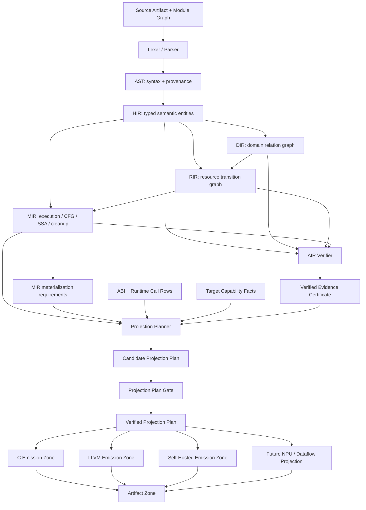

# 180. Compiler Logical Spine, Handles, And Gates

Status: `architecture-frame` (2026-07-10)

This document fixes the logical frame used to grow the compiler. It is not a
claim that every layer already satisfies the target. Current gaps are marked
`PARTIAL` or `ABSENT`.

The central rule is:

> **Stable handles, movable boundaries, gated migrations.**

Compiler ownership boundaries are not permanent folder borders. They move as a
fact gains more consumers, requires broader context, becomes cacheable, or must
survive serialization. Identity must remain stable while the owner moves, and a
gate must prevent the old owner from remaining as a second truth.

Related contracts:

- `docs/125_source_of_truth_spine.md`
- `docs/131_ai_coding_atomic_units.md`
- `docs/169_agent_boundary_sentinel_library.md`
- `docs/semantics/09_abstraction_loss_contracts.md`
- `docs/semantics/pass_contract_manifest.md`
- `docs/self_hosted/14_target_compiler_world.md`

## 0. Anchored boundary deltas (2026-07-17)

The current hardening pass makes the input-side identities explicit at their
first real consumers:

- `PgyTokenStreamHandle` fingerprints one lexer input and stamps every token
  with a monotonic ordinal. The parser rejects a token whose stream anchor
  changes, while token printing remains byte-compatible and does not expose
  the internal handle.
- `PgySourceModuleGraph` is built from the import-resolved AST's canonical
  origin paths and syntax IDs. The native driver validates the graph before
  lowering and destroys it at the pipeline boundary; it cannot silently fall
  back to a path-only module identity.
- DIR carries both `source_program_syntax_id` and `domain_graph_id`, and DIR
  validation fails closed when either anchor is absent. The graph anchor is a
  bridge until typed domain payload/entity rows move off the AST carrier.
- Semantic for-loop header facts now survive into native MIR JSON and the
  self-host MIR JSON producer. C/LLVM source-local capture and the self-host
  rung-2 producer consume the same `(function_syntax_id,
  iteration_syntax_id)` rows; no backend source-type guess is used.
- The self-host compatibility-evolution manifest is validated by the native
  diagnostic driver on the normal compile path. This validates the manifest
  shape and coverage without turning the driver into a second compatibility
  owner; diagnostic ABI trace and package-gate consumers remain a documented
  bridge.

The permanent gates for this slice are
`lexer-token-stream-anchor-test-smoke`, `source-module-graph-test-smoke`,
`iteration-type-fact-test-smoke`, `compatibility-evolution-native-test-smoke`,
and `dir-domain-identity-test-smoke`. The C/LLVM producer-first rung-2 gate
also exercises the for-range and identifier-foreach rows.

## 1. Current Logical Topology

The native compiler currently behaves approximately as this graph:

```text
source bytes
  -> lexer -> tokens
  -> parser -> AST
  -> semantic annotations on the AST
       |-> HIR indexed view + CFG
       |-> DIR domain relation graph
       |-> RIR resource/state graph
       `-> DAG type-resolution metadata
  -> HIR + RIR -> MIR CFG/SSA/cleanup/ABI facts
  -> HIR/DIR/RIR/DAG/runtime-policy facts -> AIR verification graph
  -> MIR facts augment the same AIR verification graph
  -> CompilerIRBundle(HIR, DIR, RIR, MIR)
  -> C or LLVM backend + runtime
  -> artifacts
```

This fan-out is current reality: DIR and initial RIR lowering still collect
their domain/state shape from the annotated AST, but the semantic
`ResourceFlowUniverse` has one native adapter consumer. HIR receives the
`SemanticResult` rows once, then DIR receives a copied HIR-derived snapshot
through `dir_lower_with_hir_resource_flow_facts`; RIR joins source-backed
routines by HIR source identity and consumes HIR-owned stable rows during flow
enrichment. The qualified DIR slot nodes carry declaration and owner
`SyntaxNodeId` values. RIR validation joins exact owner IDs and fails closed
when they are absent. The demanded function-parameter flow summary is likewise
snapshotted by semantic analysis and attached to HIR routines by stable
`SyntaxNodeId`; unknown routine or duplicate parameter rows fail closed. HIR is
not yet the sole semantic input for all DIR/RIR domain/state shape, so the
target diagram below is still a migration, not a description of an already
linear HIR -> DIR -> RIR pipeline.

Two decisions are already correct:

1. `CompilerIRBundle` excludes AIR. AIR is a verifier/evidence side graph, not
   a backend input.
2. Both native backends receive MIR and are progressively losing permission to
   reconstruct semantic facts from AST/source.

The main current structural debt is that the graph still uses three identity
systems at once:

- raw `ASTNode *` provenance that is sometimes still read semantically;
- names such as `slot_anchor`, owner name, or type spelling used as identity;
- owner-local `size_t` indexes with no compilation-revision or cross-layer
  handle contract.

Measured examples make this concrete:

- HIR callgraph now joins semantic declaration targets to `RoutineId`; MIR
  hosted-method/routine joins still use `(owner_name, method_name)` lookup;
- C/LLVM intent inventory permits prefix-shaped compatibility matching;
- AIR/RIR boundary evidence joins by names plus AST pointer/subtree matching;
- semantic type metadata is keyed by `ASTNode * -> Type *`, then later MIR
  stages recapture type spellings from AST;
- lexical bindings and SSA values are collapsed into name and `name.version`
  strings, so shadowing has no first-class identity;
- dynamic ABI rows can be returned from temporary ring storage and therefore
  cannot serve as durable layout/runtime-call identity.
- `ResourceFlowUniverse` snapshots function-local stable rows into
`SemanticResult`; HIR is the single native adapter consumer and carries those
  rows on the matching `RoutineId`. DIR receives only a copied HIR-derived
  snapshot through its enriched lowering entry point. Its top-level node and
  edge iteration also consumes the HIR declaration inventory; only the
  declaration payload details remain AST-backed. RIR verifies HIR's
  declaration/parameter identity before it enriches flow.
- `FunctionParamFlowSummary` snapshots demanded interprocedural rows into
  `SemanticResult`; HIR carries `(SyntaxNodeId, parameter_index, mask)` rows
  with duplicate and unknown-routine rejection. RIR now copies and validates
  those rows during HIR enrichment, and MIR materializes the same rows on each
  routine with source syntax identity, duplicate/index checks, and a
  program-level presence flag. AIR projects the MIR rows with the same stable
  identity and fail-closed presence/index checks. The self-hosted MIR JSON
  routine owner now consumes those rows and rejects malformed identity/count
  facts; full self-hosted summary parity remains the final open seam.
  The eventual HIR entity carrier for DIR's domain collection is still open.
- RIR captures each resource fact's source `SyntaxNodeId` at its initial fact
  collection boundary. HIR-to-RIR flow enrichment joins that typed ID and no
  longer derives identity from `fact->ast`; the remaining AST ownership is the
  initial RIR shape/resource collection itself, not a second identity source.

## 2. Target Logical Topology

The target is a graph of owned facts, not a linear stack of copied trees:



The `Verified Projection Plan` is the physical nerve bundle from the compiler
world into codegen. It is not a new semantic IR. It contains only target-facing
rows already justified by owner facts:

- target profile and accepted capability rows;
- ABI layout handles;
- runtime-call ABI handles;
- materialize / summarize / erase / reject decisions;
- required cleanup, panic, ownership, and source-map rows;
- the verification certificate/digest that approved the plan.

AIR validates evidence/disposition and emits a compact certificate. The
Projection Planner cites that certificate, and the Projection Plan Gate checks
the candidate plan. C, LLVM, SelfHosted, and future targets do not read AIR,
AST, or source to rebuild it.

## 2.1 Self-Hosted Program Graph Unification Contract

Status: `PARTIAL`; semantic topology repointed. This is a hard-substitution
condition, not an independent graph-cleanup project.

Objective card:

- Objective: carry one immutable expression topology from HIR through semantic
  analysis and MIR consumption instead of copying node kind, text, and child
  arrays into each stage.
- Priority: stable identity and byte-equal behavior, owner-directed facts,
  bounded lifetime and memory, old-store deletion, then physical file layout.
- Fact owner: the HIR program-graph structural owner issues expression identity;
  semantic, MIR, AIR, and backend paths consume typed overlays or projections.
- Last legitimate consumers: semantic expression verdict owners, MIR
  instruction-root projection, AIR evidence publication, and the verified
  C/LLVM/self-hosted projection lanes.
- Forbidden fallback: dual structural reads, `new ? old`, reparsing expression
  text, copying a whole-program graph per routine or instruction, aliasing
  distinct semantic identities to one integer, or raising the build-memory cap.
- Verification: the structural-owner ratchet below, bounded MIR/C byte parity,
  missing/foreign-handle rejection, and a complete full-driver MIR artifact
  under the existing 3 GiB process-tree private-memory boundary.

Target structural owner: `src/self_hosted/hir/program_graph_owner.pgy`.
The existing `AstExpressionArena` type identity moved intact to that owner, so
parser/HIR and semantic consumers share the same node ordinals. A future
`CompilationRevisionId` must scope this topology when the source/module owner
lands; this migration must not invent a substitute revision identity.
Normalized expression nodes that are not one-to-one with syntax nodes will
receive an owner-issued `ExpressionNodeId`. `SyntaxNodeId`, `EntityId`,
`TypeId`, `SymbolId`, `InstructionId`, and `ValueId` remain distinct because
their equality and lifetime contracts differ.

The target is one immutable expression topology with typed overlays, not one
flat mutable mega-graph:

| Projection | Owns | Must not own |
|---|---|---|
| HIR program graph | expression node kind, interned atom/text handle, ordered child handles, syntax provenance | type verdicts, SSA values, backend layout |
| Semantic overlay | normalized spelling plus `ExpressionNodeId -> TypeId/SymbolId/place/call/verdict` facts | copied node kind or child arrays; normalized spelling remains an explicit open overlay until text handles land |
| MIR view | instruction/root/origin handles plus MIR-only CFG/SSA nodes | a second copy of source expression topology |
| Type DAG / DIR / RIR | their typed relations keyed by stable handles | syntax-tree storage or backend recovery policy |
| AIR | evidence provider/subject/disposition references | semantic rediscovery or backend materialization decisions |
| Projection plan | verified target-facing MIR/ABI/runtime rows | AST, expression text, or AIR graph traversal |

AIR remains a verifier. CFG, the type DAG, DIR, RIR, and AIR keep their own
typed edge sets and lifetimes; "one graph" means one revision and structural
identity spine, not one node-kind enum or one always-live allocation. Routine
scratch and temporary analysis regions must still be released at their last
consumer so graph unification does not turn into whole-program retention.

Current structural storage:

| State | Owner | Current duplicate payload |
|---|---|---|
| `LANDED` | `src/self_hosted/hir/program_graph_owner.pgy` | stable `AstExpressionArena` kind/text/children topology shared by parser/HIR and semantic |
| `RETIRED` | `src/self_hosted/hir/ast_expression_graph_owner.pgy` | no structural fields; validates graph rows and node invariants over the target topology |
| `REPOINTED` | `src/self_hosted/semantic/ast_expression_graph_fact_owner.pgy` | borrows target topology; owns normalized text, call-target, and place overlays only |
| `BRIDGE` | `src/self_hosted/mir/expression_graph_fact_owner.pgy` | the same topology plus per-instruction ranges |

This is a storage-and-identity migration under the existing
`selfhost.expression_graph` semantic authority, not a second top-level fact
family. The owner move is recorded in
`docs/semantics/boundary_migration_manifest.md`, while the existing registry
authority remains `selfhost.expression_graph`; the target is classified as its
structural carrier rather than a competing semantic authority.

Migration order:

1. **Done:** lock the three legacy stores as the starting baseline.
2. **Done:** move the stable `AstExpressionArena` declaration to the target
   owner without renumbering handles.
3. **Partial:** semantic now consumes that topology and its duplicate kind/child
   arrays are deleted. Normalize text and call/place facts remain overlays;
   missing rows fail closed, and revision-scoped `ExpressionNodeId` is open.
4. Repoint MIR to instruction/root/origin handles. Delete graph-row copying and
   forbid expression-text recovery in the MIR consumer.
5. Repoint AIR and emission consumers to typed handles/projections, then retire
   the HIR compatibility owner if no legitimate consumer remains.
6. Run the pressure-owned full-driver fixed point and the unfiltered 280-row
   C/LLVM/self-hosted matrix. The first artifact/parity failure selects the next
   owner seam.

`tests/self_host_program_graph_unification_smoke.sh` is the initial negative
ratchet. Before the target exists it recognizes exactly the three historical
stores. With the target present it requires exactly two structural stores: the
program topology and the still-open MIR projection. A returned HIR/semantic
topology copy, any unregistered store, or a third owner fails the gate. The MIR
migration must tighten this same gate to one owner.

The first official pressure observation after the semantic topology repoint
remains red. A semantic-repointed snapshot completed codegen bootstrap and the
bounded seed/oracle parity, then the full driver stopped during initializer row
5,215. The pressure owner recorded 2,531.5 MB peak working set, 3,076.7 MB peak
private memory, and `driver_oracle.exe` at 3,065.9 MB private before enforcing
the 3 GiB limit. Removing the semantic kind/child copy is therefore a real
storage substitution but not the dominant full-driver lifetime closure. The
next falsifier remains routine-scoped semantic fact lifetime; MIR topology
retirement follows only after that executable boundary can be measured without
whole-program retention.

## 3. Layer Contract

| Layer | Owns | Stable output | Last legitimate consumer | Current |
|---|---|---|---|---|
| Source Artifact | canonical module identity, bytes, content digest, import relation, source spans | `CompilationRevisionId`, `SourceUnitId`, `SourceSpan` | diagnostics, compatibility, source maps | `PARTIAL`: import expansion remains driver-owned and source identity is not one stable cross-stage handle |
| Lexer/Tokens | token kind, token value, source position, lexical diagnostics | token stream scoped to `SourceUnitId` | parser and explicit token dump | `PASS` for the current lexical owner |
| AST | syntax category, concrete provenance, recovery artifact | `SyntaxNodeId` scoped to a source unit | target: HIR lowering plus diagnostics/source maps | `PARTIAL`: parser-to-AST loss is documentation-only; per-module stable IDs are assigned before import merge; AST payloads currently survive into MIR/backend debt |
| Semantic/Type DAG | binding, resolved type, generic/default/ability metadata | `EntityId`, `SymbolId`, `TypeId` mappings | HIR/DIR/RIR lowering and AIR evidence | `PARTIAL`: metadata is AST-pointer keyed and much of the semantic context is destroyed before later IR consumers, which then recapture type spellings |
| HIR | typed normalized entities, declarations, routines, scopes, body facts | `EntityId`, `TypeId`, `ScopeId` | DIR/RIR/MIR and semantic tooling | `PARTIAL`: declaration/routine IDs and CFG exist, but HIR still borrows `ASTNode *` and is not a total owning semantic IR |
| DIR | intent/domain declarations and typed relations | references to `EntityId`, domain-edge IDs, source/owner `SyntaxNodeId` | RIR and AIR verifier | `PARTIAL`: HIR owns top-level declaration inventory and DIR uses it for node/edge iteration; qualified payload slots and remaining entity/type joins are still AST/name based |
| RIR | resources, slot ownership, transfer, authority, state transitions | `ResourceId`, `BoundaryId` | MIR and AIR verifier | `PARTIAL`: HIR source identity, parameter-count facts, and stable resource rows are verified during enrichment; summary validation no longer rereads AST parameter bounds, while initial shape and `slot_anchor` joins remain |
| MIR | routines, blocks, instructions, SSA values, cleanup, cancellation, abstract materialization requirements | routine-scoped block/value/instruction handles plus ABI references | Projection Planner, AIR verifier, diagnostics | `PARTIAL`: strong CFG/dataflow facts exist; statement inventories, expressions, match payloads, and some type recovery still carry AST |
| AIR | evidence completeness, abstraction drift, compression disposition/explanation, diagnostics | `EvidenceId`, verified evidence certificate | current: driver/LSP/CI/compatibility; target: Projection Planner, Artifact Zone, verifier paths | `PASS` for backend isolation; `PARTIAL` for hosted-method boundary producer coverage and complete evidence lifetime/certificate projection |
| ABI/Target Facts | type layout, call shape, target capability, ownership/materialization policy | `LayoutId`, `RuntimeCallAbiId`, `TargetProfileId` | compiler-owned Projection Planner (single native SoT consumer) | `PARTIAL`: the planner alone reads/validates the target-capability adapter and binds its fingerprint; C/LLVM receive only the derived plan row; artifact digest and complete target-profile binding remain open |
| Verified Projection Plan | target-specific projection of already-owned facts | `ProjectionPlanId` and typed plan rows | backend emitters and Artifact Zone | `PARTIAL`: native plan row 1 maps MIR intent-observability usage to C/LLVM `OBS0/ERASE` or `OBS1/MATERIALIZE`, cites the AIR evidence certificate fingerprint, carries target-envelope plus abstract and physical machine-declaration fingerprints, and is the only row C/LLVM inspect; C/LLVM `CompilerResult` now carries the anchored plan revision/digest; persisted content digest and remaining axes are open |
| Backend | mechanical emission only | object/text/debug artifacts | linker and Artifact Zone | `PARTIAL`: AIR is excluded, but native AST/type reconstruction and backend-local compatibility paths remain |
| Runtime | only explicitly materialized state, guards, capabilities, quotas, and observability | runtime handles tied to plan rows | execution and runtime trace | `PARTIAL`: retained facilities exist; attribution and sandbox coverage are not total |
| Artifact/Compatibility | schema-versioned outputs, hashes, parity, migration policy | `ArtifactId` | cache, CI, release, migration tooling | `PARTIAL`: many schemas and a seed corpus exist; historical compatibility corpus is incomplete |
| Self-Hosted Compiler | a replacement implementation over the same handles and artifacts | the same MIR/AIR/ABI/diagnostic artifacts | bootstrap and Artifact Zone | `PARTIAL`: bounded fixed points exist; whole semantic/MIR/native-driver replacement does not |

The target-capability owner is self-hosted, but it is not self-host-only. The
compiler-owned projection planner is the single native consumer of the
immutable adapter rows in `src/compiler/target_capability_contract.c` and the
abstract machine manifest and its checked host-sim physical declaration in
`src/compiler/machine_layer_manifest.c`; it
validates both selected projections and forwards one fingerprinted plan row.
C and LLVM consume that derived row only, so their physical representations
remain backend-specific without duplicating target-envelope or machine-manifest
reads. In particular, LLVM's `DeviceSlot<T>` projection retains a distinct
named `%PgyDeviceSlot_<T>` IR aggregate instead of silently reusing the
ordinary `%PgySlot_<T>` type. Self-hosted parity is an additional owner/proof
path; it does not make
C or LLVM reinterpret the machine layer or infer a target from command-line
defaults. The current physical declaration is an explicit host-sim target
record; it is not a claim that a board/MMIO/linker source has been imported.
The self-host MIR reader validates explicit `machine_contact_kind` plus its
`machine_layer` row, and the self-host AIR validator validates
`machine_layer_sites`; both consume the native `pgy.machine-layer.declaration.v1`
artifact through `machine_layer_declaration_consumer.pgy`, including the
physical grant `base`, `size`, and access `mode`, and fail closed
on a missing or mutated row. The self-host MIR producer now carries the same
row from the semantic expression-graph call-target fact into its JSON output;
`tests/self_hosted/mir_machine_layer_smoke.sh` exercises that producer-to-reader
path for all five contacts.
The native RIR owner also exposes the same contact rows through
`--rir-json`/`rir_dump_json` as a clean `pgy.rir.v1` artifact. This is an
inspection and handoff boundary, not a second machine contract: the RIR owner
still owns classification, while later consumers validate the typed rows they
receive.

## 4. When A Handle Is Required

Do not create a handle for every struct or helper. A handle is required when at
least one of these is true:

1. identity crosses an owner or IR boundary;
2. another graph stores a reference to the fact;
3. the fact survives serialization, caching, or incremental invalidation;
4. equality changes semantic behavior;
5. the fact outlives the arena or storage that produced it;
6. a runtime artifact must point back to a compile-time reason.

Owner-local pointers and indexes remain valid implementation details when they
never escape the owner, never become serialized identity, and are invalidated
before storage mutation or destruction.

Spelling is not identity. After HIR normalization, a name string may be used for
diagnostics, mangling input, or provenance, but not as the only join key between
DIR, RIR, MIR, AIR, ABI, and runtime facts.

## 5. Minimal Handle Spine

The goal is a small set of real identities, not a collection of aliases over
`size_t`.

| Handle | Issuing owner | Meaning | Required validation |
|---|---|---|---|
| `CompilationRevisionId` | Source/Module owner | one immutable source/module graph revision | content/module digest matches every serialized child handle |
| `SourceUnitId` | Source owner | canonical module/source identity | canonical path/module row and content digest are present |
| `SyntaxNodeId` | AST owner | provenance-only syntax node within `SourceUnitId` | node exists, span belongs to source unit, parent/child graph is valid |
| `EntityId` | HIR semantic owner | declaration or domain entity identity | kind is explicit; no name-only lookup after binding; every downstream reference resolves |
| `RoutineId` | HIR routine owner | executable body identity, including specialization origin/substitution | no first-match name or prefix lookup; every call edge resolves exactly one routine |
| `SymbolId` | semantic binding owner | parameter/local/member binding identity | shadowed declarations receive different IDs; name is dump/provenance only |
| `TypeId` | Type DAG owner | canonical resolved type including generic actuals/defaults | resolver row exists; no backend string reconstruction |
| `ScopeId` | HIR owner | lexical/semantic scope | parent scope is valid and every local belongs to one scope |
| `ResourceId` | RIR owner | resource/slot/view ownership identity | state machine and owning entity exist |
| `RirOpId` | RIR owner | one resource transition operation | operation belongs to one resource/scope and remains addressable after storage growth |
| `BoundaryId` | RIR boundary owner | authority/concurrency/transfer/IO boundary | producer site, capture facts, and required evidence are total |
| `BlockId` / `InstructionId` | MIR owner | routine-scoped CFG/instruction identity | ID belongs to one `RoutineId`; DCE and rewrites reject dangling references |
| `ValueId` | MIR owner | one SSA definition/result identity | every use and phi input resolves one dominating value; spelling is dump-only |
| `LayoutId` | ABI owner | target-specific type representation row | target, size, align, fields, ownership, tag/niche policy are complete |
| `RuntimeCallAbiId` | ABI owner | logical operation to calling convention/symbol row | argument/return layout handles and target availability exist |
| `TargetProfileId` | Target capability owner | one target capability and ABI policy set | target facts and fallback/reject reasons are complete |
| `ProjectionPlanId` | Projection Planner | immutable target plan over MIR/ABI/target facts | AIR evidence certificate matches; Projection Plan Gate proves every row cites owner handles |
| `EvidenceId` | AIR owner | evidence node with typed provider and subject references | producer, subject, last consumer, and disposition are known |
| `ArtifactId` | Artifact Zone | schema + producer + target + content digest identity | content hash and producing plan/revision are recorded |

Do not create aliases that merely rename the same index. Create a separate
identity only when lifetime or equality is genuinely different. In the current
compiler, `RoutineId`, `SymbolId`, and `ValueId` meet that test: generic routine
specialization, lexical shadowing, and SSA definitions are not the same entity
relation as a source declaration.

## 6. Boundaries Must Be Allowed To Move

A growing compiler will discover that an earlier boundary was too narrow. This
is expected. The architecture fails only when both boundaries remain valid
sources of truth.

Typical migration signals:

- two or more consumers repeat the same derivation;
- a consumer lacks context and rescans source/AST/program roots;
- a fact must survive longer than its owner's arena;
- a codegen helper starts resolving declarations or generic defaults;
- a backend needs a semantic fact that MIR does not carry;
- incremental invalidation needs stable identity across files or passes;
- an owner grows unrelated mutable resources or exceeds the responsibility cap;
- a runtime check exists because no compile-time owner exposes the decision.

The recent local-binding migration is the canonical example:

```text
old: codegen-local Let name/type/initializer owner
signal: semantic and multiple codegen consumers require the same binding fact
new: artifact-bound semantic local-binding owner
bridge: explicitly named initializer-provenance view only
retired: old codegen owner and name/type fallback
```

### Boundary Migration Protocol

Every ownership move follows this order:

1. **Declare** the fact set, old owner, new owner, stable handle, and last
   consumer.
2. **Produce** the new owner facts without changing consumers.
3. **Compare** old/new facts on positive, negative, nested, generic, and stale
   artifact fixtures.
4. **Repoint** consumers one at a time to the new owner.
5. **Fail closed** when the new fact is missing; never use `new ? old`.
6. **Delete** the old producer/accessor rather than leaving an alias.
7. **Ratcheting gate** rejects the old symbol, source rescan, and fallback.
8. **Update** owner, loss, lifetime, compatibility, and self-host manifests.

An allowed migration bridge is one-way and typed. It may expose provenance or a
fact not yet promoted, but it cannot decide the migrated fact and cannot fall
back to the old owner.

### Boundary Migration Gate

The repository has one manifest-backed gate with these fields:

```text
migration_id
fact_kind
stable_handle
old_owner
new_owner
allowed_bridge
forbidden_old_reads
consumer_inventory
parity_fixture
negative_fixture
retirement_gate
status: shadow | repointing | mandatory | retired
```

`retired` is valid only when the old producer is absent and the negative gate
proves it cannot return.

The live ledger is
[`semantics/boundary_migration_manifest.md`](semantics/boundary_migration_manifest.md),
and `make boundary-migration-test-smoke` is blocking on Linux, macOS, and
Windows CI. The first retired row records the self-hosted local-binding owner
migration; later rows must reuse this contract instead of inventing a second
migration vocabulary.

## 7. Gate Map

| Gate | Protected boundary | Current | Missing closure |
|---|---|---|---|
| Source/Parser Artifact Gate | bytes/tokens -> AST | `ABSENT` dedicated enforcement | stable source/syntax handles, recovery artifact totality, raw-source reread rejection |
| Boundary Migration Gate | compiler owner movement | `LANDED`; manifest-backed and blocking CI | add each live owner move before shadow facts are consumed; keep all retired paths absent |
| Stable Identity Gate | AST/HIR/DIR/RIR/MIR/AIR joins | `PARTIAL`; merged-program `SyntaxNodeId`, semantic declaration placeholders, and HIR `RoutineId` call edges are blocking CI | add revision/source-unit identities; exact method/boundary/type/binding/value joins; stale/foreign ID rejection; remaining name/prefix/AST join prohibition |
| HIR Totality Gate | AST -> typed semantic entities | `PARTIAL` | every stable declaration/local/body/type fact owned without semantic AST fallback |
| DIR Referential Gate | HIR entity -> domain graph | `PARTIAL`; source/owner `SyntaxNodeId` is carried and the RIR join is exact, but collection is still AST-owned | make HIR/entity facts the input; typed references replace name/AST joins; edge totality corpus |
| RIR Transition Gate | HIR/DIR resource facts -> state graph | `PARTIAL`; current initial lowering is AST-owned | remove AST-call recovery in validation; stable resource/boundary handles across join/loop/transfer/authority cases |
| MIR Verifier Gate | HIR/RIR -> executable graph | `PARTIAL`, comparatively strong | eliminate residual AST statement/expression/type recovery; complete cleanup/cancellation/body facts |
| AIR Evidence Lifetime Gate | owner facts -> proof/disposition | `PARTIAL`; enum/manifest gate is not blocking CI | hosted-method/expression boundary producer totality; all evidence kinds prove producer, last consumer, erase/summarize/retain/reject behavior and the gate is CI-required |
| Projection Plan Gate | certified evidence + MIR/ABI/target facts -> target plan | `PARTIAL`; `make verified-projection-plan-test-smoke` blocks the first native intent-observability row | bind AIR certificate/digest, layout/cleanup/capability rows, Artifact Zone identity, and self-hosted consumption |
| ABI/Runtime Call Gate | type/op -> target ABI | `PARTIAL` | every aggregate/generic/runtime callsite consumes `LayoutId`/`RuntimeCallAbiId`; active LLVM Slot/resource consumers now validate concrete MIR rows and call shapes through one owner; constructed nominal materialization remains an explicit compatibility edge, never an implicit symbol fallback |
| Backend Dumb-Emitter Gate | MIR/plan -> C/LLVM | `PARTIAL` | forbid all AST/HIR/AIR semantic recovery and backend-local layout/materialization decisions |
| Materialization Residue Gate | plan -> runtime symbols/state | `PARTIAL` | every retained symbol cites a plan row; erase fixtures contain zero forbidden residue |
| C/LLVM/SelfHosted Parity Gate | peer projections -> artifacts | `PARTIAL`, broad bounded coverage | same plan, ABI, diagnostics, trace, and behavior for whole stable corpus |
| Determinism/Incremental Gate | revision/handles -> cache | `PARTIAL`; collection determinism is CI-backed but double-emit codegen determinism is not | import-graph fingerprints, stable handle ordering, precise invalidation, bounded cache ownership |
| Sandbox Gate | untrusted plan -> runtime | `PARTIAL` | default deny, signed/content loader, file/network chokepoints, full frame/host-call quotas |
| Compatibility Gate | old artifact -> new compiler/runtime | `PARTIAL` seed corpus | real historical source/MIR/AIR/ABI/diagnostic/trace/capability artifacts and migration targets |
| Bootstrap Gate | compiler source -> self compiler | `PARTIAL` | whole semantic/MIR/driver replacement plus gen1/gen2/gen3 artifact equality |
| Build Resource Budget Gate | compiler/test graph -> host resources | `PARTIAL` | per-stage RSS/disk/process caps, isolated impact plan, bounded parallelism, leak-vs-work amplification diagnostics |
| Program Graph Unification Gate | HIR expression identity -> semantic/MIR typed views | `PARTIAL`; semantic topology repointed and the exact two-owner state is blocking | remove the MIR topology copy, bind the owner to revision-scoped handles, reject missing/foreign handles, and complete the full driver below 3 GiB |

## 8. Highest-Value Missing Choke Points

### P0-A. Stable Cross-Layer Identity

Introduce `CompilationRevisionId`, `SourceUnitId`, `SyntaxNodeId`, `EntityId`,
`RoutineId`, `SymbolId`, `TypeId`, `ResourceId`, `RirOpId`, `BoundaryId`, and
MIR `ValueId` as owner-issued records. Start by carrying them beside current
pointers/strings, then retire semantic pointer/string joins one owner at a time
through the migration protocol.

The negative corpus now covers same-name hosted and top-level routines for HIR
callgraph linkage. It must expand to receiver/method joins, `Foo` versus
`Foo_T` prefix collision, nested shadowing with different
types, multiple boundaries on one source line, stale/foreign IDs, parser ID
overflow, and ABI call-shape mismatch.

The first parser migration must assign program-wide IDs after import merge or
use `(SourceUnitId, local_node_id)` identity. Per-module counters restarted at
one cannot be used as merged-program identity or backend symbol entropy.

### P0-B. HIR Semantic Totality

HIR must stop being only an indexed borrowed AST view. Function signatures,
local declarations, and the first ResourceFlowUniverse stable-symbol carrier
have begun the move. Assignment/use/expression/body facts, scope/type
references, declaration identity, and a Semantic/Type DAG lifetime that
survives lowering are the next required owners.

### P0-C. DIR/RIR Input Ownership

Rebase DIR and RIR construction on HIR/entity facts instead of independent AST
rescans. The first identity seams are now landed: DIR consumes the semantic
HIR owns the `ResourceFlowUniverse` snapshot and its qualified slots carry
source/owner `SyntaxNodeId`; DIR receives only the HIR-derived carrier, while
RIR validation rejects missing owner identity instead of joining by owner name.
RIR captures its initial resource-fact IDs once and HIR-owned `parameter_count`
bounds RIR function-flow summaries without an AST reread. For the machine
boundary specifically, MIR now carries a typed `machine_layer_fact_required`
bit from the RIR contact owner; once RIR declares a contact, MIR validation
does not recover contact identity by scanning AST/source call names.
Remove the remaining AST domain collection, initial resource shape collection,
and AST-call recovery paths and extend the missing-fact corpus. Until that
closes, the target HIR -> DIR -> RIR spine is a design contract rather than the
native data path.

### P0-D. Verified Projection Plan

Extend the native plan owner beyond its first gate-backed intent-observability
row. That row turns the canonical MIR inventory fact plus the shared
runtime-call ABI rows into C/LLVM `OBS0/ERASE` or `OBS1/MATERIALIZE`, and now
requires an AIR evidence certificate whose fingerprint still matches the AIR
owner facts. It also binds the abstract machine-layer manifest and checked
physical host-sim declaration fingerprints, so machine contact projection
cannot be silently changed behind the plan. Missing or mutated facts fail
closed. The single native planner consumer reads the target-capability envelope
and both machine declaration rows, so target defaults and command guessing are
not an allowed native fallback. C and LLVM receive only the verified plan row.
The remaining work is a persisted
cryptographic/artifact identity plus ABI layout, cleanup, target capability,
Artifact Zone, and self-hosted rows in one immutable plan. Backends receive the
verified plan, not AIR.

This closes the current wording tension between "AIR is verification-only" and
"a backend needs a proof-gated compression/materialization decision."

### P0-E. Backend Recovery Elimination

Remove the C MIR resource-hook AST type reconstruction and complete the native
consumer inventory. A missing plan/layout/type row must be a structured backend
error, never an AST rescan or default C type.

### P0-F. Boundary Migration Gate

Make ownership movement first-class so compiler growth does not leave aliases,
dual reads, or compatibility fallbacks behind. Use the local-binding migration
as the first committed manifest row.

### P1. Parser, Artifacts, Compatibility, And Resource Budgets

Close parser-to-AST loss, stable module/source identity, historical
compatibility artifacts, incremental fingerprints, and build RSS/disk/process
budgets after the identity and projection spines exist.

## 9. Required Contract Template

Every new layer, fact owner, or boundary migration must fill this frame:

```text
Owner:
Input artifacts:
Owned facts:
Issued handles:
Preserved facts:
Allowed loss:
Last legitimate consumers:
Allowed bridge:
Forbidden recovery:
Verifier:
Positive fixture:
Negative fixture:
Migration trigger:
Retirement gate:
Serialization/version policy:
```

If the owner, handle, last consumer, and negative gate cannot be named, the
boundary is not ready to become architecture.

The accepted whole-spine instances of this template are registered in
`docs/semantics/sot_owner_spine_registry.md`. New top-level fact families must
extend that registry and `SoTAuthority.v` in the same change. Moving an existing
owner uses `boundary_migration_manifest.md`; it must not create a second owner
row or a second handwritten self-host registry.

## 10. Execution Order

Do not implement all handles at once.

1. **LANDED:** boundary-migration manifest/gate and the completed local-binding
   move are blocking CI.
2. **PARTIAL:** merged-program `SyntaxNodeId` is unique and fail-closed; add
   semantic declaration placeholders now match by that ID rather than source
   coordinates; add source/revision/entity handles in shadow mode with parity
   checks.
3. Move HIR declaration/local/body/type facts behind those handles.
4. Carry resource/boundary handles through DIR -> RIR -> MIR -> AIR.
5. Add the Verified Projection Plan over existing ABI/runtime-call/target rows.
6. Repoint C, LLVM, and self-host emitters to the same plan.
7. Delete AST/string recovery paths and lower ratchets to zero.
8. Expand compatibility, incremental, materialization, sandbox, and build-budget
   gates over the stable handle spine.

This order lets boundaries evolve without freezing today's physical folder
shape as tomorrow's semantics.
