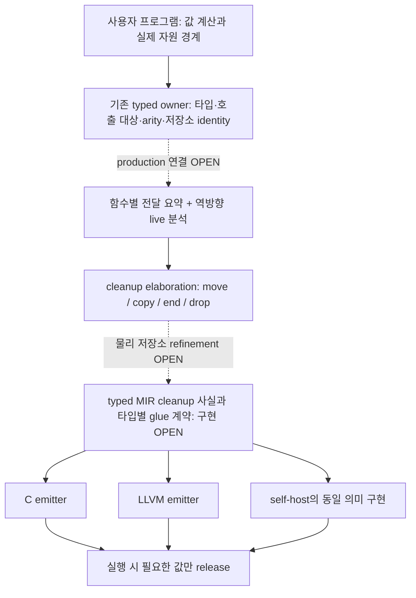
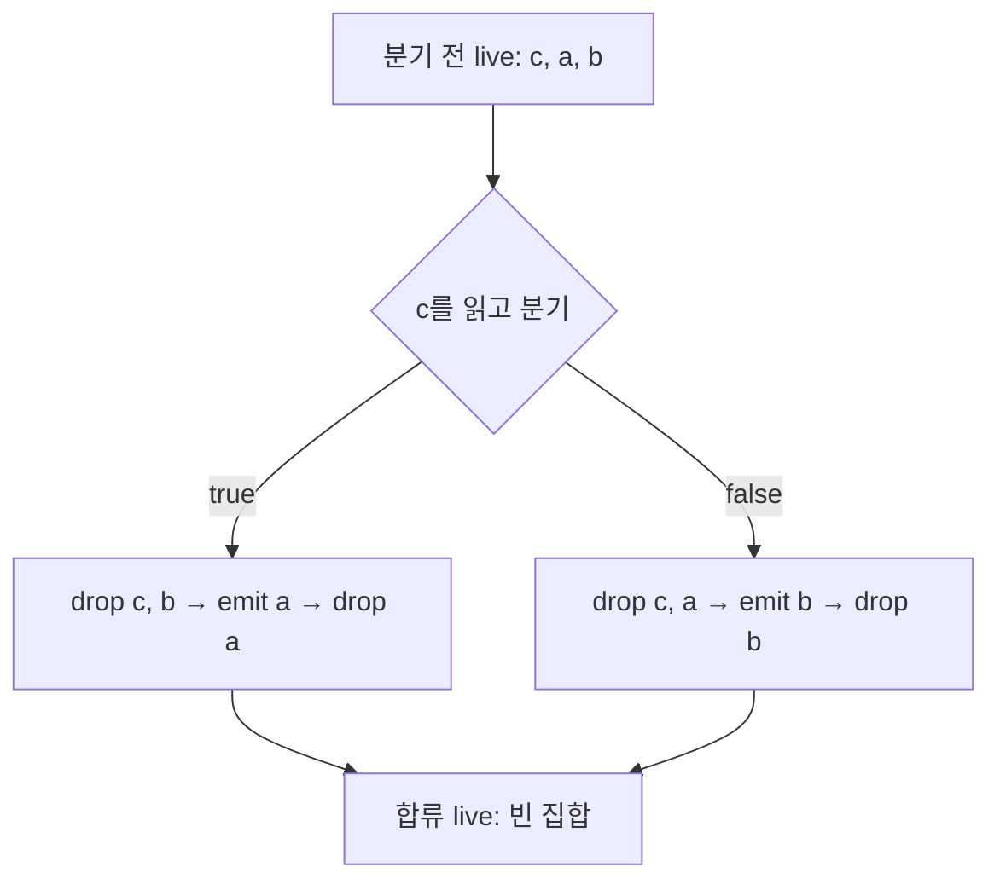
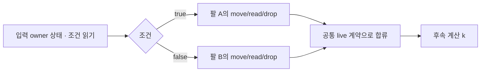
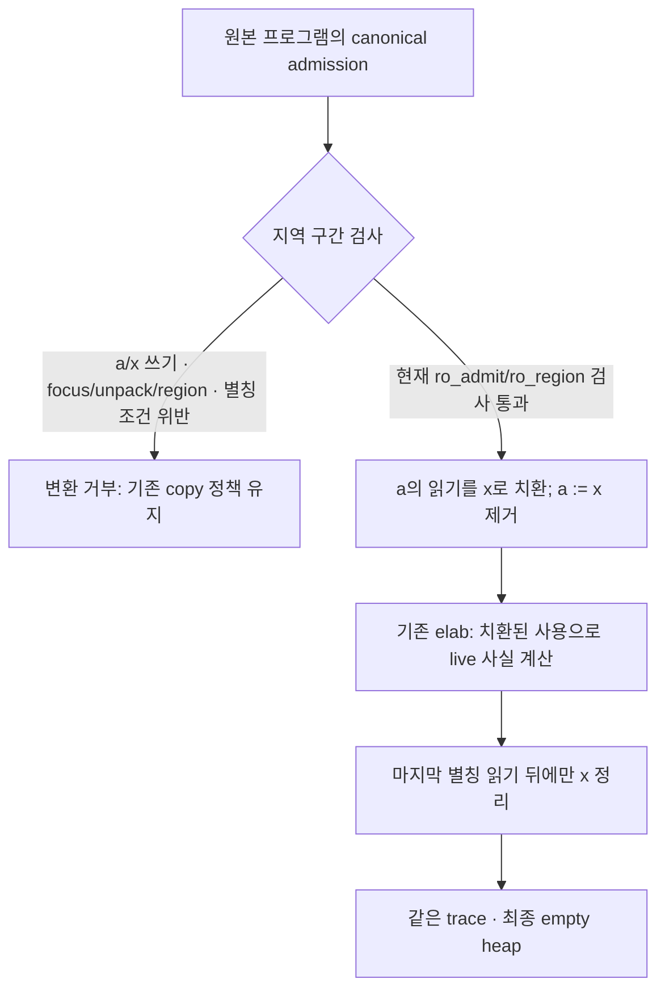

# 핵심 알고리즘: Compiler-Owned Ownership Cleanup

검토일: 2026-10-08. 분류: **core compiler algorithm / 설명 문서**.
상태: **bounded formal core checked; compiler/runtime implementation OPEN**.

컴파일러가 값의 사용 관계를 분석해 소유권 이전과 해제를 삽입한다.
사용자는 정상적인 값 계산을 작성하고, 컴파일러는 **어떤 저장소를 누가
소유하며 언제까지 필요한가**를 보존한다. 실행 중 전체 힙을 탐색하는 GC나
전역 참조계수를 이 알고리즘의 기본 수단으로 삼지 않는다.

이 문서는 새로운 의미 규칙이나 MIR 스키마의 소유자가 아니다.
언어 정책은 [Ownership Clean](semantics/27_ownership_clean.md), 실제 수학적
정의는 [OwnershipCleanCore.v](semantics/proofs/OwnershipCleanCore.v)가 소유한다.
논문에서 가져올 후보와 검토 기록은
[최신 연구 적용성 검토](audits/2026-10-08_ownership_cleanup_recent_research.md)에 있다.
설계 이유는 이런 외부 문서에 남기며, 언어에는 검증 가능한 계약만 둔다.

## 1. 검토 목표와 소유권 경계

| 항목 | 이번 문서의 기준 |
|---|---|
| 목표 | 자동 cleanup의 결정 절차, 보장, 구현 공백을 같은 예제로 설명한다 |
| 우선순위 | 값 의미와 단일 소유권 → 안전한 해제 → 불필요한 사용자 의식 제거 → 비용 |
| 사실 소유자 | 의미 정책 `27_ownership_clean.md`; 모델 `OwnershipCleanCore.v`; 구현 사실은 도달한 typed/MIR owner |
| 마지막 소비자 | 목표 구현에서는 C/LLVM 및 self-host emitter가 같은 admitted cleanup 사실과 타입별 glue를 소비한다 |
| 금지 경로 | 얕은 descriptor 복사를 독립 소유자로 취급하기, backend별 재추론, 누락된 사실을 borrowed/owned로 추측하기 |
| 검증 | 고정 소스의 Rocq 커널 검사, 정식 알고리즘을 직접 호출하는 예제, 이후 동일 입력의 실제 C/LLVM·self-host 메모리 검사 |
| 반례 | 마지막 사용 전 해제, borrowed 값 해제, 중복 owner, 분기 누락, 잘못된 loop certificate, 호출 후 별칭 사용 |

이 문서는 설명과 검토를 맡는다. §9–10의 후속 증명·추출 코드도 현재 열려 있는
production 구현 작업을 대신하거나 새로운 병렬 구현 트랙을 열지 않는다. 실제 교체 순서는
[기존 work split](agent_work_directives/ownership_clean_work_split_2026-10-08.md)을 따른다.

## 2. 전체 원리: 분석 결과를 실행 가능한 해제로 내린다

아래는 **목표 구현 연결도**다. 점선은 현재 모델에서 production까지 아직
입증하지 못한 연결이다. 상자가 존재한다는 것만으로 구현 완료가 아니다.



컴파일 시에는 사용·전달·해제 계획을 계산한다. 실행 시에는 선택된 경로의
해제 코드만 돈다. 배열 원소를 순회하는 drop glue는 있을 수 있지만, 이를
전체 힙 추적과 혼동하면 안 된다. 증명 속 `H`와 `R`도 런타임 전역 힙
레지스트리를 구현하라는 지시가 아니라 안전성을 기술하는 수학적 상태다.

Slot의 generation·authority·resource lifecycle와 일반 값의 저장소 cleanup은
다른 계약이다. 이 알고리즘으로 Slot을 대체하거나 모든 값을 Slot에 넣지 않는다.

## 3. 알고리즘의 입력과 불변식

고정하여 검사한 모델의 진입점은 다음과 같다.

```text
elab(M, statement, L, B) = Some(target, live_before) | None

M : 함수/프로시저 인자의 borrowed 또는 sink 전달 모드
L : 이 문장을 마친 뒤에도 필요한 변수 집합
B : 현재 프레임의 borrowed 매개변수 집합
```

`sink`는 인자를 소비하는 **내부 전달 방식**이다. 새 사용자 키워드를
요구하자는 뜻이 아니다. `B`는 이 코어의 borrowed 매개변수이며,
임의의 지역 loan·멤버 경로·탈출하는 참조를 모두 표현하지는 않는다.

핵심 불변식 `INV`와 `CORR`를 읽기 쉽게 줄이면 다음과 같다.

```text
live heap = 현재 프레임 owner들의 footprint ⊎ 바깥 프레임의 footprint R
borrowed footprint ⊆ R
소유 binding = L - B, borrowed binding = L ∩ B
문장 경계에 compiler temporary가 남지 않음
관찰하는 값과 출력 trace는 원본 값 의미와 같음
```

`⊎`는 중복 소유가 없는 결합이다. **동일 블록에 owner가 둘이면 안 된다**는
뜻이지, 읽기 borrow 두 개가 같은 저장소를 가리키면 안 된다는 뜻은 아니다.
타입/호출 이름/arity 검사는 선행 의미 분석의 책임이다. `elab`가 성공했다는
사실만으로 입력 프로그램 전체가 유효하다고 결론 내릴 수 없다.

## 4. move/copy와 cleanup을 결정하는 절차

### 4.1 뒤에서 앞으로 필요한 값을 계산한다

`s1; s2`는 `s2`를 먼저 분석하고, 그 입력 live 집합으로 `s1`을 분석한다.
문자열 변수명이나 소스 줄 수가 아니라 구분된 값 identity를 대상으로 한다.
실제 구현은 재할당·부분 초기화·멤버 경로의 identity를 먼저 명확히 해야 한다.

```text
(t2, L2) = elab(M, s2, L_after, B)
(t1, L1) = elab(M, s1, L2,      B)
result  = (t1; t2, L1)
```

### 4.2 소유권이 필요한 사용에서 값을 유지해야 하는지 판단한다

모델의 `keep(L,B,y) = (y ∈ L) or (y ∈ B)`다.
다음 표는 **복사·aggregate 삽입·sink 전달**에 대한 결정이다.
단순 읽기까지 모두 복사하는 규칙이 아니다.

| 상황 | 모델이 만드는 동작 | 지켜야 할 사실 |
|---|---|---|
| owned `y`가 이후 불필요 | `TMove` 또는 소비 연산으로 이전 | 원래 binding은 더 이상 owner가 아님 |
| `y`가 나중에도 필요 | 새 독립 값으로 `TCopy` | 같은 backing을 두 owner가 공유하면 안 됨 |
| borrowed `y`를 소유해야 함 | `TCopy` | 빌린 저장소를 이동·해제하지 않음 |
| pack/push/sink가 유지 중인 값을 소비 | 임시 값에 copy 후 임시 owner를 이전 | 임시는 사용자 코드에 나타나지 않음 |
| 죽은 owned binding | `TDrop` | 그 binding의 footprint만 한 번 해제 |
| 죽은 borrowed binding | `TEnd` | borrow만 끝내고 원래 owner의 힙은 그대로 |

언어의 D1 정책은 이 무타입 모델보다 좁다. 타입별 결정은 다음처럼 적용되어야
하며, **이 정책과 물리 glue를 모델에서 실제 구현으로 연결하는 작업은 OPEN**이다.

| 타입 분류 | 독립 복사가 정말 필요할 때 |
|---|---|
| 스칼라 및 재귀적으로 trivial인 값 | 값 복사; 힙 drop 없음 |
| `String`, trivial/implicit-copy 부분만 갖는 aggregate | compiler-owned deep copy |
| collection 또는 collection을 포함한 aggregate | D1에 따라 명시적 `Clone` |
| affine handle | 복사 불가 |

먼저 마지막 사용의 move가 가능한지 본다. 읽기만 하는 겹침을 borrow로
대체하는 최적화는 해당 증명과 escape·mutation 검사가 갖춰졌을 때만 쓴다.
현재 증명은 그 최적화가 모든 경우에 가능하다고 보장하지 않는다.

### 4.3 문장 뒤에서 불필요해진 binding을 정리한다

```text
settle(A, L, B):
    for each distinct variable v in (A - L):
        if v in B: emit EndBorrow(v)
        else:      emit Drop(v)
```

여기서 `A`는 그 지점에 실제로 남아 있는 binding 집합이다. 이미 aggregate로
move한 원본을 `A`에 다시 남기면 중복 해제가 된다. 모델은 각 연산의 이동
결과에 맞게 `A`를 구성한다. `settle_tail`은 `L`에 남는 공통 꼬리를 release
후보에서 생략할 수 있음을 보인다. 이것이 전체 분석의 선형 시간 증명은 아니다.

### 4.4 값이 사라지는 것이 아니라 해제 책임이 이동한다

아래는 `String → Label → Array<Label>`의 **모델 수준 예시**다.
실제 Pergyra 문법이나 완성된 MIR 출력이 아니다.


원래 `text`와 `Label`에 따로 drop을 더하지 않는다. 반대로 원래 `text`를
나중에 다시 읽으면 이전 전에 독립 복사가 필요하다. checked GUI 모델은
sink 호출 경로에서 재사용이 없을 때 0회, 원본 문자열 재사용 시 1회의
`TCopy`를 보인다. 이는 추상 연산 수이지 실제 malloc/free 횟수 측정이 아니다.

## 5. 분기와 반복이 안전해지는 원리

### 5.1 분기: 선택되지 않은 경로만 필요한 값도 정리한다

예시 입력은 `if c then emit(a) else emit(b)`이고 이후 사용은 없다.
세 값이 owned라면 각 분기는 다음처럼 정리된다.
여기서 `drop c`는 모델의 추상 값 정리다. 실제 trivial `Bool`에 힙 해제를
삽입한다는 뜻은 아니다.



일반식은 `Lin = {c} ∪ Lthen ∪ Lelse`이며, 각 arm 앞에서
`settle(Lin, Larm, B)`를 넣는다. arm의 끝은 같은 `Lafter`에 맞춰져 있으므로
다음 문장이 어느 분기에서 왔는지 추측하지 않는다.

이 **structured·whole-value·정상 종료 코어**는 runtime drop flag 없이
증명되었다. 부분 초기화, 임의 CFG, 예외 종료에서도 flag가 절대 필요 없다는
주장으로 확대하면 안 된다.

### 5.2 반복: loop head의 live 집합을 검사한다

모델은 loop solver가 제시한 집합 `h`를 받아 다음을 검사한다.

```text
body를 live_after = h로 분석 → Lbody
검사: Lbody ⊆ h, Lafter ⊆ h, condition ∈ h
실행: while condition { settle(h, Lbody, B); compiled_body }
종료: settle(h, Lafter, B)
```

셋 중 하나라도 빠지면 거부한다. 반복 중 필요한 값을 보존하고 종료 경로에서
남은 값을 정리하는 조건이다. `h`가 보수적으로 크면 값이 더 오래 유지될 수
있으므로 “모든 값이 가능한 가장 이른 순간에 해제된다”는 최적성 정리는 아니다.
유한 종료를 전제하는 big-step 모델이어서 무한 실행의 모든 prefix 안전성도
별도로 다뤄야 한다.

## 6. 함수 경계: borrow, sink, inout

| 전달 방식 | 호출자의 책임 | callee의 책임 |
|---|---|---|
| borrowed | 원래 owner를 유지 | 읽기; 소유 결과가 필요하면 독립 copy; 원본 drop 금지 |
| sink | 마지막 사용이면 move, 유지가 필요하면 허용된 copy | 받은 owner를 결과/저장으로 이전하거나 정리 |
| inout | 대상 owner를 잠시 callee로 이전 | 갱신한 owner를 반환; 단순 왕복 자체에 copy 불필요 |

호출 지점에서는 `K = borrowed_actuals ∪ (Lafter - result)`도 유지 조건에
포함한다. 같은 값이 sink 인자와 읽기 인자로 동시에 쓰이면 나중에 안 쓴다는
이유만으로 원본을 먼저 없애면 안 된다.

`infer_modes`는 저장·수정·반환·다른 sink로의 전달을 보고 모드를 만든다.
검사한 코드에서 이 함수는 **한 번의 전파 단계**다. 호출 사슬이나 상호 재귀를
처리하는 production 구현은 전체 요약이 안정될 때까지의 고정점 및 그 admission을
소유해야 한다. 3단계 호출 사슬이 한 번의 추론으로 끝나지 않는 예제를 확인했다.

모드 추론기를 믿어서 안전성을 얻는 것은 아니다. `elab_sound`는 주어진 모드로
모든 callee 본문이 admit되었다는 조건을 요구한다. 모델의 짧은 모드 목록을
borrowed로 해석하는 규칙도 production에서 “요약 누락 시 borrowed fallback”을
허용한다는 뜻이 아니다. 미정 요약과 검증된 borrowed는 구별해야 한다.

## 7. 증명된 것과 아직 연결해야 할 것

| 항목 | 현재 확인된 범위 |
|---|---|
| `elab_sound` | source 실행, callee admission, `INV/CORR` 전제 아래 target 실행·trace 보존 |
| `closed_program_frees_everything` | admit된 유한 정상 종료 closed 프로그램의 추상 힙이 비어 있음 |
| `heap_is_live_footprint` | 중복 소유·owner 없는 블록이 없는 프레임 불변식 |
| 네 가지 반례 정리 | 얕은 alias copy, 이른 drop, borrowed drop, settle 누락의 문제를 구분 |
| GUI sink 예제 | 호출을 통한 0-copy 이동, 재사용 시 1-copy, 최종 empty heap |
| D1 타입별 copy/drop | 정책은 선택됨; abstract core에서 실제 타입·레이아웃으로의 연결 OPEN |
| early return/break/continue/error/panic, 부분 초기화 | 이 코어의 syntax/정리 범위 밖 |
| 일반 loan, member-path inout, region, async, FFI | 추가 계약·증명·구현 필요 |
| 실제 누수/UAF, peak RSS, self-host DRV-2 | 이 모델 검사로 입증되지 않음 |

특히 `TE_Copy`와 `TE_Field`는 순수 값 내용과 새 추상 블록을 만든다.
이것은 중첩 `Array<struct{String,...}>`의 allocator provenance, backing,
active variant, 초기화된 원소를 실제로 순회하는 코드를 증명한 것이 아니다.

현재 [native MIR 진입점](../src/compiler/driver_app.c)은
[`mir_lower`](../src/compiler/mir.c)를 사용하고,
[`mir_cleanup.c`](../src/compiler/mir_cleanup.c)에는 RIR resource/intent cleanup
경로가 있다. 이것을 범용 collection/value 자동 cleanup pass로 세면 안 된다.
[`llvm_expr_aggregate.c`](../src/codegen/llvm_expr_aggregate.c)의 nested-array
경로에는 아직 no-free 전제의 shallow backing 공유가 명시되어 있다.
여기에 drop만 붙이는 것은 올바른 이행이 아니다.

기존 `Clone<Array<String>>`은
[`PGY_ARRAY_COPY_VALUE_String`](../src/runtime/pgy_runtime_memory_array_slot_inline.h)을
통해 문자열을 복제한다. 따라서 “현재 Clone은 전부 shallow”도 부정확하다.
부족한 것은 타입별 전체 물리 소유권 계약과 모든 도달 소비자의 일관된 이행이다.

## 8. 검증 기록과 구현 착지 조건

검토 기준 HEAD: `3658548d24bca3d721e4f1974ac7a10da99f7aa8` + 보존된 dirty tree.
고정 모델 SHA-256:
`f8ac63cf9a9a47389863761b3c84a49279b7e683f807956950844bc3d0d69d00`.

- Rocq 9.3.0 / Stdlib 9.2.0에서 해당 모델의 fresh compile + kernel recheck PASS.
  이 isolated 검사에서 axiom/admit/unsafe feature 없음.
- 같은 소스를 사용한 문서용 15개 예제도 2-module kernel 검사 PASS.
  move/copy/end, 분기, loop의 세 거부 조건, sink 전파, 중복 sink, 미해결 호출,
  GUI 0/1-copy 및 empty heap을 확인했다.
- `tests/ownership_clean_direction_smoke.sh` PASS: 폐기한 owner 27개와 두 번째
  모델이 되살아나지 않았다는 **구조 검사**다.
- 최초 검토의 `tests/ownership_cleanup_smoke.sh`는 모델 커널 검사 뒤 기존
  OCaml observer의 API 불일치로 FAIL했다. 아래 §9의 후속 작업은 observer를
  `elab M s L B`와 새 routine 결과 형식에 맞췄다. 과거 15/24/30 receipt를
  새 모델의 실행·성능 결과로 재사용하지 않는다.

예제와 재실행 명령은
[검토 기록](audits/2026-10-08_ownership_cleanup_recent_research.md#local-verification)에 있다.
OCaml은 여기서 Rocq 추출 코드의 검증 observer일 뿐, Pergyra 컴파일러의
구현 언어를 바꾸려는 계획이 아니다.

실제 완료에는 다음 순서가 필요하다. 이것은 새 연구 트랙이 아니라 기존
C1/C2/C3/G3/C5/G4/C6 경계에 필요한 증거다.

1. 같은 소스 hash로 proof·observer·문서의 API를 맞추고 음성 검사를 통과한다.
2. admitted typed ownership/place/storage/exit 사실과 MIR cleanup/glue 계약을 확정한다.
3. 실제 native C/LLVM에서 동일 프로그램의 값 결과·move/copy/drop·누수/UAF를 확인한다.
4. self-host도 같은 의미로 교체하고 installed driver·bootstrap·CI를 확인한다.
5. 마지막 소비자까지 교체된 뒤에만 수동 release/carrier/분석 우회 경로를 삭제한다.

문서 등록이나 수학적 모델의 PASS만으로 SoT CLOSED, 완전 self-hosted,
GUI 준비 완료를 선언하지 않는다.

## 9. 순차 합성과 분기: 모나드에서 가져올 것

2026-10-08 후속 요청으로
[OwnershipCleanComposition.v](semantics/proofs/OwnershipCleanComposition.v)를
추가했다. 기존 `OwnershipCleanCore`를 import하여 같은 `TStmt`와 `texec`를
쓴다. 별도 힙, 별도 소유권 규칙, 새 언어 문법은 만들지 않았다.

### 9.1 합성 법칙은 효과를 지울 수 있는 조건을 분명하게 한다

현재 문장 기계에서 순차 합성은 **값 결과가 unit인 state/trace bind**처럼
볼 수 있다. 아래 `;`와 `≈`는 설명용 표기이며 Pergyra 문법이 아니다.

```text
Skip ; k                 ≈ k
k ; Skip                 ≈ k
(a ; b) ; k              ≈ a ; (b ; k)
(if c then a else b) ; k  ≈ if c then (a ; k) else (b ; k)
```

이들은 `cleanup_left_unit`, `cleanup_right_unit`, `cleanup_associative`,
`cleanup_branch_bind`로 증명된다. 마지막 식은 **선택된 팔과 k만 실행한다**.
양쪽 팔을 이어 실행하거나 `k`를 조건 검사 앞으로 옮긴다는 뜻이 아니다.
임의 결과 타입을 가진 전체 monad/HKT 체계를 증명한 것도 아니다.



[Capture Now, Consume Later의 효과 연산](https://arxiv.org/html/2510.08939v2)
도 순차 합성과 비순차 join을 구분한다. 다만 그 논문의 idempotent free를
Pergyra의 물리 해제에 적용하지 않는다. 아래 반례는 논문 전체의 재현이 아니라
우리 기계의 이 차이를 직접 확인하는 증거다.

| 반례 | 이 기계에서 지켜야 할 것 |
|---|---|
| `if c then Skip else Skip`, 그런데 c가 없음 | Skip으로 바꾸면 실패가 성공이 된다. 조건 검사를 유지한다. |
| `if c then Drop(x) else Drop(x)` | 선택된 팔에서 한 번만 해제한다. 두 팔의 Drop을 순차 실행하면 거부된다. |
| `Emit(x); Emit(x)` | 출력 두 번이다. 같은 효과처럼 보여도 한 번으로 줄이지 않는다. |

### 9.2 이번에 실제 적용한 범위

`elab_normalized`는 **기존 elab의 성공 결과에만** `normalize_cleanup`을 적용한다.
이 pass는 `Seq(Skip,t)`/`Seq(t,Skip)`을 제거하고, 조건과 loop body 안에서도
같은 처리를 한다. 실패를 성공으로 바꾸지 않는다. 함수 호출 자체와 호출 대상
테이블은 바꾸지 않는다. 모든 callee 테이블을 함께 정규화하는 증명은 별개다.

- `normalize_cleanup_equiv`: 양방향 `texec` 동치. 출력 trace뿐 아니라
  최종 owned/borrowed 환경, 힙, 다음 allocation 번호까지 정확히 같다.
- `elab_normalized_sound`: 기존 source-execution/admitted-callee/INV/CORR 전제
  아래 source trace와 ownership 불변식을 그대로 물려받는다.
- `normalized_closed_program_frees_everything`: 닫힌 프로그램의 empty heap 보존.
- `normalize_cleanup_nodes`: 구문 노드 수가 증가하지 않는다.
- `normalize_cleanup_sites` / `normalize_cleanup_copies`: primitive site와
  복사 site 수는 그대로다. 이 정규화가 할당·해제 횟수를 줄였다는 주장이 아니다.

추출 코드에서 확인한 예:

| 입력 | 제어 노드 포함 구문 수 | 복사 site |
|---|---:|---:|
| GUI inline | 23 → 11 | 0 → 0 |
| GUI sink caller | 25 → 11 | 0 → 0 |
| GUI sink caller + 원본 재사용 | 33 → 17 | 1 → 1 |
| 양팔이 서로 다른 값을 읽는 branch | 23 → 15 | 0 → 0 |

기존 sink 추론의 GUI **호출자+callee 합계 2→0 copy**와 이 정규화의
**같은 프로그램에서 구문 수 감소**는 서로 다른 비교다. 섞어 성능 개선으로 세지 않는다.

### 9.3 실제 메모리 효과를 줄이는 경계

선택한 다음 경계는 **지역 read-only alias elision**이다. 모나드 문법을
사용자에게 추가하는 대신, 기존 함수/값 owner 사실을 이용한다. 아래 §10은
그중 whole-value 지역 별칭을 실제 증명·추출 코드로 구현한 범위다.

```text
a := x
if c then observe(a) else observe(x)
observe(x)
```

현재처럼 x가 계속 live라는 사실만 보면 복사가 필요하다. 겹치는 구간에서
두 이름 모두 읽기 전용이고, mutation·move·storage escape가 없다고 증명하면
복사 allocation을 없앨 여지가 있다. 처음 검토한 방법은 지역 loan이었다.
하지만 **현재 B는 enclosing-call borrow이므로 지역 loan을 그대로 넣을 수 없다.**
이번 bounded 구현은 새 loan binding을 만들지 않고 `a`의 읽기를 x의 읽기로
치환한다. 그러면 기존 liveness가 마지막 별칭 읽기까지 x를 유지한다.
일반 member-path/escaping loan은 여전히 별도 root/lifetime 증명이 필요하다.

그 경계의 반례는 `a`를 저장하거나 callback으로 탈출시키기, 한 팔에서 x를
변경하기, 마지막 읽기 전 x를 소비하기다. 이때 elision을 거부하고 기존 D1
copy/Clone 규칙을 지켜야 한다. 원본과 최적화 결과의 trace가 같고 allocation이
정말 하나 줄었는지를 별도 cost 의미로 증명한 뒤 동일 MIR 사실을 C/LLVM으로
내린다. 합성 법칙만으로 그 감소를 추정하지 않는다.

함수 간 확장에서는 mode summary의 수렴·admission을 먼저 확인한다.
세 함수 호출 사슬의 새 추출 control은 한 번의 `infer_modes`가 fixpoint가
아님을 확인한다. 이는 일반 수렴 정리를 대신하지 않는다. escaping closure,
member-path, early exit/unwind, 실제 drop glue까지 닫혔다고 주장하지 않는다.

## 10. 읽기 전용 별칭 제거: 같은 계산, 한 번 적은 추상 할당

[OwnershipCleanReadOnly.v](semantics/proofs/OwnershipCleanReadOnly.v)는 기존
source/target 의미와 heap을 그대로 import한다. **새 포인터나 두 번째 소유
descriptor를 만들지 않는다.** 지역 `a := x` 뒤의 연속 구간에서 a를 지워도
되는지 검사하고, 허용되면 a의 읽기를 x로 바꾼다. 이름은 문자열이 아니라
이 코어의 `Var` identity다. production에서는 기존 typed/SSA identity를 써야 한다.



예를 들어 `observe(x); observe(a)`에서 x의 마지막 **직접** 사용이 끝나도
저장소를 해제하면 안 된다. 치환 후에는 `observe(x); observe(x)`이므로 기존
cleanup이 두 번째 읽기 다음에 `Drop(x)`를 배치한다. a에 대한 별도 `Drop`이나
`End`는 생기지 않는다. 두 이름을 소유 descriptor로 복사한 다음 drop만
생략하는 방식이 아니다.

### 10.1 허용·거부 조건과 의미 보존

| 입력 | 이번 bounded 검사 |
|---|---|
| 읽기, 순수 값 계산, 순차/분기/루프 | 허용. 계산의 결과 destination은 a/x와 달라야 함 |
| `SField` 읽기 | source만 치환. 결과는 여전히 새 값 복사이며 borrowed place가 아님 |
| a/x 재정의 또는 수정 | 거부. 한쪽 분기나 루프 안에 있어도 거부 |
| `SPack`, `SPush`, 다른 `SCopy` | destination이 a/x가 아니면 허용. 값 의미론의 읽기 치환이며 새 loan을 발급하지 않음 |
| 함수/프로시저 호출 | destination 또는 inout target이 a/x가 아니면 허용. 원래 canonical admission도 필요 |
| focus, unpack, region | 현재 지역 검사에서는 거부. 일반 place 변환의 허용 조건을 대신하지 않음 |
| a가 live-out, borrowed destination, a=x | 서로 다른 이유로 거부 |

`ro_admit`는 위 위험을 검사하며 `RORefused`의 네 종류로 거부 이유를 구분한다.
새 production 진단 코드를 정한 것은 아니다. 원본 의미 검사를 통과하지 못한
프로그램은 `elab_readonly_program`에서 먼저 거부한다. 예를 들어 존재하지 않는
x를 읽는 `a := x`는 a가 이후 쓰이지 않아도 지워서 성공으로 바꾸지 않는다.

증명과 그 전제는 다음과 같다.

- `readonly_copy_elision`: 허용된 변환과 **원본의 유효한 source 실행**이 있으면
  같은 trace로 변환본을 실행할 수 있고, 없앤 별칭 외의 최종 값이 같다.
- `readonly_elaboration_frees_everything`: 기존 callee admission 등 코어의 전제
  아래 정상 종료 closed 프로그램은 변환 후에도 heap과 owned/borrowed 환경이
  비어 있다. 별도 해제 기계를 신뢰하지 않고 기존 cleanup 정리를 소비한다.
- `ro_mutation_changes_observation`: `x=7; a=x; x=9; observe(a)`는 7을 읽지만
  무검사 치환은 9를 읽는다. canonical `sexec`에서 양쪽 실행을 증명했고,
  admission은 이 변환을 거부한다. 값 변경 위험을 단지 문법 검사로 설명하지 않는다.

원본 admission은 범위·identity·타입 오류를 숨기지 않기 위한 것이다. 다만
**추상 코어에는 D1 타입별 copy 정책이 없다.** production에서 이 선행 검사를
"원본 가상 copy의 D1 거부부터 적용"으로 옮기면 합법적인 elision까지 막는다.
기존 사실을 검증하고, 허용된 rewrite를 반영한 뒤 **실제로 남은 copy**에 D1을
적용해야 한다. 이것은 C2 구현 연결 시 확인할 의무이며 doc 27을 덮어쓰지 않는다.

### 10.2 할당 감소는 구문 수가 아니라 실행으로 검증한다

`fixed_allocations_sound`는 기존 `texec`의 allocation frontier에 대해
`fixed_allocations(t) = Some(k)`이면 `n_after = n_before + k`임을 증명한다.
분기는 선택된 한 팔만 센다. loop, call 또는 비용이 다른 두 팔은 `None`이며
0으로 보고하지 않는다. 이 값은 추상 블록의 할당 수이지 바이트나 peak RSS가 아니다.

고정 예제는 x=7, 조건 flag를 정의하고 §9.3의 두 번 읽기를 실행한다.

| 조건 | 출력 trace | `TCopy` site | 실행의 추상 할당 | 종료 heap |
|---|---|---:|---:|---|
| false | `[7, 7]` → `[7, 7]` | 1 → 0 | 3 → 2 | 둘 다 empty |
| true | `[7, 7]` → `[7, 7]` | 1 → 0 | 3 → 2 | 둘 다 empty |

`ro_demo_one_fewer_allocation`은 모든 flag에 대해 **두 target 실행 자체**를
증명한다. 단순한 syntax count 비교가 아니다. 추출 gate는 이 정확한 명제를
타입으로 소비하고, flag 0/1 결과를 source hash에 묶인 receipt에 기록한다.
한편 `TCopy` 집계는 `TField`를 세지 않는다. field 예제에서 alias copy를 없애도
field의 새 값 allocation은 남으며, 이 둘을 동일한 카운터로 혼동하지 않는다.

### 10.3 완료 경계와 다음 통합 의무

지역 변환, 유한 실행의 trace/cleanup 증명, 추출 검사까지가 이번 범위다.
finite loop의 의미 보존은 포함하지만 실행 횟수를 모르는 loop의 할당 수를
상수로 보장하지 않는다. 종료성, early exit/unwind, 부분 초기화, callback/worker
escape, 일반 loan, **`let a = x.field` 자체의 projection 복사 제거**는 포함하지 않는다.
`SDef`도 이 코어의 순수 값 연산이지 임의 effectful API 호출이 아니다.

다음 통합은 C2 §5의 typed/SSA 사실과 같은 root identity로 연결하고, 기존
liveness certificate를 변환 후의 uses와 맞춰 검증하며, C/LLVM의 실제 glue로
동일 관찰과 메모리 안전성을 확인하는 일이다. production에서 두 번 전체
elaboration을 돌리라는 성능 설계도 아니다. admission 사실의 재사용은 기존
owner/generation 경계를 지켜야 한다.

현재 native/self-host pass 연결, 물리 allocator refinement, sanitizer,
installed-driver와 CI는 아직 이 증거의 범위 밖이다. 이 문서와 정리만으로
자동 cleanup 전체, C2의 member-path 공백, SoT 또는 완전 self-host를 닫지 않는다.
정확한 실행 로그·해시·검사 수는
[후속 검증 기록](audits/2026-10-08_ownership_cleanup_recent_research.md#follow-up-checked-read-only-alias-elision)에 있다.

## 11. 채택 결정 (2026-10-08)

11.1–11.4는 당시의 검증·제안 기록이다. 같은 날의 후속 상태는 11.5이며,
현재 규범·구현 미폐쇄 의무는 27번 §5와 전환 계획을 따른다. 아래 옛 해시나
"아직 저장소 증명은 아니다"를 현재 상태로 읽지 않는다.

§9의 합성 법칙과 §10의 읽기 전용 별칭 제거를 표준 설계로 **채택**한다.
규범 문구는 [27_ownership_clean.md §2.6](semantics/27_ownership_clean.md)에 있고,
이 절은 결정 근거와 다음 수정 항목만 기록한다.

### 11.1 재검증

| 대상 | 결과 |
|---|---|
| Core `f8ac63cf…`, Composition `e1283673…`, ReadOnly `14b01228…` | Rocq 9.3.0 fresh compile, `rocqchk` 통과 |
| 핵심 정리 9개 (`normalize_cleanup_equiv`, `cleanup_branch_bind`, `elab_normalized_sound`, `readonly_copy_elision`, `readonly_elaboration_frees_everything`, `ro_demo_one_fewer_allocation` 등) | 모두 가정 없음 (`Closed under the global context`) |

### 11.2 더 나은 방식이 있는지

- **합성 법칙.** target 재작성을 증명하는 등식 이론이다. 대안인 결과
  비교·출력 비교보다 강하다. `cleanup_equiv`는 trace뿐 아니라 환경, 힙,
  allocation 번호까지 같다는 동치다. 따라서 그대로 쓴다.
- **별칭 제거.** 값 의미론 위의 copy propagation이다. 대안인 지역 loan(별칭이
  원본을 빌리고 원본을 고정)은 프레임 상태와 모든 소비 규칙의 고정 검사를
  새로 요구한다. 값 의미론에서는 쓰기 외에는 별칭이 관측되지 않는다. 그래서
  치환이 같은 결과를 런타임 상태 없이 얻는다. loan은 저장되는 참조가 있어야
  이득이라는 판단은 이 독립 값 코어의 범위다. 기존 write-through `Slice`와
  indexed String borrow까지 참조가 없다고 주장하는 것은 아니다. 그 view의
  backing 수명은 별도로 보존한다(27 §5.10). 독립 값의 치환 방식은 유지한다.

### 11.3 같은 설계 안의 수정 항목

다음 두 항목은 스크래치 모듈에서 Rocq 9.3과 `rocqchk`로 가정 없이 확인했다.
아직 저장소 증명은 아니다:
`.tmp/ownership-cleanup/claude-refinements/OwnershipCleanWide.v`, 실행기 `run.sh`.

1. **허용 조건 확대.** 현재 bounded 규칙은 구간 안의 copy/pack/push/호출을 모두
   거부한다. 값 의미론에서 필요한 조건은 하나다. 구간이 별칭이나 원본에
   **쓰지 않으면** 된다. 정의 대상, push 대상, inout 인자가 쓰기에 해당한다.
   - `copy_propagation_elision`: 넓힌 규칙에서도 trace와 최종 값을 보존한다.
   - `call_in_overlap`: 호출이 낀 구간을 받아들인다. 원본이 sink 호출 뒤에도
     필요하면 복사가 호출 지점으로 옮겨질 뿐, 늘어나지 않는다.
2. **drop 순서 자유.** `drops_commute`: 서로 다른 변수의 두 drop은 어느
   순서로든 `cleanup_equiv`다. 구현은 해제 집합을 임의 순서로 내보내도 된다.

### 11.4 남은 설계 작업

- 위 두 항목을 저장소 증명(`OwnershipCleanReadOnly.v`, `OwnershipCleanComposition.v`)으로
  옮기고, 추출 observer와 control을 함께 갱신한다.
- `let items = h.items` 같은 projection 별칭은 변수가 아니라 place를 치환해야
  한다. places 코어가 필요하다.
- production(SSA MIR)에서는 SSA 값이 재정의되지 않는다. 그래서 검사는 "별칭의
  마지막 사용 전까지 원본·별칭의 제자리 변경(push, inout, 멤버 대입)이
  없음"으로 줄어든다.
- pass 순서는 copy propagation → 모드 추론 → elaboration → 남은 복사에 D1
  적용이다(27 §5.3).

### 11.5 반영 결과 (같은 날 후속)

- 11.3의 두 수정은 저장소 증명에 들어갔다. 넓힌 허용 조건은
  `OwnershipCleanReadOnly.v`의 `readonly_copy_elision`, `ro_call_in_overlap`,
  `ro_value_semantics_accepts`에 있다. 현재 조건은 §10.1의 전체 guard를 따른다.
  §11.3의 "조건 하나"와 "복사가 늘지 않는다"는 일반 정리로 채택된 것이 아니다.
  복사 수는 고정 예들에서만 확인했다. `OwnershipCleanComposition.v`의
  `drops_commute`는 인접한 두 distinct-variable drop의 교환이다. 임의 해제 집합
  순열이나 borrow end와의 재배치는 별도 증명 의무다.
- places 코어는 `OwnershipCleanCore.v`의 focus 문장이다. 원본의 한 부분을
  임시 변수로 옮기고, 본문을 실행한 뒤 다시 넣는다. 블록은 노드마다
  하나씩 두고, 할당 한 번이 값의 모든 블록을 만든다. 그래서 부분의 블록을
  경로로 정확히 찾는 추상 모델이다. `pack_child_segment` 자체는 pack 직후
  직접 자식 `[i]`의 블록 구간만 다루며, 일반 중첩 경로·물리 layout 정리는 아니다.
  아래 세 형태는 손으로 만든 core 예이지 source selection/lowering의 동치가 아니다.
  - inout 멤버 경로: `gui_state_focus_copies_nothing`, 복사 0회
    (떼어냈다 되돌리기는 필드 복사 1회).
  - 자기 필드 갱신: `gui_state_update_copies_nothing`, 복사 0회.
  - 읽기 전용 부분 보기: `projection_view_copies_nothing`, 복사 0회.
- 남은 설계 작업이던 세 코어도 같은 날 들어갔다. 규범 문구는 27번 §2.3
  9~11단계에 있다.
  - 겹치는 projection: `unpack`이 죽은 레코드의 부분을 각자의 블록 그대로
    지역 변수로 옮기고 레코드 노드 블록만 해제한다. `h.items`를 읽으면서
    `h.name`도 읽고 나중에 `h`를 통째로 쓰는 프로그램이 복사 0회다
    (`overlapping_projection_copies_nothing`, 필드 복사 버전은 2회).
  - 탈출: `OwnershipCleanExits.v`. break/continue/return/throw/try마다
    목표 live 집합이 있고, 탈출 직전 settle이 그 집합 밖의 값을 해제한다.
    부분 두 개를 만든 뒤 pack 전에 오류가 나면 두 부분이 오류 간선에서
    해제된다(`error_releases_partial_parts`).
  - region: 값을 region 끝까지 live로 두고 끝에서 한 번 해제한다
    (`region_released_at_exit`). 탈출하는 값은 복사된다.
- 같은 날 리뷰를 반영해 요약 누락을 모델에서 막았다. `Modes`는 `option`
  요약을 담고, 요약이 없거나 길이가 틀린 호출과 루틴은 거부된다. 예전의
  "항목 없음 = borrow" 기본값은 없어졌다. 추론은 요약 없음에서 시작해
  단조 증가한다(`infer_ascends`). 수렴 전 표도 본문/호출이 elaboration되면 안전하다.
  `chain_needs_two_rounds`는 복사가 한 번 더 드는 허용된 예이고,
  `owned_update_needs_sink`처럼 수렴 전 거부될 수 있는 본문도 있다.
  추론된 표에서 모든 본문이 elaboration된다는 일반 정리는 없다.
- 남은 것은 구현 의무다(27번 §4 "Not modelled"). 특히 오늘의 얕은 descriptor
  공유 위에 drop만 넣으면 이중 해제이므로, 저장 모델 교체(단일 소유자와
  깊은 복사 glue)가 모든 drop보다 먼저다.
- 규범 문구는 27번 §2.3 6~11단계, §2.6, §5.3에 있다.

### 11.6 착수 전 모순 정리 (2026-10-09)

- 사용자 최신 지시는 문서 모순 정리와 읽기 전용 마지막 검토다. compiler,
  runtime, 증명 정의 변경 및 부트스트랩 실행은 착수 확인 전까지 보류한다.
- native의 초기 분석 뒤에 DCE가 있으므로 패스 입력은 정규화·DCE 후 최종
  MIR 세대의 checked liveness다. copy propagation → 모드 추론 순서를 I4와
  통일하고, def/use가 바뀌면 이전 certificate는 무효다.
- 단일 `SCallIO` 증명은 실제 다중 inout + 별도 반환값 정규화의 증거가 아니다.
  선행 semantic place/temp admission, 결과의 소유 출처와 Slice backing 수명,
  교체·제거·성장의 원소 소비는 27 §5.10의 OPEN refinement 의무다.
- 원자적 공개 착지는 단계별 안전 장벽을 생략한다는 뜻이 아니다. 필수 게이트는
  기존 빨강이어도 고치며, retired builtin 음성 fixture는 0-call 래칫의 명시적
  예외다. candidate CI와 최종 설치를 구분한다. 이 문서 수정은 그 증거가 아니다.

## 12. 소유권 기반 자동 메모리 관리와 GC 비교

2026-10-08 사용자 결정으로 이름을 **소유권 기반 자동 메모리 관리**로 채택한다.
핵심은 **GC 같은 편의성을 소유권 증거로 제공하는 것**이다. 규범 owner는
[27번 문서 §0](semantics/27_ownership_clean.md#0-adopted-name-and-comparison-boundary)이며,
이 절은 비교 근거와 한계를 설명한다. 기존 소유권 의미나 D1을 바꾸지 않는다.

### 12.1 무엇과 무엇을 비교하는가

[OwnershipCleanGCComparison.v](semantics/proofs/OwnershipCleanGCComparison.v)는
기존 `OwnershipCleanCore`를 import한다. 새 소유권 기계나 runtime GC는 없다.
공통 입력은 같은 블록 identity, 값 의미, live owner와 대여 프레임이다.

- **소유권 경계:** 기존 `INV`에 의해 힙은 owner와 프레임의 footprint와 정확히
  같다. 대여가 살아 있는 블록을 버리지 않는다.
- **GC 비교 envelope:** 같은 live footprint를 모두 포함하고 블록이 중복되지
  않는 힙이다. 이는 읽기 생존 조건이지, 임의 객체 그래프용 GC 전체의 안전성
  증명은 아니다. 아직 수집하지 않은 죽은 블록을 보유할 수 있다.
- **비용 비교군:** 정확한 live footprint를 무료로 제공받는, 비이동 전체 힙
  sweep이다. `full_heap_sweep`의 재귀 실행은 보유 블록마다 정확히 한 번 검사한다.
  mark 비용은 0으로 주므로 느린 GC를 만들기 위해 그 비용을 부풀리지 않는다.
  세대별 copying collector나 빈 nursery의 묶음 reset은 이 비교군이 아니다.

추적·mark/sweep의 일반 설명은 [Go 공식 GC 가이드](https://go.dev/doc/gc-guide#Tracing_garbage_collection)를
참고한다. 이 모델은 그 설명의 특정 비용 경계를 추상화한 것이지 Go 구현의
재현, 최신 GC 전체의 비교, 실제 성능 측정이 아니다.

### 12.2 Rocq에서 확인한 명제

| 명제 | 정확한 범위 |
|---|---|
| `ownership_retains_no_more_blocks` | `INV`의 힙 크기는 같은 live footprint를 포함하는 GC envelope 이하 |
| `deferred_gc_is_read_safe` | 죽은 블록을 더 보유해도 live 블록을 지키면 읽기 생존 조건을 만족 |
| `full_heap_sweep_matches_exact_ownership` | 올바른 sweep 이후 GC도 소유권과 같은 힙을 가질 수 있음 |
| `retirement_program_uses_canonical_elab`, `retirement_program_runs_clean` | 할당·관찰·마지막 사용 반복이 기존 컴파일 알고리즘과 실행을 사용하고, 출력은 반복된 7, 종료 힙은 empty |
| `full_heap_sweep_spec` | 비교 sweep의 검사 횟수는 실제 입력 힙의 블록 수 |
| `positive_inspection_full_sweep_strict_advantage` | 공통 할당·복사·개별 회수 비용이 같고 검사 단가와 작업량이 양수일 때, sweep 검사 비용만큼 낮은 추상 비용 |

3개의 한 블록 값을 정의하고 관찰하는 고정 예에서 단가를 모두 1로 두면,
공통 할당 3 + 회수 3은 두 방식 모두 6이다. 비교 sweep에는 블록 검사 3이
더해져 9가 된다. **6 대 9는 추상 연산 비용이지 33% 실행시간 개선이 아니다.**
검사 횟수만 sweep 재귀에서 센다. 할당·회수 비용은 따로 지정한 식이며
`texec` 실행에서 비용 카운터로 도출한 값이 아니다.
큰 값의 깊은 drop 비용, 숨은 복사, allocator 차이, 캐시, 동시 실행,
컴파일 분석 비용, 최대 RSS와 tail latency는 이 숫자에 들어 있지 않다.

### 12.3 안전성과 우월성의 경계

기존 core는 허용된 유한 실행의 관찰 보존, 안전한 소유권 처리와 닫힌 종료의
empty heap을 증명한다. GC envelope보다 강한 것은 **정확한 정리 불변식**이지,
"올바른 GC도 UAF가 난다"는 명제가 아니다. 비교 proof에는 다음 반례를 함께 둔다.

- live 블록을 제거한 힙은 읽기 생존 조건을 만족하지 않는다.
- 죽은 블록 하나를 남긴 힙은 읽기에 안전할 수 있지만 exact ownership `INV`는 아니다.
- 같은 힙을 택한 read-covering envelope가 존재하므로 보유량의 항상 엄격한
  우위는 없다. 이것은 collector 구현이나 GC 메모리 안전성 정리가 아니다.
- 검사 단가가 0이면 비용이 같고, 다른 allocator가 묶음 reset 한 번으로
  회수한다면 개별 drop 세 번보다 저렴할 수도 있다.
- 독립 allocator/copy/inspection/barrier 비용표에서는 공유 참조가 복사보다
  저렴한 경우 GC 쪽이 이기는 반례와 소유권 쪽이 이기는 예를 모두 둔다.
  동일 정책 가정의 비용 차이는 회계 항등식이지 실제 collector 실행 성능이 아니다.

묶음 reset 항목은 `1 < 3`이라는 대안 비용식의 산술 예다. 묶음 reset allocator나
즉시 수집 비용 알고리즘은 정의하지 않았다. 실제 GC allocator의 실행·안전성을
정제한 반례나 실측 결과로 세지 않는다.

따라서 핵심 기제를 채택하되 **일반 GC보다 항상 빠르고 안전하다는 문구는
계약이나 홍보 근거로 사용하지 않는다.** actual compiler/glue의 메모리 안전성,
같은 workload의 C/LLVM 비용·해제 지연은 기존 구현 통합 의무다.

### 12.4 검증과 구현 경계

`tests/coq/OwnershipCleanGCComparisonAudit.v`가 정리의 정확한 타입, 양수 조건,
canonical 실행 및 반례를 소비한다. 집중 gate는 fresh source snapshot을
Rocq 9.3.0 / Stdlib 9.2.0과 `rocqchk`로 검사하며, 별도 가정은 허용하지 않는다.
formal proof inventory와 안정 Rocq CI에도 등록한다. 실제 관측 결과와 해시는
[작업 기록](agent_work_directives/ownership_automatic_memory_gc_comparison_2026-10-08.md)에
남긴다. gate의 성공은 모델 증거이며 자동 cleanup 구현·SoT·CI 전체 폐쇄가 아니다.

이번 관측: 집중 gate 3개 모듈 / 가정 0개, 전체 corpus 62개 proof와 승인
consumer, 기존 추출·비용 gate, 문서 품질 gate가 통과했다. corpus에는 기존
SlotCalculus의 승인된 추상 가정 2개만 있다. 실제 GC 대비 C/LLVM 속도나
설치본 자동 정리의 검증은 여전히 OPEN이다.

## 13. 공유 그래프의 후속 설계 제안

**Qt에서 이 방향을 가져와 Pergyra에 적용하자고 제안한 사람은 사용자다.**
Qt의 부모·자식 소유 트리와 비소유 참조 무효화가 출발점이고, AI가 한 일은
그 제안의 검토·형식화·레드팀·수정이다. Qt 차용 자체를 AI의 독자적 발견으로
기록하지 않는다. 공식 출처와 Pergyra의 추가 의무는
[설계 출처](semantics/28_memory_boundary_composition.md#design-provenance)에 구분했다.
일반 값의 liveness·move/copy 알고리즘 전체를 Qt에서 가져왔다는 뜻은 아니다.

소유자가 하나라는 조건과 참조가 하나라는 조건을 구분한다.
[공유 그래프 설계 메모](audits/ownership_graph_links_design_2026-10-08.md)는
한 소유 영역이 노드 저장소를 책임지고, 비소유 링크가 공유와 순환을 표현하는
방향을 기록한다. 일반 값의 의미와 D1을 유지하며 링크마다 공개 Slot을
강제하지 않는 것이 목표다.

일반 값 core는 저장된 참조를 다루지 않는다. 별도 `OwnershipGraphLinks.v`는
슬롯별 정리, 재사용 세대, 대여와 성장의 제한 모델을 검증한다. owner 종료 시
전체 정리는 장기 그래프 내부의 고립된 순환 자동 회수와 다르며, 실제 삭제·
escape와 컴파일러 연결은 여전히 OPEN이다. 제안의 구체 ABI나 구현 착수,
기존 자동 cleanup 작업 순서는 이 메모로 바뀌지 않는다.

## 14. Slot·자동 정리·그래프의 통합 수명 계약

사용자가 선택한 결합 요건은
[28번 계약](semantics/28_memory_boundary_composition.md)에 둔다. 이 절은 설명이며
Slot·ordinary value의 기존 의미 owner를 대체하지 않는다.

```text
한 저장소 owner ── 소유 footprint { A, B, C }
      │                    연결 A↔B, A→C, B→C는 비소유
      ├─ 접근: owner 생존 + 현재 target + 권한 + 대여/주소 안정성
      └─ 종료: 정리 허용 확인 → 소유 payload 정리 → owner 무효화
```

공유하는 것은 연결이지 정리 책임이 아니다. 외부 대여가 살아 있으면 owner를
정리할 수 없고, 내부 링크의 순환을 따라 정리하지 않는다. Slot의 root 세대가
유효해도 그 안에서 삭제·재사용된 노드가 유효하다는 증거는 별도로 필요하다.
일반 `{ value, occupied }` Slot ABI를 세대 핸들로 몰래 해석하지도 않는다.
개발자는 실제 수명·권한 경계를 작성하고, 내부 proof view나 링크마다의 Slot을
일상적인 작성 의례로 떠안지 않는다.

`tests/coq/MemoryBoundaryCompositionAudit.v`는 기존 Core·GraphLinks·SlotCalculus를
가져온다. 명시적으로 같은 root와 footprint임을 인정하고 두 불변식, 대여 없음과
Slot release guard가 성립하면 그래프 ODrop과 일반 TDrop의 결과 힙이 같고,
각 불변식이 보존되며 같은 Slot root의 release가 허용됨을 검사한다. 양방향 링크와
다중 참조를 가진 고정 그래프가 두 불변식을 실제로 만족하는 positive witness도 둔다.
**이는 한 정리의 두 모델 view가 일치한다는 뜻이지 두 번 free하라는 절차가 아니다.**

반례는 root binding 누락·불일치, stale/released root, 미발급 token, pin 또는 대여 중
정리, 유효한 root 아래 누락·재사용된 target과 두 번째 drop이다. 실제 binding
발급자, 저장된 참조의 source 의미, 원자성·finalizer·async/FFI와 C/LLVM refinement는
열려 있다. 특히 payload를 먼저 free하고 나중에 Slot release 거부를 발견하는 경로는
금지한다. 집중 gate는 `tests/memory_boundary_composition_smoke.sh`다.

장점만으로 설계를 평가하지 않는다. 오래 사는 owner의 불필요한 노드 보존,
삭제 가능한 링크의 부재 처리, 색인·조상 검사·복사 비용, 큰 정리 묶음의 지연과
컴파일러 추론 비용을
[트레이드오프와 한계](semantics/28_memory_boundary_composition.md#tradeoffs-and-limits)에
명시했다. 해체 모델의 "해제는 항상 성공"은 정확한 해제 단위의 존재에 한정되며,
실제 권한·loan·pin 거부나 동시성까지 없앤다는 뜻이 아니다. 일반 GC보다 항상
빠르거나 안전하다는 결론, 또는 구현·SoT CLOSED의 근거로 사용하지 않는다.
