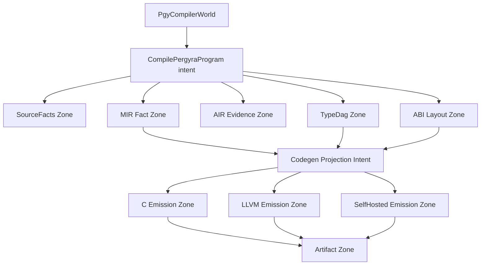

# Target Compiler World

Status: `target-architecture-contract` (2026-06-25)

This document records the target shape for hard self-hosting. It is the
architecture that `11_compiler_world_architecture.md`,
`12_intent_zone_self_host_architecture.md`, and
`13_compiler_substrate_architecture.md` should grow toward.

This is not a release claim that the compiler is already self-hosted. It is the
target contract: the Pergyra compiler should read as one compiler world whose
facts are owned by zones and whose backends are projections, not as a C folder
graph rewritten in Pergyra.

## Shape

The root is one `world`: `PgyCompilerWorld`.
The root action is one `intent`: `CompilePergyraProgram`.

The compiler flow owns five fact zones:

| Zone | Owned resource |
|---|---|
| `SourceFacts` | source intake, tokens, AST/tree facts, and provenance |
| `TypeDag` | resolved type and declaration facts |
| `AIR Evidence` | intent/effect/authority/coordination evidence and erasure/materialization facts |
| `MIR Fact` | CFG, body, routine, cleanup, ownership, and backend-consumed MIR facts |
| `ABI Layout` | representation, field order, tuple/tag/niche policy, and ownership layout facts |

Codegen is then one projection intent over those facts. C, LLVM, and
self-hosted emission are peer projections. None of them owns a second semantic
truth.

This is also the future backend replacement boundary. A future tensor/NPU,
dataflow, capability-machine, or other non-CPU emitter must attach below the
same `Codegen Projection Intent` and consume the same fact envelope. It may
lower those facts to a different execution substrate, but it must not create a
new semantic oracle beside `SourceFacts`, `TypeDag`, `AIR Evidence`, `MIR Fact`,
or `ABI Layout`.

## Contract

1. **Facts before backends.** Frontend, type, AIR, MIR, and ABI data are owned
   facts. Backend emitters consume them; they must not reconstruct them from
   source text, AST payloads, or backend-specific fallbacks.
2. **Codegen is projection.** `Codegen Projection Intent` carries
   MIR/type/ABI facts into backend artifacts. It is a projection nerve bundle,
   not a new compiler kingdom.
3. **SelfHosted is a peer emission.** C, LLVM, and SelfHosted are three
   emission zones. SelfHosted is not allowed to decide which C/LLVM oracle is
   correct until parity has promoted that slice.
4. **Artifact Zone is the parity sink.** The emitted C artifact, LLVM artifact,
   and self-hosted artifact flow into one parity owner. That owner compares
   diagnostics, AIR JSON, MIR JSON, ABI/layout facts, runtime materialization
   classification, emitted text where stable, and run behavior.
   The runtime materialization classification is an artifact-zone fact, not a
   backend-local note.
5. **AIR Evidence is a fact zone.** AIR is not an ornamental dump and not a
   hidden codegen fallback. It owns proof-carrying evidence that can be measured
   by erasure/materialization gates and consumed by verifier/parity paths.
6. **No hidden materialization.** If a world, zone, intent, slot, authority, or
   runtime boundary survives into emitted code, the retaining owner fact must
   say why. Static hot paths may erase; open-world or FFI/raw boundaries may
   materialize only through explicit evidence.
7. **Backend replacement happens above CPU shape.** The compiler world does not
   promise zero cost and does not promise that every target can accept every
   intent. It promises that target acceptance, loss/quantization, buffer
   transfer, materialization, and fallback are owned facts, so a CPU backend can
   be replaced by another projection without rewriting source semantics.

## Current-To-Target Mapping

| Current compiler-world surface | Target owner |
|---|---|
| `SourceIntakeZone`, `TokenStreamZone`, `AstTreeZone` | `SourceFacts` |
| `SemanticVerdictZone`, `TypeEnvZone` | `TypeDag` |
| AIR graph/checker tools and erasure evidence | `AIR Evidence` |
| `MirFactGraphZone` | `MIR Fact` |
| `AbiLayoutZone` | `ABI Layout` |
| `AirEvidenceZone`, `air_evidence_owner.pgy` | `AIR Evidence` |
| `SymbolFactTableZone`, `symbol_table_owner.pgy` | symbol/mangle fact rows |
| `AbiRowProjectionZone`, `abi_layout_row_owner.pgy` | ABI/layout row projection |
| `EmissionZone` | `C Emission`, `LLVM Emission`, and `SelfHosted Emission` |
| `ArtifactZone`, `artifact_zone_owner.pgy` | `Artifact Zone` |
| `TestHarnessZone`, `test_harness_owner.pgy` | parity fixture/result rows |
| `SubprocessRunnerZone`, `subprocess_runner_owner.pgy` | capability-gated oracle execution envelope |
| `ParityZone` | proof verdict |
| current backend drivers | `Codegen Projection Intent` participants |

The migration order is:

1. Name AIR evidence as a first-class fact zone in the self-hosted compiler
   world.
2. Split the generic `EmissionZone` target into peer C, LLVM, and SelfHosted
   emission zones when each projection owns a comparable artifact resource and
   consumes the same MIR/type/ABI/target-capability rows. Until that condition
   is met, `EmissionZone` remains a current C-emission owner rather than a
   final peer-projection status claim.
3. Move backend-specific layout guesses behind `ABI Layout`.
4. Move backend-specific symbol spelling behind a symbol/mangle fact owner.
5. Promote parity from run-output checks to artifact-zone evidence that includes
   diagnostics, AIR JSON, MIR JSON, ABI/layout, runtime materialization
   classification, emitted artifacts, and behavior.

## What This Rejects

- A `compiler/` directory that becomes a C-style driver folder.
- One zone per file, function family, or helper category.
- Separate C, LLVM, and SelfHosted semantic decisions.
- Backend-local layout, symbol, authority, or slot fallback paths.
- A self-hosted compiler that passes by parsing text/JSON back into facts that
  already have MIR, AIR, DAG, ABI, or stage owners.
- Runtime manager calls that appear in emitted code without an AIR/MIR/ABI
  retaining fact.

## Gate Direction

The existing compiler-world gate already checks `PgyCompilerWorld`, resource
zones, stage intents, path manifest ownership, line caps, and the
projection-nerve rule. This target document adds the next gate direction:

- a future AIR-evidence gate should reject unowned evidence drift;
- a future codegen-projection gate should prove C, LLVM, and SelfHosted consume
  the same MIR/type/ABI rows;
- a future target-capability gate should prove any non-CPU projection consumes
  the same intent/effect/authority/slot/layout/loss envelope and explains every
  reject or CPU fallback;
- a future artifact-zone gate should classify retained runtime symbols as
  erased, summarized, or explicitly materialized by evidence;
- a future ABI/layout gate should reject backend-local field order, tag/niche,
  or ownership-layout invention.

## Related Documents

- `11_compiler_world_architecture.md` - current compiler-world scaffold and
  resource-zone rule.
- `12_intent_zone_self_host_architecture.md` - intent/zone growth rules.
- `13_compiler_substrate_architecture.md` - concrete self-host architecture
  stack, codegen resources, caching, runtime materialization, and promotion.
- `../semantics/14_air_erasure_measurement.md` - measured erased, summarized,
  and materialized runtime residue.
- `../semantics/pass_contract_manifest.md` - pass-level owner contract.
