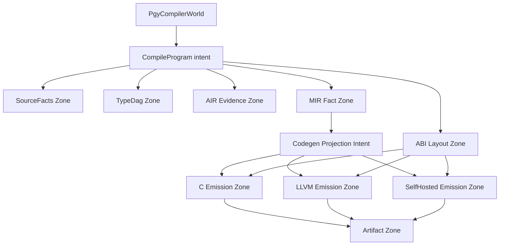

# 14. Target Compiler World — codegen-as-projection

Status: **target (BDFL-desired)**, 2026-06-25. 현재 `world.pgy`(docs/11–13)는 이
모양으로 자라는 parse-gated scaffold다. 이 문서는 *도달 목표*를 고정한다 —
hard substitution이 이 모양을 향해 자란다.

## 모양

## 읽는 법

하나의 `world`(`PgyCompilerWorld`), 하나의 root `intent`(`CompileProgram`). intent가
**fact zone 5개**를 소유한다. 여기서 zone은 *자원 소유 경계*(파일/모듈 라벨 아님 —
docs/11의 원칙):

| Zone | 소유하는 자원 |
|---|---|
| **SourceFacts** | frontend 사실(lex/parse/source)을 한 fact set으로 합침 |
| **TypeDag** | 타입 해소 DAG |
| **AIR Evidence** | proof-carrying 증거(intent/effect/erasure). *검증/parity가 소비*하는 fact — codegen projection 경로 밖(다이어그램상 `AF`는 codegen으로 가는 화살표가 없다) |
| **MIR Fact** | lowering된 MIR fact graph — **백엔드가 바라보는 단일 IR** |
| **ABI Layout** | 구체 레이아웃 사실(struct/niche/tuple ABI) |

그다음이 핵심 선언이다: **codegen은 세 개의 별도 컴파일러가 아니라 하나의 projection.**
`Codegen Projection Intent`가 **MIR Fact + ABI Layout**을 소비해 emission zone 셋
(C / LLVM / SelfHosted)으로 *투영*한다. 셋은 *같은 사실의 projection*이며, 모두
**Artifact Zone**으로 수렴한다 — 그 zone의 불변식이 **parity**(세 artifact가 일치).

## 왜 이 모양인가 (설계 선언)

1. **Facts before backends.** frontend/type/AIR/MIR/ABI는 *fact zone* — 소유·불변·투영
   대상. 어떤 백엔드도 fact 뒤로 손을 뻗지 않고 *소비*만 한다.
2. **Codegen = MIR+ABI의 projection.** 하나의 intent, 셋의 emission. 이게
   architecture target #4(unified MIR consumption)의 명시화 — 백엔드가 각자 구조를
   재유도하지 않고 같은 MIR+ABI를 투영한다. (현재: C·LLVM이 MIR 소비, self-hosted는
   origin surface. target은 셋을 **peer projection**으로.)
3. **SelfHosted는 peer 백엔드.** C/LLVM/SelfHosted = emission zone 셋이지 "진짜 백엔드
   + dogfood"가 아니다. self_hosted = origin([[project_self_hosted_origin_framing]])이되
   여기선 *emission target*이기도 하다.
4. **Artifact Zone = parity sink.** 세 emission이 한 zone으로 떨어지고, parity
   (byte-equal/behavior-equal)가 그 zone의 invariant. soundness oracle(C==LLVM, 종국엔
   ==SelfHosted)이 사는 자리. [[project_backend_strategy]]의 parity-gate를 구조로 승격.
5. **AIR Evidence는 fact지 codegen 의존이 아님.** 다이어그램이 정직하다 — `AF`는
   intent가 소유하는 fact zone이지만 codegen으로 가는 엣지가 없다. 즉 AIR는 *검증/parity가
   소비하는 증거*로 남고 codegen 경로엔 안 올라간다(현재 AIR off-path 실측과 정합 —
   [[project_machine_neutral_falsification]]). target은 AIR에 "evidence fact zone"이라는
   *명명된 역할*은 주되, codegen load-bearing으로 과대포장하지 않는다.

## 현재 `world.pgy`와의 대응 (정제 방향)

| 현재 zone | → target |
|---|---|
| SourceIntakeZone + TokenStreamZone + AstTreeZone | **SourceFacts** (합침) |
| SemanticVerdictZone + TypeEnvZone | **TypeDag** |
| (없음) | **AIR Evidence** (신규 — AIR를 fact zone으로 명명) |
| MirFactGraphZone | **MIR Fact** |
| AbiLayoutZone | **ABI Layout** |
| EmissionZone | **C / LLVM / SelfHosted Emission** (3 projection으로 분리) |
| ParityZone | **Artifact Zone** (수렴 sink) |
| (신규 intent) | **Codegen Projection Intent** |

자라는 순서: AIR Evidence zone 추가 → EmissionZone을 3 projection zone으로 분리 →
Codegen Projection intent 추가. 각각 *자원 소유 zone/intent*로, 게이트로.

## 게이트 정합

compiler-world conformance 게이트(docs/11, `self-host-compiler-world-contract-test-smoke`)가
이미 zone=자원소유 + manifest↔현실을 강제한다. 이 target으로 자랄 때 각 단계는 그
게이트가 받는 형태(resource-owned zone/intent)여야 한다 — 모양이 문서가 아니라 *게이트로*
지켜지게.

## 관련 문서
- `docs/self_hosted/11_compiler_world_architecture.md` — 현재 world scaffold + zone=자원소유 원칙
- `docs/self_hosted/12_intent_zone_self_host_architecture.md` — intent/zone 성장 규칙
- `docs/self_hosted/13_compiler_substrate_architecture.md` — codegen 자원·fact owner·parity promotion
- `docs/36`(IR 최소성), `docs/118`(abstraction portability) — MIR-단일-소비의 근거
