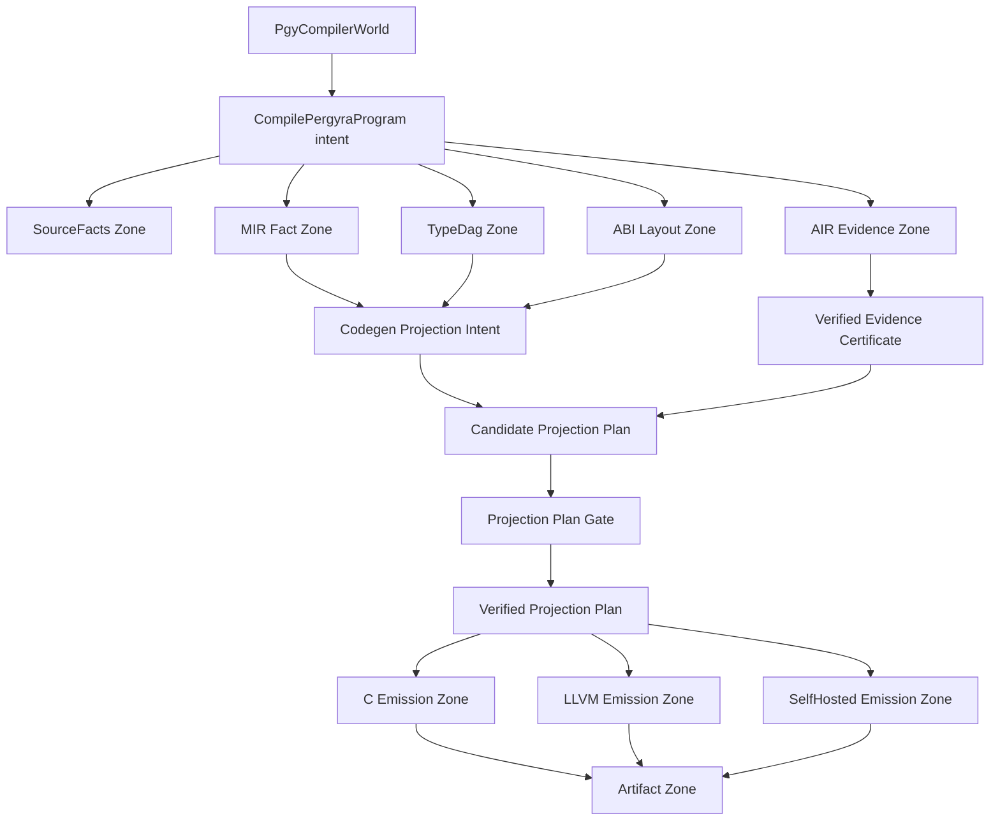

# Target Compiler World

Status: `target-architecture-contract` (2026-06-25); vision revised and
prioritized 2026-09-29 (see the first section below)

This document records the target shape for hard self-hosting. It is the
architecture that `11_compiler_world_architecture.md`,
`12_intent_zone_self_host_architecture.md`, and
`13_compiler_substrate_architecture.md` should grow toward.

This is not a release claim that the compiler is already self-hosted. It is the
target contract: the Pergyra compiler should read as one compiler world whose
facts are owned by zones and whose backends are projections, not as a C folder
graph rewritten in Pergyra.

## 2026-09-29 비전 개정: 컴파일러를 자기 세계 위에

사용자 결정(2026-09-29): 컴파일러의 설계 구조가 언어가 추구하는 세계관을
따르게 만드는 일을 높은 우선순위로 둔다. 아래 모양이 목표다. 이 절 뒤의
`Shape`, `Contract`, `What This Rejects`는 이 모양의 세부 계약으로 계속 유효하다.

```text
PgyCompilerWorld
├─ CompileProgram intent
├─ CheckProgram intent
├─ FormatSource intent
├─ DebugProgram intent
│
├─ CompilationRevisionZone
│  ├─ SourceGraph
│  ├─ TypeDag + HIR
│  ├─ DIR
│  ├─ RIR
│  ├─ MIR
│  └─ AIR certificate
│
├─ TargetEnvironmentZone
│  └─ ABI + capability facts
│
├─ VerifiedProjectionPlan
│  ├─ C projection
│  ├─ LLVM projection
│  └─ self-host projection
│
└─ ArtifactTransactionZone
   └─ published artifact | typed rejection
```

원칙은 다음과 같다.

- 순수 계산은 `func`/`struct` owner로 남는다. 권한, 상태 전이, 효과가 실제로
  있는 곳만 `subject`/`action`/`zone`/`intent`가 소유한다. 그런 곳은 소스
  입수(IO 권한), revision 봉인, 산출물 게시(효과), 워커 경계다.
- intent는 실제 목적 하나에 성공과 실패의 의미가 닫혀 있을 때만 둔다.
  Compile(산출물 게시), Check(판정만), Format(소스 재작성), Debug(세션)는
  성공의 의미가 서로 달라서 intent가 넷이다.
- 한 규칙은 한 곳에서만 결정된다. 단계 사이의 인계는 같은 revision 안의 사실을
  읽는 것이다. 텍스트로 직렬화했다가 다시 파싱하는 것은 인계가 아니다.

`Shape`의 기존 다섯 fact zone은 다음처럼 옮겨진다.

| 기존(2026-06-25) | 개정 |
|---|---|
| `SourceFacts`, `TypeDag`, `AIR Evidence`, `MIR Fact` | `CompilationRevisionZone`의 층 |
| `ABI Layout`, target capability | `TargetEnvironmentZone` |
| C/LLVM/SelfHosted emission zone | `VerifiedProjectionPlan`의 projection |
| `Artifact Zone` | `ArtifactTransactionZone` |

### 현재와의 거리 (2026-09-29, `unit-scope` 트리에서 측정)

- **외곽은 이미 세계 위에 있다.** `PgyCompilerWorld`의 멤버는 경로마다 둔
  zone 네 개(`direct_mir`, `source_mir`, `source_llvm`, `source_c`)다. 기본
  경로 `pgy file --backend=c`는 self-host 드라이버를 거쳐 다음 순서로 간다.
  `CompileSourceToCThroughPgyCompilerWorld` → `PgyCompilerWorld.CompileSourceToC`
  → `intent CompilePergyraCArtifact` → `DriverSourceCExecution.Compile`.
  이 action은 `io_read`/`io_write` 권한 아래 산출물을 원자적으로 commit하고,
  receipt나 typed rejection을 남긴다. 따라서 `ArtifactTransactionZone`의 실체는
  이미 있다. 다만 경로마다 따로 있다. source→LLVM은 `CompilePergyraProgram`
  intent를 거친다.
  - `AGENTS.md`, `docs/55_keyword_progress_board.md`,
    `18_c_oracle_bootstrap_contract.md`는 world가 direct-MIR 조각에서만 실행
    루트라고 적고 있었다. 2026-09-29에 이 도달 범위로 고쳤다.
- **내부 단계는 세계 밖에 있다.**
  - `Compile` action 안의 lexer부터 codegen까지는 평범한 함수 호출이다.
  - `LexerStage`, `ParserStage`, `SemanticStage`, `MirLowerStage`,
    `ProgramEmitter`와 단계 zone들은 world 멤버가 아니다. 선언된 목표
    토폴로지일 뿐이다. 그 action들은 `CompilerTokenStreamFactReady()` 같은
    readiness 불리언만 돌려준다.
- **단계 인계가 텍스트를 거친다.**
  - `CompileSourceToCVerified`는 `CompileSourceToMirJsonVerified`로 MIR JSON
    문자열을 만든다. 그 문자열을 `CompileMirJsonTextToCForTargetVerifiedObserved`가
    다시 읽는다.
  - canonical MIR 실행은 MIR에서 AST 텍스트를 다시 만들고 semantic을 한 번 더
    돌린다(`MirExpressionGraphFactsForArtifact`). PP-064에서 bind subject를
    이 재구성 경로에 따로 등록해야 했던 것이 그 비용이다.
  - 이는 이 문서의 `What This Rejects`와 부딪친다.
- **선언 분포.**
  - self-host 선언: `func` 9,206, `struct` 735, `action` 24, `subject` 20,
    `zone` 18, `intent` 14, `world` 2.
  - 파일: `.pgy` 1,915개 중 1,810개가 `*_owner.pgy`다.
- **규칙이 두 번 구현된다.** native C와 self-host가 semantic 규칙을 각자
  결정한다. PP-064 한 단위에서만 다음이 두 번 구현됐다.
  - local name rule
  - bind subject 검사
  - bound party escape
  - role 본문 `self`

  그 과정에서 두 구현의 어긋남이 둘 드러났다: 파라미터 subject 허용 여부와
  dyn slot 구분.
- **세계관 구성요소가 아직 건전하지 않았다.**
  - role 본문 `self`는 native에서 타입이 없었고(f13090b0에서 수정), default
    route에서는 role 이름으로 잘못 매겨졌다.
  - party slot은 subject 없이 NULL이나 party 자신을 `self`로 넘겼다.
  - 두 파서의 AST 텍스트는 `dyn` 여부를 담지 않는다.
- **이미 있는 조각.**
  - LSP의 `document_revision_owner.pgy`와 `document_store_owner.pgy`는 revision
    개념의 씨앗이다.
  - `SelfHostMachineLayerDeclaration`과 `CompilerTargetProjectionFact`는
    `TargetEnvironmentZone`의 씨앗이다.

### 열린 설계 결정 (권고 포함, 사용자 확정 전)

1. **`VerifiedProjectionPlan`의 자리.**
   - 권고: world 멤버가 아니라 (revision, target environment) 쌍의 파생 사실로
     둔다.
   - 같은 revision이 여러 target으로 투영되기 때문이다.
   - 계획을 만드는 단계와 계획 게이트(`Projection Plan Gate`)는 Compile intent의
     step이다.
2. **소스 입수 경계.**
   - 권고: 파일 시스템과 편집 버퍼를 읽는 `io_read` 권한 경계를 revision
     바깥에 둔다. 그 경계가 봉인된 revision을 만든다.
   - Format과 LSP 편집도 같은 입수 경계를 쓴다.
3. **revision 봉인.**
   - 권고: 한 층의 사실은 봉인된 뒤 불변이다.
   - 그래서 병렬 워커는 문서화된 read-only view로 공유한다. 이는 AGENTS의
     컨테이너 경계 규칙과 맞는다.
4. **IR 층의 표현.**
   - 권고: HIR, DIR, RIR, MIR, AIR는 revision 안의 fact owner(`func`/`struct`)로
     둔다. 층마다 zone을 두지 않는다(`What This Rejects`: zone per function
     family).
5. **MIR 중간 진입.**
   - 권고: `--mir-json` 입력은 MIR 층에서 시작하는 revision으로 둔다. 출처는
     provenance로 표시한다.
   - 재도출 검증을 원하면, 그 검증은 CheckProgram의 인증서 owner가 명시적으로
     소유한다. 인계 수단으로 쓰지 않는다.
6. **native C 컴파일러의 자리.**
   - 권고: world 바깥의 bootstrap oracle로 둔다.
   - 새 규칙 family는 권위 쪽을 먼저 정하고, 양쪽 parity/negative 게이트를
     함께 둔다.

### 실현 우선순위 (높음)

현재 진행 중인 활성 rung이 착지한 뒤에는 아래 순서가 다음 활성 rung을 정한다.
P1만은 예외로, 지금 활성인 소유권 rung 자신의 닫힘 조건이다. 이 순서는
`docs/206`의 남은 단위(PP-063, R11/R13)보다 앞선다. 각 rung은 `AGENTS.md`의
진척 가드를 따른다. 가드는 production entrypoint, 지울 direct bypass, fact
owner, 마지막 consumer, 게이트 하나를 요구한다.

- **P0. 세계관 구성요소 건전성 마무리.**
  - PP-064 3b(bind subject, role `self`, bound party escape)를 착지한다.
  - `dyn` 표현 구멍을 닫는다. 두 파서의 AST 텍스트가 dyn 여부를 싣고,
    default route가 static slot bind를 거부하게 한다.
- **P1. 소유권 레인을 닫을 수 있게 만든다(사용자 결정, 2026-09-29).**
  - 걱정: owner가 너무 잘게 쪼개져 끝내 닫지 못하게 되는 것.
  - 측정: 전체는 수렴 중이다.
    - owner 파일 증가폭은 2주 단위로 +672 → +356 → +106 → +63이다.
    - SoT 행은 63에서 95로 늘었고, CLOSED는 33에서 69로 늘었다. 열린 행은
      26개다.
  - 위험은 타입과 모양별로 쪼개지는 곳에 몰려 있다.
    - 열린 projection 행 다섯 개가 모양별이다: `array_int_program`,
      `string_array_push`, `collection_pop_effect`, `collection_program_plan`,
      `scalar_cfg_program_extension`.
    - `HashMap<Int,V>`, `<Long,V>`, `<Bool,V>`, `<String,V>`가 각각 따로
      rung이었다.
  - **전이표 완결성.** `CollectionOwnershipTransfer.v`에 유한한 전이표를 넣고,
    표가 완결됐음을 증명한다.
    - 상태: EMPTY, OWNED, MOVED, BORROWED, UNKNOWN
    - 전이: push, move, clone, drop, 인자, 반환, inout

    `semantic.hashmap_collection_ownership`는 표의 모든 칸에 owner 하나와
    게이트 하나가 있을 때 CLOSED다. 표 밖의 새 항목은 먼저 표를 고친 뒤에만
    들어온다.
  - **타입과 연산은 매개변수로 둔다.**
    - 원소 타입은 ABI layout 행의 매개변수다. 소유 전이는 타입과 무관한
      행 하나다.
    - 모양별 projection 행 다섯 개는 `collection_program_plan` 하나로 합쳐
      닫는다.
  - **행 수 래칫.** SoT 행 수(현재 95)를 상한으로 둔다.
    - 새 사실 가족은 기존 행의 매개변수로 표현할 수 없음을 보인 뒤에만
      추가한다.
    - 하나를 추가하면 다른 행 하나를 합치거나 닫는다.
    - `scripts/sot_registry_gate.py`가 이 상한을 검사한다.
  - `docs/206` §4에 맞춰, 레인 WIP의 암묵적 deep copy를 move/clone 결정으로
    바꾼다.
  - 이 레인은 활성 rung이다. 그래서 전이표와 래칫은 병렬 트랙이 아니라 그
    rung의 닫힘 조건으로 넘긴다.
  - 진척은 CLOSED 수와 열린 행 수로 센다. owner 파일 수나 테스트 수는 세지
    않는다.
- **P2. 단계 인계를 revision 사실로.**
  - production entrypoint: `pgy-self-driver` source→C
    (`CompileSourceToCVerified`).
  - 지울 bypass: 같은 프로세스 안에서 MIR JSON 문자열을 만들고 다시 읽는 인계.
  - MIR는 계속 codegen의 단일 입력이다. 문자열 대신 revision 안의 MIR 사실을
    넘긴다.
  - 게이트: emitted C가 같음을 보이는 parity, 그리고 source 경로가 MIR JSON
    텍스트를 다시 읽지 않는다는 negative ratchet.
- **P3. `ArtifactTransactionZone` 하나로.**
  - 경로별 zone 네 개의 commit/reject를 target environment를 인자로 받는
    transaction 하나로 합친다.
  - 경로별 중복 receipt 코드를 지운다.
  - Compile과 Check가 같은 revision을 쓰고, 게시 여부만 다르게 한다.
- **P4. 단계 subject를 실제 전이의 주인으로.**
  - readiness 불리언 action을 지운다.
  - 입수 경계와 revision 층 봉인을 action이 소유하게 한다.
  - 소스 입수(`io_read`)부터 시작한다.
- **P5. `TargetEnvironmentZone`과 `VerifiedProjectionPlan`.**
  - C, LLVM, self-host projection이 같은 계획과 같은 MIR/ABI 사실을 소비함을
    게이트로 증명한다(이 문서의 Gate Direction).
- **P6. Check/Format/Debug intent.**
  - LSP, `fmt`, `debug` 세션을 같은 world의 intent로 올린다.
  - 따로 가진 revision/store를 `CompilationRevisionZone`으로 합친다.

## Shape


```mermaid
flowchart TD
    W["PgyCompilerWorld"]
    I["CompilePergyraProgram intent"]

    W --> I

    I --> SF["SourceFacts Zone"]
    I --> TD["TypeDag Zone"]
    I --> AE["AIR Evidence Zone"]
    I --> MF["MIR Fact Zone"]
    I --> AL["ABI Layout Zone"]

    MF --> CG["Codegen Projection Intent"]
    TD --> CG
    AL --> CG

    AE --> AC["Verified Evidence Certificate"]
    CG --> CP["Candidate Projection Plan"]
    AC --> CP
    CP --> PV["Projection Plan Gate"]
    PV --> VP["Verified Projection Plan"]

    VP --> CE["C Emission Zone"]
    VP --> LE["LLVM Emission Zone"]
    VP --> SE["SelfHosted Emission Zone"]

    CE --> AZ["Artifact Zone"]
    LE --> AZ
    SE --> AZ
```

The root is one `world`: `PgyCompilerWorld`.
The root action is one `intent`: `CompilePergyraProgram`.

The compiler flow owns five fact zones:

| Zone | Owned resource |
|---|---|
| `SourceFacts` | source intake, tokens, AST/tree facts, and provenance |
| `TypeDag` | resolved type and declaration facts |
| `AIR Evidence` | intent/effect/authority/coordination evidence and erasure/materialization facts |
| `MIR Fact` | CFG, body, routine, cleanup, ownership, and backend-consumed MIR facts |
| `ABI Layout` | representation, field order, tuple/tag/niche policy, and ownership layout facts |

Codegen is then one projection intent over those facts plus AIR's verified
evidence certificate. It produces a candidate plan; the Projection Plan Gate
validates that plan; C, LLVM, and self-hosted emission consume the resulting
`VerifiedProjectionPlan` as peer projections. AIR itself is not a backend input,
and none of the emitters owns a second semantic truth.

This is also the future backend replacement boundary. A future tensor/NPU,
dataflow, capability-machine, or other non-CPU emitter must attach below the
same `Codegen Projection Intent` and consume the same fact envelope. It may
lower those facts to a different execution substrate, but it must not create a
new semantic oracle beside `SourceFacts`, `TypeDag`, `AIR Evidence`, `MIR Fact`,
or `ABI Layout`.

## Contract

1. **Facts before backends.** Frontend, type, AIR, MIR, and ABI data are owned
   facts. Backend emitters consume them; they must not reconstruct them from
   source text, AST payloads, or backend-specific fallbacks.
2. **Codegen is projection.** `Codegen Projection Intent` turns MIR/type/ABI and
   target-capability facts plus AIR's evidence certificate into a candidate
   plan. The Projection Plan Gate validates it, and the resulting
   `VerifiedProjectionPlan` is the projection nerve bundle carried into backend
   artifacts. It is not a new semantic IR or compiler kingdom.
3. **SelfHosted is a peer emission.** C, LLVM, and SelfHosted are three
   emission zones. SelfHosted is not allowed to decide which C/LLVM oracle is
   correct until parity has promoted that slice.
4. **Artifact Zone is the parity sink.** The emitted C artifact, LLVM artifact,
   and self-hosted artifact flow into one parity owner. That owner compares
   diagnostics, AIR JSON, MIR JSON, ABI/layout facts, runtime materialization
   classification, emitted text where stable, and run behavior.
   The runtime materialization classification is an artifact-zone fact, not a
   backend-local note.
5. **AIR Evidence is a fact zone.** AIR is not an ornamental dump, a backend
   input, or a hidden codegen fallback. It owns proof-carrying evidence and a
   compact verification certificate consumed by the planner and measured by
   erasure/materialization and parity paths.
6. **No hidden materialization.** If a world, zone, intent, slot, authority, or
   runtime boundary survives into emitted code, the retaining owner fact must
   say why. Static hot paths may erase; open-world or FFI/raw boundaries may
   materialize only through explicit evidence.
7. **Backend replacement happens above CPU shape.** The compiler world does not
   promise zero cost and does not promise that every target can accept every
   intent. It promises that target acceptance, loss/quantization, buffer
   transfer, materialization, and fallback are owned facts, so a CPU backend can
   be replaced by another projection without rewriting source semantics.

## Current-To-Target Mapping

| Current compiler-world surface | Target owner |
|---|---|
| `SourceIntakeZone`, `TokenStreamZone`, `AstTreeZone` | `SourceFacts` |
| `SemanticVerdictZone`, `TypeEnvZone` | `TypeDag` |
| AIR graph/checker tools and erasure evidence | `AIR Evidence` |
| `MirFactGraphZone` | `MIR Fact` |
| `AbiLayoutZone` | `ABI Layout` |
| `CompatibilityEvolutionZone`, `compatibility_evolution_owner.pgy` | compatibility evolution surface |
| `AirEvidenceZone`, `air_evidence_owner.pgy` | `AIR Evidence` |
| `SymbolFactTableZone`, `symbol_table_owner.pgy` | symbol/mangle fact rows |
| `AbiRowProjectionZone`, `abi_layout_row_owner.pgy` | ABI/layout row projection |
| `EmissionZone` | `C Emission`, `LLVM Emission`, and `SelfHosted Emission` |
| `ArtifactZone`, `artifact_zone_owner.pgy` | `Artifact Zone` |
| `TestHarnessZone`, `test_harness_owner.pgy` | parity fixture/result rows |
| `SubprocessRunnerZone`, `subprocess_runner_owner.pgy` | capability-gated oracle execution envelope |
| `ParityZone` | proof verdict |
| current backend drivers | `Codegen Projection Intent` participants |

The migration order is:

1. Name AIR evidence as a first-class fact zone in the self-hosted compiler
   world.
2. Split the generic `EmissionZone` target into peer C, LLVM, and SelfHosted
   emission zones when each projection owns a comparable artifact resource and
   consumes the same MIR/type/ABI/target-capability rows. Until that condition
   is met, `EmissionZone` remains a current C-emission owner rather than a
   final peer-projection status claim.
3. Move backend-specific layout guesses behind `ABI Layout`.
4. Move backend-specific symbol spelling behind a symbol/mangle fact owner.
5. Promote parity from run-output checks to artifact-zone evidence that includes
   diagnostics, AIR JSON, MIR JSON, ABI/layout, runtime materialization
   classification, emitted artifacts, and behavior.

## What This Rejects

- A `compiler/` directory that becomes a C-style driver folder.
- One zone per file, function family, or helper category.
- Separate C, LLVM, and SelfHosted semantic decisions.
- Backend-local layout, symbol, authority, or slot fallback paths.
- A self-hosted compiler that passes by parsing text/JSON back into facts that
  already have MIR, AIR, DAG, ABI, or stage owners.
- Runtime manager calls that appear in emitted code without an AIR/MIR/ABI
  retaining fact.

## Gate Direction

The existing compiler-world gate already checks `PgyCompilerWorld`, resource
zones, stage intents, path manifest ownership, line caps, and the
projection-nerve rule. This target document adds the next gate direction:

- a future AIR-evidence gate should reject unowned evidence drift;
- a future codegen-projection gate should prove C, LLVM, and SelfHosted consume
  the same verified plan and MIR/type/ABI rows;
- a future target-capability gate should prove any non-CPU projection consumes
  the same intent/effect/authority/slot/layout/loss envelope and explains every
  reject or CPU fallback;
- a future artifact-zone gate should classify retained runtime symbols as
  erased, summarized, or explicitly materialized by evidence;
- a future ABI/layout gate should reject backend-local field order, tag/niche,
  or ownership-layout invention.

## Related Documents

- `11_compiler_world_architecture.md` - current compiler-world scaffold and
  resource-zone rule.
- `12_intent_zone_self_host_architecture.md` - intent/zone growth rules.
- `13_compiler_substrate_architecture.md` - concrete self-host architecture
  stack, codegen resources, caching, runtime materialization, and promotion.
- `../semantics/14_air_erasure_measurement.md` - measured erased, summarized,
  and materialized runtime residue.
- `../semantics/pass_contract_manifest.md` - pass-level owner contract.
- `../180_compiler_logical_spine_handles_gates.md` - stable handles, movable
  boundaries, migration protocol, and gate map.
